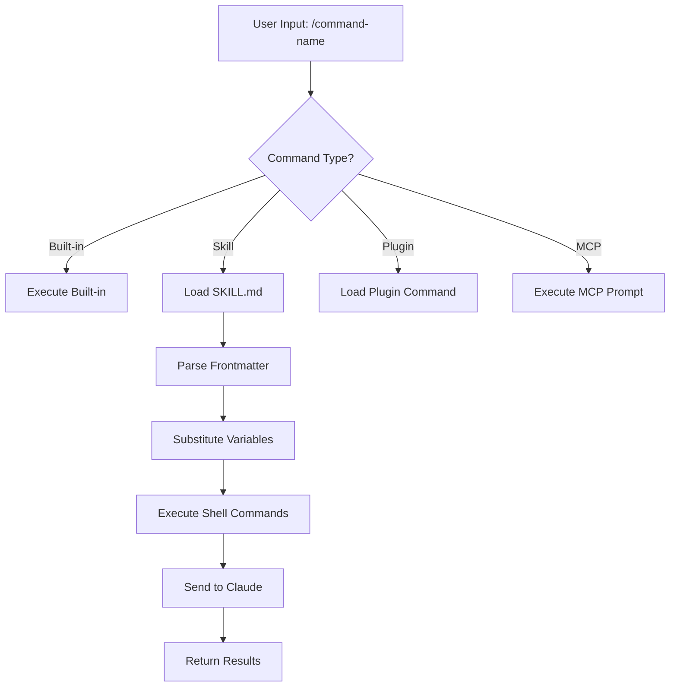
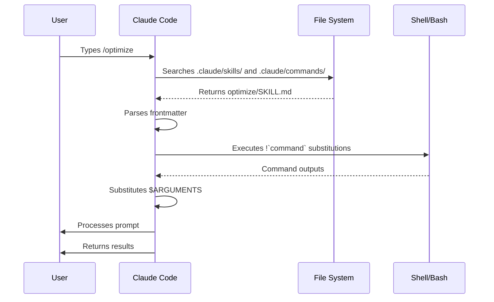

<picture>
  <source media="(prefers-color-scheme: dark)" srcset="../resources/logos/claude-howto-logo-dark.svg">
  
</picture>

# Slash Commands

## Descripcion General

Los slash commands son atajos que controlan el comportamiento de Claude durante una sesion interactiva. Existen varios tipos:

- **Comandos integrados**: Provistos por Claude Code (`/help`, `/clear`, `/model`)
- **Skills**: Comandos definidos por el usuario como archivos `SKILL.md` (`/optimize`, `/pr`)
- **Comandos de plugins**: Comandos de plugins instalados (`/frontend-design:frontend-design`)
- **Prompts MCP**: Comandos de servidores MCP (`/mcp__github__list_prs`)

> **Nota**: Los slash commands personalizados se han fusionado con skills. Los archivos en `.claude/commands/` siguen funcionando, pero skills (`.claude/skills/`) es el enfoque recomendado. Ambos crean atajos `/nombre-del-comando`. Consulta la [Guia de Skills](../03-skills/) para la referencia completa.

## Referencia de Comandos Integrados

Los comandos integrados son atajos para acciones comunes. Hay **mas de 60 comandos integrados** y **5 skills incluidos** disponibles. Escribe `/` en Claude Code para ver la lista completa, o `/` seguido de letras para filtrar.

| Comando | Proposito |
|---------|-----------|
| `/add-dir <path>` | Agregar directorio de trabajo |
| `/agents` | Gestionar configuraciones de agentes |
| `/branch [name]` | Bifurcar conversacion en nueva sesion (alias: `/fork`). Nota: `/fork` renombrado a `/branch` en v2.1.77 |
| `/btw <question>` | Pregunta lateral sin agregar al historial |
| `/chrome` | Configurar integracion con Chrome |
| `/clear` | Limpiar conversacion (aliases: `/reset`, `/new`) |
| `/color [color\|default]` | Establecer color de la barra de prompt |
| `/compact [instructions]` | Compactar conversacion con instrucciones opcionales |
| `/config` | Abrir Configuracion (alias: `/settings`) |
| `/context` | Visualizar uso de contexto como grilla de colores |
| `/copy [N]` | Copiar respuesta al portapapeles; `w` escribe a archivo |
| `/cost` | Mostrar estadisticas de uso de tokens |
| `/desktop` | Continuar en app de escritorio (alias: `/app`) |
| `/diff` | Visor interactivo de diff para cambios sin commit |
| `/doctor` | Diagnosticar salud de la instalacion |
| `/effort [low\|medium\|high\|max\|auto]` | Establecer nivel de esfuerzo. `max` requiere Opus 4.6 |
| `/exit` | Salir del REPL (alias: `/quit`) |
| `/export [filename]` | Exportar conversacion actual a archivo o portapapeles |
| `/extra-usage` | Configurar uso extra para limites de tasa |
| `/fast [on\|off]` | Alternar modo rapido |
| `/feedback` | Enviar feedback (alias: `/bug`) |
| `/help` | Mostrar ayuda |
| `/hooks` | Ver configuraciones de hooks |
| `/ide` | Gestionar integraciones con IDE |
| `/init` | Inicializar `CLAUDE.md`. Usar `CLAUDE_CODE_NEW_INIT=1` para flujo interactivo |
| `/insights` | Generar reporte de analisis de sesion |
| `/install-github-app` | Configurar app de GitHub Actions |
| `/install-slack-app` | Instalar app de Slack |
| `/keybindings` | Abrir configuracion de atajos de teclado |
| `/login` | Cambiar cuentas de Anthropic |
| `/logout` | Cerrar sesion de tu cuenta Anthropic |
| `/mcp` | Gestionar servidores MCP y OAuth |
| `/memory` | Editar `CLAUDE.md`, alternar auto-memory |
| `/mobile` | Codigo QR para app movil (aliases: `/ios`, `/android`) |
| `/model [model]` | Seleccionar modelo con flechas izq/der para esfuerzo |
| `/passes` | Compartir semana gratis de Claude Code |
| `/permissions` | Ver/actualizar permisos (alias: `/allowed-tools`) |
| `/plan [description]` | Entrar en modo plan |
| `/plugin` | Gestionar plugins |
| `/powerup` | Descubrir features con lecciones interactivas y demos animados |
| `/privacy-settings` | Configuracion de privacidad (solo Pro/Max) |
| `/release-notes` | Ver changelog |
| `/reload-plugins` | Recargar plugins activos |
| `/remote-control` | Control remoto desde claude.ai (alias: `/rc`) |
| `/remote-env` | Configurar entorno remoto por defecto |
| `/rename [name]` | Renombrar sesion |
| `/resume [session]` | Retomar conversacion (alias: `/continue`) |
| `/review` | **Deprecado** — instalar el plugin `code-review` en su lugar |
| `/rewind` | Retroceder conversacion y/o codigo (alias: `/checkpoint`) |
| `/sandbox` | Alternar modo sandbox |
| `/schedule [description]` | Crear/gestionar tareas programadas en la nube |
| `/security-review` | Analizar branch en busca de vulnerabilidades |
| `/skills` | Listar skills disponibles |
| `/stats` | Visualizar uso diario, sesiones, rachas |
| `/stickers` | Pedir stickers de Claude Code |
| `/status` | Mostrar version, modelo, cuenta |
| `/statusline` | Configurar linea de estado |
| `/tasks` | Listar/gestionar tareas en segundo plano |
| `/terminal-setup` | Configurar atajos de terminal |
| `/theme` | Cambiar tema de colores |
| `/ultraplan <prompt>` | Crear borrador de plan en sesion ultraplan, revisar en navegador |
| `/upgrade` | Abrir pagina de upgrade a plan superior |
| `/usage` | Mostrar limites de uso del plan y estado de rate limit |
| `/voice` | Alternar dictado por voz push-to-talk |

### Skills Incluidos

Estos skills vienen con Claude Code y se invocan como slash commands:

| Skill | Proposito |
|-------|-----------|
| `/batch <instruction>` | Orquestar cambios paralelos a gran escala usando worktrees |
| `/claude-api` | Cargar referencia de la API de Claude para el lenguaje del proyecto |
| `/debug [description]` | Habilitar logging de debug |
| `/loop [interval] <prompt>` | Ejecutar prompt repetidamente en un intervalo |
| `/simplify [focus]` | Revisar archivos modificados para calidad de codigo |

### Comandos Deprecados

| Comando | Estado |
|---------|--------|
| `/review` | Deprecado — reemplazado por el plugin `code-review` |
| `/output-style` | Deprecado desde v2.1.73 |
| `/fork` | Renombrado a `/branch` (alias sigue funcionando, v2.1.77) |
| `/pr-comments` | Eliminado en v2.1.91 — pídele a Claude directamente que vea los comentarios del PR |
| `/vim` | Eliminado en v2.1.92 — usar /config -> Editor mode |

### Cambios Recientes

- `/fork` renombrado a `/branch` con `/fork` como alias (v2.1.77)
- `/output-style` deprecado (v2.1.73)
- `/review` deprecado en favor del plugin `code-review`
- Comando `/effort` agregado con nivel `max` que requiere Opus 4.6
- Comando `/voice` agregado para dictado por voz push-to-talk
- Comando `/schedule` agregado para crear/gestionar tareas programadas
- Comando `/color` agregado para personalizar la barra de prompt
- /pr-comments eliminado en v2.1.91 — pídele a Claude directamente que vea los comentarios del PR
- /vim eliminado en v2.1.92 — usar /config -> Editor mode en su lugar
- /ultraplan agregado para revision y ejecucion de planes en el navegador
- /powerup agregado para lecciones interactivas de features
- /sandbox agregado para alternar modo sandbox
- El selector de `/model` ahora muestra nombres legibles (ej. "Sonnet 4.6") en vez de IDs crudos de modelo
- `/resume` soporta el alias `/continue`
- Los prompts MCP estan disponibles como comandos `/mcp__<server>__<prompt>` (ver [Prompts MCP como Comandos](#prompts-mcp-como-comandos))

## Comandos Personalizados (Ahora Skills)

Los slash commands personalizados se han **fusionado con skills**. Ambos enfoques crean comandos que se invocan con `/nombre-del-comando`:

| Enfoque | Ubicacion | Estado |
|---------|-----------|--------|
| **Skills (Recomendado)** | `.claude/skills/<nombre>/SKILL.md` | Estandar actual |
| **Comandos Legacy** | `.claude/commands/<nombre>.md` | Sigue funcionando |

Si un skill y un comando comparten el mismo nombre, el **skill tiene prioridad**. Por ejemplo, cuando existen tanto `.claude/commands/review.md` como `.claude/skills/review/SKILL.md`, se usa la version del skill.

### Ruta de Migracion

Tus archivos existentes en `.claude/commands/` siguen funcionando sin cambios. Para migrar a skills:

**Antes (Comando):**

```text
.claude/commands/optimize.md
```

**Despues (Skill):**

```text
.claude/skills/optimize/SKILL.md
```

### Por que Skills?

Los skills ofrecen funcionalidades adicionales sobre los comandos legacy:

- **Estructura de directorios**: Agrupa scripts, plantillas y archivos de referencia
- **Auto-invocacion**: Claude puede activar skills automaticamente cuando son relevantes
- **Control de invocacion**: Elegir si usuarios, Claude, o ambos pueden invocar
- **Ejecucion como subagente**: Ejecutar skills en contextos aislados con `context: fork`
- **Revelacion progresiva**: Cargar archivos adicionales solo cuando se necesitan

### Crear un Comando Personalizado como Skill

Crea un directorio con un archivo `SKILL.md`:

```bash
mkdir -p .claude/skills/my-command
```

**Archivo:** `.claude/skills/my-command/SKILL.md`

```yaml
---
name: my-command
description: Que hace este comando y cuando usarlo
---

# My Command

Instrucciones que Claude seguira cuando se invoque este comando.

1. Primer paso
2. Segundo paso
3. Tercer paso
```

### Referencia de Frontmatter

| Campo | Proposito | Default |
|-------|-----------|---------|
| `name` | Nombre del comando (se convierte en `/nombre`) | Nombre del directorio |
| `description` | Descripcion breve (ayuda a Claude a saber cuando usarlo) | Primer parrafo |
| `argument-hint` | Argumentos esperados para autocompletado | Ninguno |
| `allowed-tools` | Herramientas que el comando puede usar sin permiso | Hereda |
| `model` | Modelo especifico a usar | Hereda |
| `disable-model-invocation` | Si es `true`, solo el usuario puede invocar (no Claude) | `false` |
| `user-invocable` | Si es `false`, ocultar del menu `/` | `true` |
| `context` | Establecer en `fork` para ejecutar en subagente aislado | Ninguno |
| `agent` | Tipo de agente al usar `context: fork` | `general-purpose` |
| `hooks` | Hooks con alcance al skill (PreToolUse, PostToolUse, Stop) | Ninguno |

### Argumentos

Los comandos pueden recibir argumentos:

**Todos los argumentos con `$ARGUMENTS`:**

```yaml
---
name: fix-issue
description: Fix a GitHub issue by number
---

Fix issue #$ARGUMENTS following our coding standards
```

Uso: `/fix-issue 123` -> `$ARGUMENTS` se convierte en "123"

**Argumentos individuales con `$0`, `$1`, etc.:**

```yaml
---
name: review-pr
description: Review a PR with priority
---

Review PR #$0 with priority $1
```

Uso: `/review-pr 456 high` -> `$0`="456", `$1`="high"

### Contexto Dinamico con Comandos de Shell

Ejecuta comandos bash antes del prompt usando `!`command``:

```yaml
---
name: commit
description: Create a git commit with context
allowed-tools: Bash(git *)
---

## Context

- Current git status: !`git status`
- Current git diff: !`git diff HEAD`
- Current branch: !`git branch --show-current`
- Recent commits: !`git log --oneline -5`

## Your task

Based on the above changes, create a single git commit.
```

### Referencias a Archivos

Incluir contenido de archivos usando `@`:

```markdown
Review the implementation in @src/utils/helpers.js
Compare @src/old-version.js with @src/new-version.js
```

## Comandos de Plugins

Los plugins pueden proveer comandos personalizados:

```text
/plugin-name:command-name
```

O simplemente `/command-name` cuando no hay conflictos de nombres.

**Ejemplos:**

```bash
/frontend-design:frontend-design
/commit-commands:commit
```

## Prompts MCP como Comandos

Los servidores MCP pueden exponer prompts como slash commands:

```text
/mcp__<server-name>__<prompt-name> [arguments]
```

**Ejemplos:**

```bash
/mcp__github__list_prs
/mcp__github__pr_review 456
/mcp__jira__create_issue "Bug title" high
```

### Sintaxis de Permisos MCP

Controlar el acceso a servidores MCP en permisos:

- `mcp__github` - Acceso a todo el servidor MCP de GitHub
- `mcp__github__*` - Acceso wildcard a todas las herramientas
- `mcp__github__get_issue` - Acceso a herramienta especifica

## Arquitectura de Comandos



## Ciclo de Vida de un Comando



## Comandos Disponibles en Esta Carpeta

Estos comandos de ejemplo se pueden instalar como skills o comandos legacy.

### 1. `/optimize` - Optimizacion de Codigo

Analiza codigo en busca de problemas de rendimiento, fugas de memoria y oportunidades de optimizacion.

**Uso:**

```text
/optimize
[Pega tu codigo]
```

### 2. `/pr` - Preparacion de Pull Request

Guia a traves de la checklist de preparacion de PR incluyendo linting, testing y formato de commits.

**Uso:**

```text
/pr
```

**Captura:**


### 3. `/generate-api-docs` - Generador de Documentacion API

Genera documentacion API completa a partir del codigo fuente.

**Uso:**

```text
/generate-api-docs
```

### 4. `/commit` - Git Commit con Contexto

Crea un commit de git con contexto dinamico de tu repositorio.

**Uso:**

```text
/commit [mensaje opcional]
```

### 5. `/push-all` - Stage, Commit y Push

Agrega todos los cambios al stage, crea un commit y hace push al remoto con verificaciones de seguridad.

**Uso:**

```text
/push-all
```

**Verificaciones de Seguridad:**

- Secretos: `.env*`, `*.key`, `*.pem`, `credentials.json`
- Claves API: Detecta claves reales vs. placeholders
- Archivos grandes: `>10MB` sin Git LFS
- Artefactos de build: `node_modules/`, `dist/`, `__pycache__/`

### 6. `/doc-refactor` - Reestructuracion de Documentacion

Reestructura la documentacion del proyecto para mayor claridad y accesibilidad.

**Uso:**

```text
/doc-refactor
```

### 7. `/setup-ci-cd` - Configuracion de Pipeline CI/CD

Implementa pre-commit hooks y GitHub Actions para aseguramiento de calidad.

**Uso:**

```text
/setup-ci-cd
```

### 8. `/unit-test-expand` - Expansion de Cobertura de Tests

Incrementa la cobertura de tests apuntando a branches no testeados y casos limite.

**Uso:**

```text
/unit-test-expand
```

## Instalacion

### Como Skills (Recomendado)

Copiar a tu directorio de skills:

```bash
# Crear directorio de skills
mkdir -p .claude/skills

# Para cada archivo de comando, crear un directorio de skill
for cmd in optimize pr commit; do
  mkdir -p .claude/skills/$cmd
  cp 01-slash-commands/$cmd.md .claude/skills/$cmd/SKILL.md
done
```

### Como Comandos Legacy

Copiar a tu directorio de comandos:

```bash
# Para todo el proyecto (equipo)
mkdir -p .claude/commands
cp 01-slash-commands/*.md .claude/commands/

# Uso personal
mkdir -p ~/.claude/commands
cp 01-slash-commands/*.md ~/.claude/commands/
```

## Crear Tus Propios Comandos

### Plantilla de Skill (Recomendado)

Crear `.claude/skills/my-command/SKILL.md`:

```yaml
---
name: my-command
description: Que hace este comando. Usar cuando [condiciones de activacion].
argument-hint: [args-opcionales]
allowed-tools: Bash(npm *), Read, Grep
---

# Command Title

## Context

- Current branch: !`git branch --show-current`
- Related files: @package.json

## Instructions

1. First step
2. Second step with argument: $ARGUMENTS
3. Third step

## Output Format

- How to format the response
- What to include
```

### Comando Solo para Usuarios (Sin Auto-Invocacion)

Para comandos con efectos secundarios que Claude no deberia activar automaticamente:

```yaml
---
name: deploy
description: Deploy to production
disable-model-invocation: true
allowed-tools: Bash(npm *), Bash(git *)
---

Deploy the application to production:

1. Run tests
2. Build application
3. Push to deployment target
4. Verify deployment
```

## Buenas Practicas

| Hacer | No Hacer |
|-------|----------|
| Usar nombres claros orientados a la accion | Crear comandos para tareas de una sola vez |
| Incluir `description` con condiciones de activacion | Construir logica compleja en comandos |
| Mantener comandos enfocados en una sola tarea | Hardcodear informacion sensible |
| Usar `disable-model-invocation` para efectos secundarios | Omitir el campo description |
| Usar prefijo `!` para contexto dinamico | Asumir que Claude conoce el estado actual |
| Organizar archivos relacionados en directorios de skills | Poner todo en un solo archivo |

## Solucion de Problemas

### Comando No Encontrado

**Soluciones:**

- Verificar que el archivo este en `.claude/skills/<nombre>/SKILL.md` o `.claude/commands/<nombre>.md`
- Verificar que el campo `name` en el frontmatter coincida con el nombre esperado del comando
- Reiniciar la sesion de Claude Code
- Ejecutar `/help` para ver los comandos disponibles

### Comando No Ejecuta Como Se Espera

**Soluciones:**

- Agregar instrucciones mas especificas
- Incluir ejemplos en el archivo del skill
- Verificar `allowed-tools` si se usan comandos bash
- Probar primero con inputs simples

### Conflicto entre Skill y Comando

Si ambos existen con el mismo nombre, el **skill tiene prioridad**. Eliminar uno o renombrarlo.

## Guias Relacionadas

- **[Skills](../03-skills/)** - Referencia completa de skills (capacidades auto-invocadas)
- **[Memoria](../02-memory/)** - Contexto persistente con CLAUDE.md
- **[Subagentes](../04-subagents/)** - Agentes de IA delegados
- **[Plugins](../07-plugins/)** - Colecciones de comandos empaquetados
- **[Hooks](../06-hooks/)** - Automatizacion basada en eventos

## Recursos Adicionales

- [Documentacion Oficial de Modo Interactivo](https://code.claude.com/docs/en/interactive-mode) - Referencia de comandos integrados
- [Documentacion Oficial de Skills](https://code.claude.com/docs/en/skills) - Referencia completa de skills
- [Referencia de CLI](https://code.claude.com/docs/en/cli-reference) - Opciones de linea de comandos

---

**Ultima Actualizacion**: Abril 2026
**Version de Claude Code**: 2.1+
**Modelos Compatibles**: Claude Sonnet 4.6, Claude Opus 4.6, Claude Haiku 4.5

*Parte de la serie de guias [Claude How To](../)*
