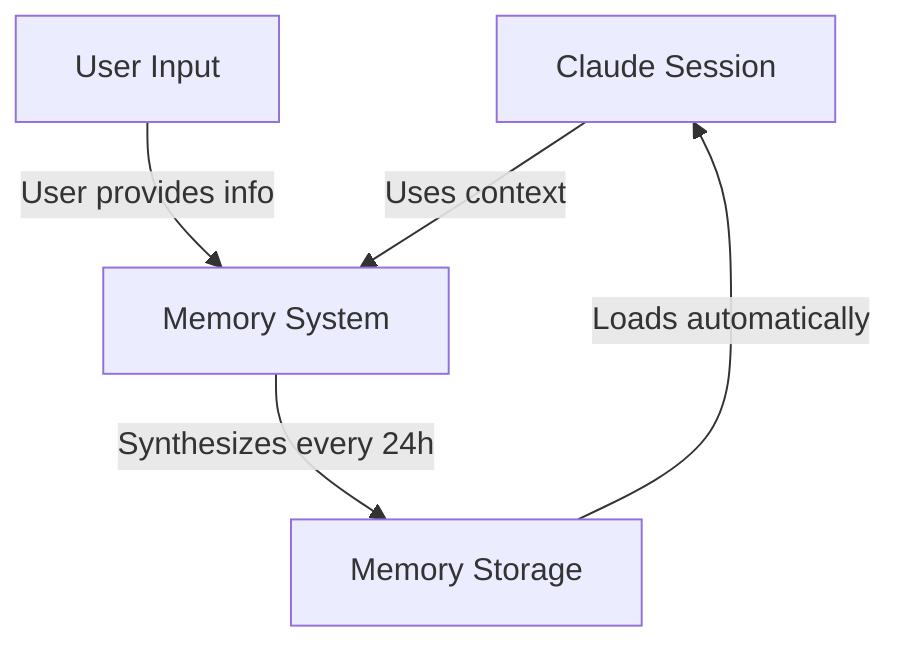
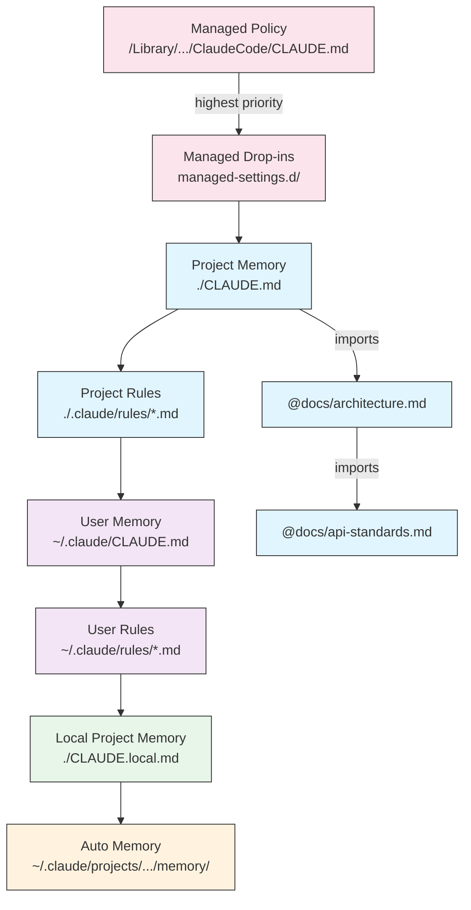
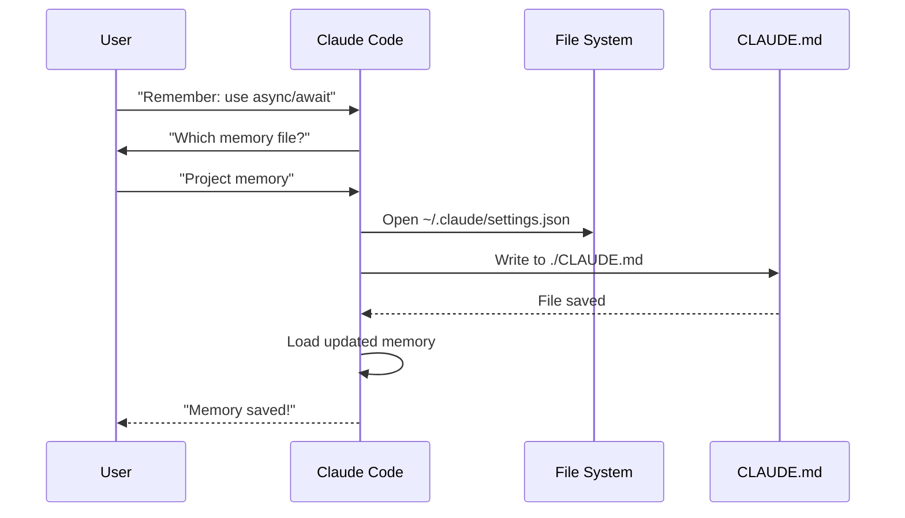
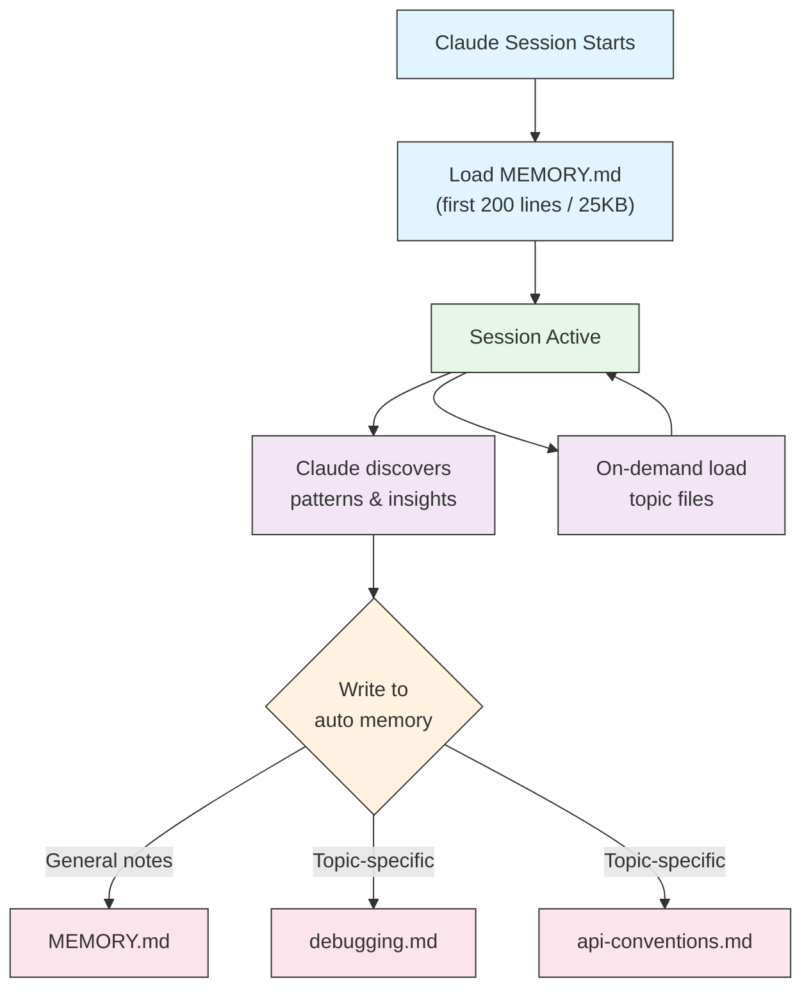
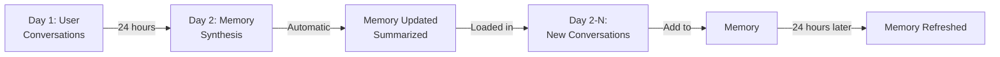

<picture>
  <source media="(prefers-color-scheme: dark)" srcset="../resources/logos/claude-howto-logo-dark.svg">
  
</picture>

# Guia de Memoria

La memoria permite a Claude retener contexto entre sesiones y conversaciones. Existe en dos formas: sintesis automatica en claude.ai, y archivos CLAUDE.md basados en el filesystem en Claude Code.

## Descripcion General

La memoria en Claude Code proporciona contexto persistente que se mantiene a traves de multiples sesiones y conversaciones. A diferencia de las ventanas de contexto temporales, los archivos de memoria permiten:

- Compartir estandares de proyecto con tu equipo
- Almacenar preferencias personales de desarrollo
- Mantener reglas y configuraciones especificas por directorio
- Importar documentacion externa
- Versionar la memoria como parte de tu proyecto

El sistema de memoria opera en multiples niveles, desde preferencias personales globales hasta subdirectorios especificos, permitiendo un control granular sobre lo que Claude recuerda y como aplica ese conocimiento.

## Referencia Rapida de Comandos de Memoria

| Comando | Proposito | Uso | Cuando Usar |
|---------|-----------|-----|-------------|
| `/init` | Inicializar memoria del proyecto | `/init` | Comenzando proyecto nuevo, primer setup de CLAUDE.md |
| `/memory` | Editar archivos de memoria en el editor | `/memory` | Actualizaciones extensas, reorganizacion, revision de contenido |
| Prefijo `#` | Agregar regla rapida de una linea | `# Tu regla aqui` | Agregar reglas rapidas durante la conversacion |
| `# new rule into memory` | Agregar regla explicita | `# new rule into memory<br/>Tu regla detallada` | Agregar reglas complejas multi-linea |
| `# remember this` | Memoria en lenguaje natural | `# remember this<br/>Tu instruccion` | Actualizaciones conversacionales de memoria |
| `@path/to/file` | Importar contenido externo | `@README.md` o `@docs/api.md` | Referenciar documentacion existente en CLAUDE.md |

## Inicio Rapido: Inicializar Memoria

### El Comando `/init`

El comando `/init` es la forma mas rapida de configurar la memoria del proyecto en Claude Code. Inicializa un archivo CLAUDE.md con documentacion fundacional del proyecto.

**Uso:**

```bash
/init
```

**Que hace:**

- Crea un nuevo archivo CLAUDE.md en tu proyecto (tipicamente en `./CLAUDE.md` o `./.claude/CLAUDE.md`)
- Establece convenciones y guias del proyecto
- Configura la base para persistencia de contexto entre sesiones
- Provee una estructura template para documentar los estandares de tu proyecto

**Modo interactivo mejorado:** Establece `CLAUDE_CODE_NEW_INIT=1` para habilitar un flujo interactivo multi-fase que te guia paso a paso por el setup del proyecto:

```bash
CLAUDE_CODE_NEW_INIT=1 claude
/init
```

**Cuando usar `/init`:**

- Comenzando un nuevo proyecto con Claude Code
- Estableciendo estandares de codificacion del equipo
- Creando documentacion sobre la estructura del codebase
- Configurando la jerarquia de memoria para desarrollo colaborativo

**Ejemplo de workflow:**

```markdown
# En el directorio de tu proyecto
/init

# Claude crea CLAUDE.md con estructura como:
# Project Configuration
## Project Overview
- Name: Tu Proyecto
- Tech Stack: [Tus tecnologias]
- Team Size: [Numero de desarrolladores]

## Development Standards
- Preferencias de estilo de codigo
- Requisitos de testing
- Convenciones de workflow de Git
```

### Actualizaciones Rapidas de Memoria con `#`

Podes agregar informacion a la memoria rapidamente durante cualquier conversacion comenzando tu mensaje con `#`:

**Sintaxis:**

```markdown
# Tu regla o instruccion de memoria aqui
```

**Ejemplos:**

```markdown
# Always use TypeScript strict mode in this project

# Prefer async/await over promise chains

# Run npm test before every commit

# Use kebab-case for file names
```

**Como funciona:**

1. Comenza tu mensaje con `#` seguido de tu regla
2. Claude reconoce esto como una solicitud de actualizacion de memoria
3. Claude pregunta a que archivo de memoria actualizar (proyecto o personal)
4. La regla se agrega al archivo CLAUDE.md correspondiente
5. Las sesiones futuras cargan automaticamente este contexto

**Patrones alternativos:**

```markdown
# new rule into memory
Always validate user input with Zod schemas

# remember this
Use semantic versioning for all releases

# add to memory
Database migrations must be reversible
```

### El Comando `/memory`

El comando `/memory` proporciona acceso directo para editar tus archivos de memoria CLAUDE.md dentro de las sesiones de Claude Code. Abre los archivos de memoria en tu editor del sistema para edicion completa.

**Uso:**

```bash
/memory
```

**Que hace:**

- Abre tus archivos de memoria en el editor por defecto de tu sistema
- Permite hacer adiciones, modificaciones y reorganizaciones extensas
- Proporciona acceso directo a todos los archivos de memoria en la jerarquia
- Habilita la gestion de contexto persistente entre sesiones

**Cuando usar `/memory`:**

- Revisar contenido de memoria existente
- Hacer actualizaciones extensas a estandares del proyecto
- Reorganizar la estructura de memoria
- Agregar documentacion o guias detalladas
- Mantener y actualizar la memoria a medida que tu proyecto evoluciona

**Comparacion: `/memory` vs `/init`**

| Aspecto | `/memory` | `/init` |
|---------|-----------|---------|
| **Proposito** | Editar archivos de memoria existentes | Inicializar nuevo CLAUDE.md |
| **Cuando usar** | Actualizar/modificar contexto del proyecto | Comenzar proyectos nuevos |
| **Accion** | Abre editor para cambios | Genera template inicial |
| **Workflow** | Mantenimiento continuo | Setup inicial unico |

**Ejemplo de workflow:**

```markdown
# Abrir memoria para edicion
/memory

# Claude presenta opciones:
# 1. Managed Policy Memory
# 2. Project Memory (./CLAUDE.md)
# 3. User Memory (~/.claude/CLAUDE.md)
# 4. Local Project Memory

# Elegir opcion 2 (Project Memory)
# Tu editor por defecto se abre con el contenido de ./CLAUDE.md

# Hacer cambios, guardar y cerrar editor
# Claude recarga automaticamente la memoria actualizada
```

**Usando Imports de Memoria:**

Los archivos CLAUDE.md soportan la sintaxis `@path/to/file` para incluir contenido externo:

```markdown
# Project Documentation
See @README.md for project overview
See @package.json for available npm commands
See @docs/architecture.md for system design

# Import from home directory using absolute path
@~/.claude/my-project-instructions.md
```

**Caracteristicas de import:**

- Se soportan tanto paths relativos como absolutos (ej. `@docs/api.md` o `@~/.claude/my-project-instructions.md`)
- Se soportan imports recursivos con una profundidad maxima de 5
- Los imports de ubicaciones externas por primera vez activan un dialogo de aprobacion por seguridad
- Las directivas de import no se evaluan dentro de spans o bloques de codigo markdown (documentarlos en ejemplos es seguro)
- Ayuda a evitar duplicacion referenciando documentacion existente
- Incluye automaticamente contenido referenciado en el contexto de Claude

## Arquitectura de Memoria

La memoria en Claude Code sigue un sistema jerarquico donde diferentes alcances sirven diferentes propositos:



## Jerarquia de Memoria en Claude Code

Claude Code usa un sistema de memoria jerarquico multi-nivel. Los archivos de memoria se cargan automaticamente cuando Claude Code se inicia, con archivos de nivel superior teniendo precedencia.

**Jerarquia Completa de Memoria (en orden de precedencia):**

1. **Managed Policy** - Instrucciones a nivel de organizacion
   - macOS: `/Library/Application Support/ClaudeCode/CLAUDE.md`
   - Linux/WSL: `/etc/claude-code/CLAUDE.md`
   - Windows: `C:\Program Files\ClaudeCode\CLAUDE.md`

2. **Managed Drop-ins** - Archivos de politica fusionados alfabeticamente (v2.1.83+)
   - Directorio `managed-settings.d/` junto al CLAUDE.md de politica administrada
   - Los archivos se fusionan en orden alfabetico para gestion modular de politicas

3. **Project Memory** - Contexto compartido del equipo (versionado)
   - `./.claude/CLAUDE.md` o `./CLAUDE.md` (en la raiz del repositorio)

4. **Project Rules** - Instrucciones modulares por tema del proyecto
   - `./.claude/rules/*.md`

5. **User Memory** - Preferencias personales (todos los proyectos)
   - `~/.claude/CLAUDE.md`

6. **User-Level Rules** - Reglas personales (todos los proyectos)
   - `~/.claude/rules/*.md`

7. **Local Project Memory** - Preferencias personales especificas del proyecto
   - `./CLAUDE.local.md`

> **Nota**: `CLAUDE.local.md` esta completamente soportado y documentado en la [documentacion oficial](https://code.claude.com/docs/en/memory). Proporciona preferencias personales especificas del proyecto que no se commitean al control de versiones. Agrega `CLAUDE.local.md` a tu `.gitignore`.

8. **Auto Memory** - Notas y aprendizajes automaticos de Claude
   - `~/.claude/projects/<project>/memory/`

**Comportamiento de Descubrimiento de Memoria:**

Claude busca archivos de memoria en este orden, con las ubicaciones anteriores teniendo precedencia:



## Excluir Archivos CLAUDE.md con `claudeMdExcludes`

En monorepos grandes, algunos archivos CLAUDE.md pueden ser irrelevantes para tu trabajo actual. La configuracion `claudeMdExcludes` permite omitir archivos CLAUDE.md especificos para que no se carguen en el contexto:

```jsonc
// En ~/.claude/settings.json o .claude/settings.json
{
  "claudeMdExcludes": [
    "packages/legacy-app/CLAUDE.md",
    "vendors/**/CLAUDE.md"
  ]
}
```

Los patrones se comparan contra paths relativos a la raiz del proyecto. Esto es particularmente util para:

- Monorepos con muchos sub-proyectos, donde solo algunos son relevantes
- Repositorios que contienen archivos CLAUDE.md de terceros o vendorizados
- Reducir ruido en la ventana de contexto de Claude excluyendo instrucciones obsoletas o no relacionadas

## Jerarquia de Archivos de Configuracion

Las configuraciones de Claude Code (incluyendo `autoMemoryDirectory`, `claudeMdExcludes` y otras) se resuelven desde una jerarquia de cinco niveles, con los niveles superiores teniendo precedencia:

| Nivel | Ubicacion | Alcance |
|-------|-----------|---------|
| 1 (Mayor) | Managed policy (nivel sistema) | Aplicacion organizacional |
| 2 | `managed-settings.d/` (v2.1.83+) | Drop-ins de politica modular, fusionados alfabeticamente |
| 3 | `~/.claude/settings.json` | Preferencias de usuario |
| 4 | `.claude/settings.json` | Nivel proyecto (commiteado a git) |
| 5 (Menor) | `.claude/settings.local.json` | Overrides locales (git-ignored) |

**Configuracion especifica de plataforma (v2.1.51+):**

Las configuraciones tambien se pueden establecer via:

- **macOS**: Archivos Property list (plist)
- **Windows**: Windows Registry

Estos mecanismos nativos de plataforma se leen junto con los archivos de configuracion JSON y siguen las mismas reglas de precedencia.

## Sistema de Reglas Modulares

Crea reglas organizadas y especificas por path usando la estructura de directorio `.claude/rules/`. Las reglas se pueden definir tanto a nivel de proyecto como de usuario:

```text
your-project/
├── .claude/
│   ├── CLAUDE.md
│   └── rules/
│       ├── code-style.md
│       ├── testing.md
│       ├── security.md
│       └── api/                  # Subdirectorios soportados
│           ├── conventions.md
│           └── validation.md

~/.claude/
├── CLAUDE.md
└── rules/                        # Reglas de usuario (todos los proyectos)
    ├── personal-style.md
    └── preferred-patterns.md
```

Las reglas se descubren recursivamente dentro del directorio `rules/`, incluyendo subdirectorios. Las reglas de usuario en `~/.claude/rules/` se cargan antes que las reglas del proyecto, permitiendo defaults personales que los proyectos pueden sobrescribir.

### Reglas Especificas por Path con Frontmatter YAML

Define reglas que aplican solo a paths especificos de archivos:

```markdown
---
paths: src/api/**/*.ts
---

# API Development Rules

- All API endpoints must include input validation
- Use Zod for schema validation
- Document all parameters and response types
- Include error handling for all operations
```

**Ejemplos de Patrones Glob:**

- `**/*.ts` - Todos los archivos TypeScript
- `src/**/*` - Todos los archivos bajo src/
- `src/**/*.{ts,tsx}` - Multiples extensiones
- `{src,lib}/**/*.ts, tests/**/*.test.ts` - Multiples patrones

### Subdirectorios y Symlinks

Las reglas en `.claude/rules/` soportan dos caracteristicas organizacionales:

- **Subdirectorios**: Las reglas se descubren recursivamente, permitiendo organizarlas en carpetas por tema (ej. `rules/api/`, `rules/testing/`, `rules/security/`)
- **Symlinks**: Se soportan symlinks para compartir reglas entre multiples proyectos. Por ejemplo, podes hacer symlink de un archivo de regla compartido desde una ubicacion central al directorio `.claude/rules/` de cada proyecto

## Tabla de Ubicaciones de Memoria

| Ubicacion | Alcance | Prioridad | Compartido | Acceso | Ideal Para |
|-----------|---------|-----------|------------|--------|------------|
| `/Library/Application Support/ClaudeCode/CLAUDE.md` (macOS) | Managed Policy | 1 (Mayor) | Organizacion | Sistema | Politicas de empresa |
| `/etc/claude-code/CLAUDE.md` (Linux/WSL) | Managed Policy | 1 (Mayor) | Organizacion | Sistema | Estandares organizacionales |
| `C:\Program Files\ClaudeCode\CLAUDE.md` (Windows) | Managed Policy | 1 (Mayor) | Organizacion | Sistema | Guias corporativas |
| `managed-settings.d/*.md` (junto a policy) | Managed Drop-ins | 1.5 | Organizacion | Sistema | Archivos de politica modular (v2.1.83+) |
| `./CLAUDE.md` o `./.claude/CLAUDE.md` | Project Memory | 2 | Equipo | Git | Estandares de equipo, arquitectura compartida |
| `./.claude/rules/*.md` | Project Rules | 3 | Equipo | Git | Reglas modulares por path |
| `~/.claude/CLAUDE.md` | User Memory | 4 | Individual | Filesystem | Preferencias personales (todos los proyectos) |
| `~/.claude/rules/*.md` | User Rules | 5 | Individual | Filesystem | Reglas personales (todos los proyectos) |
| `./CLAUDE.local.md` | Project Local | 6 | Individual | Git (ignored) | Preferencias personales del proyecto |
| `~/.claude/projects/<project>/memory/` | Auto Memory | 7 (Menor) | Individual | Filesystem | Notas y aprendizajes automaticos de Claude |

## Ciclo de Vida de Actualizacion de Memoria

Asi fluyen las actualizaciones de memoria a traves de tus sesiones de Claude Code:



## Auto Memory

Auto memory es un directorio persistente donde Claude registra automaticamente aprendizajes, patrones e insights mientras trabaja con tu proyecto. A diferencia de los archivos CLAUDE.md que vos escribis y mantenes manualmente, la auto memory es escrita por Claude mismo durante las sesiones.

### Como Funciona Auto Memory

- **Ubicacion**: `~/.claude/projects/<project>/memory/`
- **Punto de entrada**: `MEMORY.md` sirve como archivo principal en el directorio de auto memory
- **Archivos por tema**: Archivos adicionales opcionales para temas especificos (ej. `debugging.md`, `api-conventions.md`)
- **Comportamiento de carga**: Las primeras 200 lineas de `MEMORY.md` (o los primeros 25KB, lo que ocurra primero) se cargan en el contexto al inicio de la sesion. Los archivos por tema se cargan bajo demanda, no al inicio.
- **Lectura/escritura**: Claude lee y escribe archivos de memoria durante las sesiones a medida que descubre patrones y conocimiento especifico del proyecto

### Arquitectura de Auto Memory



### Estructura del Directorio de Auto Memory

```text
~/.claude/projects/<project>/memory/
├── MEMORY.md              # Punto de entrada (primeras 200 lineas / 25KB cargadas al inicio)
├── debugging.md           # Archivo por tema (cargado bajo demanda)
├── api-conventions.md     # Archivo por tema (cargado bajo demanda)
└── testing-patterns.md    # Archivo por tema (cargado bajo demanda)
```

### Requisito de Version

Auto memory requiere **Claude Code v2.1.59 o posterior**. Si estas en una version anterior, actualiza primero:

```bash
npm install -g @anthropic-ai/claude-code@latest
```

### Directorio Personalizado de Auto Memory

Por defecto, auto memory se almacena en `~/.claude/projects/<project>/memory/`. Podes cambiar esta ubicacion usando la configuracion `autoMemoryDirectory` (disponible desde **v2.1.74**):

```jsonc
// En ~/.claude/settings.json o .claude/settings.local.json (solo configuracion de usuario/local)
{
  "autoMemoryDirectory": "/path/to/custom/memory/directory"
}
```

> **Nota**: `autoMemoryDirectory` solo se puede establecer en configuracion de usuario (`~/.claude/settings.json`) o local (`.claude/settings.local.json`), no en configuracion de proyecto o managed policy.

Esto es util cuando queres:

- Almacenar auto memory en una ubicacion compartida o sincronizada
- Separar auto memory del directorio de configuracion de Claude por defecto
- Usar un path especifico del proyecto fuera de la jerarquia por defecto

### Compartir entre Worktree y Repositorio

Todos los worktrees y subdirectorios dentro del mismo repositorio git comparten un unico directorio de auto memory. Esto significa que cambiar entre worktrees o trabajar en diferentes subdirectorios del mismo repo leera y escribira en los mismos archivos de memoria.

### Memoria de Subagentes

Los subagentes (creados via herramientas como Task o ejecucion paralela) pueden tener su propio contexto de memoria. Usa el campo de frontmatter `memory` en la definicion del subagente para especificar que alcances de memoria cargar:

```yaml
memory: user      # Cargar solo memoria de usuario
memory: project   # Cargar solo memoria de proyecto
memory: local     # Cargar solo memoria local
```

Esto permite a los subagentes operar con contexto enfocado en lugar de heredar la jerarquia completa de memoria.

> **Nota**: Los subagentes tambien pueden mantener su propia auto memory. Consulta la [documentacion oficial de memoria de subagentes](https://code.claude.com/docs/en/sub-agents#enable-persistent-memory) para mas detalles.

### Controlar Auto Memory

Auto memory se puede controlar via la variable de entorno `CLAUDE_CODE_DISABLE_AUTO_MEMORY`:

| Valor | Comportamiento |
|-------|---------------|
| `0` | Forzar auto memory **activada** |
| `1` | Forzar auto memory **desactivada** |
| *(sin establecer)* | Comportamiento por defecto (auto memory habilitada) |

```bash
# Desactivar auto memory para una sesion
CLAUDE_CODE_DISABLE_AUTO_MEMORY=1 claude

# Forzar auto memory activada explicitamente
CLAUDE_CODE_DISABLE_AUTO_MEMORY=0 claude
```

## Directorios Adicionales con `--add-dir`

El flag `--add-dir` permite a Claude Code cargar archivos CLAUDE.md de directorios adicionales mas alla del directorio de trabajo actual. Esto es util para monorepos o configuraciones multi-proyecto donde el contexto de otros directorios es relevante.

Para habilitar esta funcionalidad, establece la variable de entorno:

```bash
CLAUDE_CODE_ADDITIONAL_DIRECTORIES_CLAUDE_MD=1
```

Luego lanza Claude Code con el flag:

```bash
claude --add-dir /path/to/other/project
```

Claude cargara CLAUDE.md del directorio adicional especificado junto con los archivos de memoria de tu directorio de trabajo actual.

## Ejemplos Practicos

### Ejemplo 1: Estructura de Memoria de Proyecto

**Archivo:** `./CLAUDE.md`

```markdown
# Project Configuration

## Project Overview
- **Name**: E-commerce Platform
- **Tech Stack**: Node.js, PostgreSQL, React 18, Docker
- **Team Size**: 5 developers
- **Deadline**: Q4 2025

## Architecture
@docs/architecture.md
@docs/api-standards.md
@docs/database-schema.md

## Development Standards

### Code Style
- Use Prettier for formatting
- Use ESLint with airbnb config
- Maximum line length: 100 characters
- Use 2-space indentation

### Naming Conventions
- **Files**: kebab-case (user-controller.js)
- **Classes**: PascalCase (UserService)
- **Functions/Variables**: camelCase (getUserById)
- **Constants**: UPPER_SNAKE_CASE (API_BASE_URL)
- **Database Tables**: snake_case (user_accounts)

### Git Workflow
- Branch names: `feature/description` or `fix/description`
- Commit messages: Follow conventional commits
- PR required before merge
- All CI/CD checks must pass
- Minimum 1 approval required

### Testing Requirements
- Minimum 80% code coverage
- All critical paths must have tests
- Use Jest for unit tests
- Use Cypress for E2E tests
- Test filenames: `*.test.ts` or `*.spec.ts`

### API Standards
- RESTful endpoints only
- JSON request/response
- Use HTTP status codes correctly
- Version API endpoints: `/api/v1/`
- Document all endpoints with examples

### Database
- Use migrations for schema changes
- Never hardcode credentials
- Use connection pooling
- Enable query logging in development
- Regular backups required

### Deployment
- Docker-based deployment
- Kubernetes orchestration
- Blue-green deployment strategy
- Automatic rollback on failure
- Database migrations run before deploy

## Common Commands

| Command | Purpose |
|---------|---------|
| `npm run dev` | Start development server |
| `npm test` | Run test suite |
| `npm run lint` | Check code style |
| `npm run build` | Build for production |
| `npm run migrate` | Run database migrations |

## Team Contacts
- Tech Lead: Sarah Chen (@sarah.chen)
- Product Manager: Mike Johnson (@mike.j)
- DevOps: Alex Kim (@alex.k)

## Known Issues & Workarounds
- PostgreSQL connection pooling limited to 20 during peak hours
- Workaround: Implement query queuing
- Safari 14 compatibility issues with async generators
- Workaround: Use Babel transpiler

## Related Projects
- Analytics Dashboard: `/projects/analytics`
- Mobile App: `/projects/mobile`
- Admin Panel: `/projects/admin`
```

### Ejemplo 2: Memoria Especifica por Directorio

**Archivo:** `./src/api/CLAUDE.md`

````markdown
# API Module Standards

This file overrides root CLAUDE.md for everything in /src/api/

## API-Specific Standards

### Request Validation
- Use Zod for schema validation
- Always validate input
- Return 400 with validation errors
- Include field-level error details

### Authentication
- All endpoints require JWT token
- Token in Authorization header
- Token expires after 24 hours
- Implement refresh token mechanism

### Response Format

All responses must follow this structure:

```json
{
  "success": true,
  "data": { /* actual data */ },
  "timestamp": "2025-11-06T10:30:00Z",
  "version": "1.0"
}
```

Error responses:

```json
{
  "success": false,
  "error": {
    "code": "VALIDATION_ERROR",
    "message": "User message",
    "details": { /* field errors */ }
  },
  "timestamp": "2025-11-06T10:30:00Z"
}
```

### Pagination
- Use cursor-based pagination (not offset)
- Include `hasMore` boolean
- Limit max page size to 100
- Default page size: 20

### Rate Limiting
- 1000 requests per hour for authenticated users
- 100 requests per hour for public endpoints
- Return 429 when exceeded
- Include retry-after header

### Caching
- Use Redis for session caching
- Cache duration: 5 minutes default
- Invalidate on write operations
- Tag cache keys with resource type
````

### Ejemplo 3: Memoria Personal

**Archivo:** `~/.claude/CLAUDE.md`

```markdown
# My Development Preferences

## About Me
- **Experience Level**: 8 years full-stack development
- **Preferred Languages**: TypeScript, Python
- **Communication Style**: Direct, with examples
- **Learning Style**: Visual diagrams with code

## Code Preferences

### Error Handling
I prefer explicit error handling with try-catch blocks and meaningful error messages.
Avoid generic errors. Always log errors for debugging.

### Comments
Use comments for WHY, not WHAT. Code should be self-documenting.
Comments should explain business logic or non-obvious decisions.

### Testing
I prefer TDD (test-driven development).
Write tests first, then implementation.
Focus on behavior, not implementation details.

### Architecture
I prefer modular, loosely-coupled design.
Use dependency injection for testability.
Separate concerns (Controllers, Services, Repositories).

## Debugging Preferences
- Use console.log with prefix: `[DEBUG]`
- Include context: function name, relevant variables
- Use stack traces when available
- Always include timestamps in logs

## Communication
- Explain complex concepts with diagrams
- Show concrete examples before explaining theory
- Include before/after code snippets
- Summarize key points at the end

## Project Organization
I organize my projects as:

   project/
   ├── src/
   │   ├── api/
   │   ├── services/
   │   ├── models/
   │   └── utils/
   ├── tests/
   ├── docs/
   └── docker/

## Tooling
- **IDE**: VS Code with vim keybindings
- **Terminal**: Zsh with Oh-My-Zsh
- **Format**: Prettier (100 char line length)
- **Linter**: ESLint with airbnb config
- **Test Framework**: Jest with React Testing Library
```

_Mi Test_
Pedile a Claude que guarde una nueva regla


Claude no guardo la regla porque no tenia ningun archivo `Claude.md` en ningun lugar. Luego le pidio a Claude que confirme la ubicacion.


### Ejemplo 4: Actualizacion de Memoria Durante la Sesion

Podes agregar nuevas reglas a la memoria durante una sesion activa de Claude Code. Hay dos formas de hacerlo:

#### Metodo 1: Solicitud Directa

```markdown
User: Remember that I prefer using React hooks instead of class components
     for all new components.

Claude: I'm adding that to your memory. Which memory file should this go in?
        1. Project memory (./CLAUDE.md)
        2. Personal memory (~/.claude/CLAUDE.md)

User: Project memory

Claude: Memory saved!

Added to ./CLAUDE.md:
---

### Component Development
- Use functional components with React Hooks
- Prefer hooks over class components
- Custom hooks for reusable logic
- Use useCallback for event handlers
- Use useMemo for expensive computations
```

#### Metodo 2: Usando el Patron "# new rule into memory"

Tambien podes usar el patron explicito "# new rule into memory" para disparar actualizaciones de memoria:

```markdown
User: # new rule into memory
      Always validate user input with Zod schemas before processing.

Claude: I'm saving this rule to memory. Which memory file should I use?
        1. Project memory (./CLAUDE.md)
        2. Personal memory (~/.claude/CLAUDE.md)

User: Project memory

Claude: Memory saved!

Added to ./CLAUDE.md:
---

### Input Validation
- Always validate user input with Zod schemas before processing
- Define schemas at the top of each API handler file
- Return 400 status with validation errors
```

#### Tips para Agregar Memoria

- Se especifico y accionable en tus reglas
- Agrupa reglas relacionadas bajo un encabezado de seccion
- Actualiza secciones existentes en lugar de duplicar contenido
- Elegi el alcance de memoria apropiado (proyecto vs. personal)

## Comparacion de Funcionalidades de Memoria

| Funcionalidad | Claude Web/Desktop | Claude Code (CLAUDE.md) |
|---------------|-------------------|------------------------|
| Auto-sintesis | Cada 24h | Auto memory |
| Entre proyectos | Compartido | Especifico por proyecto |
| Acceso de equipo | Proyectos compartidos | Trackeado por Git |
| Buscable | Integrado | A traves de `/memory` |
| Editable | En el chat | Edicion directa de archivo |
| Import/Export | Si | Copiar/pegar |
| Persistente | 24h+ | Indefinido |

### Memoria en Claude Web/Desktop

#### Linea de Tiempo de Sintesis de Memoria



**Ejemplo de Resumen de Memoria:**

```markdown
## Claude's Memory of User

### Professional Background
- Senior full-stack developer with 8 years experience
- Focus on TypeScript/Node.js backends and React frontends
- Active open source contributor
- Interested in AI and machine learning

### Project Context
- Currently building e-commerce platform
- Tech stack: Node.js, PostgreSQL, React 18, Docker
- Working with team of 5 developers
- Using CI/CD and blue-green deployments

### Communication Preferences
- Prefers direct, concise explanations
- Likes visual diagrams and examples
- Appreciates code snippets
- Explains business logic in comments

### Current Goals
- Improve API performance
- Increase test coverage to 90%
- Implement caching strategy
- Document architecture
```

## Buenas Practicas

### Hacer - Que Incluir

- **Se especifico y detallado**: Usa instrucciones claras y detalladas en lugar de guias vagas
  - Bien: "Use 2-space indentation for all JavaScript files"
  - Evitar: "Follow best practices"

- **Mantene organizado**: Estructura los archivos de memoria con secciones y encabezados claros en markdown

- **Usa los niveles de jerarquia apropiados**:
  - **Managed policy**: Politicas de empresa, estandares de seguridad, requisitos de cumplimiento
  - **Project memory**: Estandares de equipo, arquitectura, convenciones de codificacion (commitear a git)
  - **User memory**: Preferencias personales, estilo de comunicacion, elecciones de herramientas
  - **Directory memory**: Reglas y overrides especificos del modulo

- **Aprovecha los imports**: Usa la sintaxis `@path/to/file` para referenciar documentacion existente
  - Soporta hasta 5 niveles de anidamiento recursivo
  - Evita duplicacion entre archivos de memoria
  - Ejemplo: `See @README.md for project overview`

- **Documenta comandos frecuentes**: Incluye comandos que usas repetidamente para ahorrar tiempo

- **Versiona la memoria del proyecto**: Commitea archivos CLAUDE.md de nivel de proyecto a git para beneficio del equipo

- **Revisa periodicamente**: Actualiza la memoria regularmente a medida que los proyectos evolucionan y los requisitos cambian

- **Proporciona ejemplos concretos**: Incluye fragmentos de codigo y escenarios especificos

### No Hacer - Que Evitar

- **No almacenes secretos**: Nunca incluyas claves API, passwords, tokens o credenciales

- **No incluyas datos sensibles**: Sin PII, informacion privada o secretos propietarios

- **No dupliques contenido**: Usa imports (`@path`) para referenciar documentacion existente

- **No seas vago**: Evita declaraciones genericas como "follow best practices" o "write good code"

- **No lo hagas demasiado largo**: Mantene los archivos de memoria individuales enfocados y bajo 500 lineas

- **No sobre-organices**: Usa la jerarquia estrategicamente; no crees overrides excesivos de subdirectorios

- **No te olvides de actualizar**: Memoria obsoleta puede causar confusion y practicas desactualizadas

- **No excedas los limites de anidamiento**: Los imports de memoria soportan hasta 5 niveles de anidamiento

### Tips de Gestion de Memoria

**Elegi el nivel de memoria correcto:**

| Caso de Uso | Nivel de Memoria | Razon |
|-------------|-----------------|-------|
| Politica de seguridad de empresa | Managed Policy | Aplica a todos los proyectos de la organizacion |
| Guia de estilo de codigo del equipo | Project | Compartida con el equipo via git |
| Tus atajos de editor preferidos | User | Preferencia personal, no compartida |
| Estandares del modulo API | Directory | Especifico solo para ese modulo |

**Workflow de actualizacion rapida:**

1. Para reglas individuales: Usa el prefijo `#` en la conversacion
2. Para multiples cambios: Usa `/memory` para abrir el editor
3. Para setup inicial: Usa `/init` para crear template

**Buenas practicas de import:**

```markdown
# Bien: Referenciar docs existentes
@README.md
@docs/architecture.md
@package.json

# Evitar: Copiar contenido que existe en otro lugar
# En lugar de copiar contenido del README a CLAUDE.md, simplemente importalo
```

## Instrucciones de Instalacion

### Configurar Memoria de Proyecto

#### Metodo 1: Usando el Comando `/init` (Recomendado)

La forma mas rapida de configurar la memoria del proyecto:

1. **Navega a tu directorio de proyecto:**

   ```bash
   cd /path/to/your/project
   ```

2. **Ejecuta el comando init en Claude Code:**

   ```bash
   /init
   ```

3. **Claude creara y llenara CLAUDE.md** con una estructura template

4. **Personaliza el archivo generado** segun las necesidades de tu proyecto

5. **Commitea a git:**

   ```bash
   git add CLAUDE.md
   git commit -m "Initialize project memory with /init"
   ```

#### Metodo 2: Creacion Manual

Si preferis setup manual:

1. **Crea un CLAUDE.md en la raiz de tu proyecto:**

   ```bash
   cd /path/to/your/project
   touch CLAUDE.md
   ```

2. **Agrega estandares del proyecto:**

   ```bash
   cat > CLAUDE.md << 'EOF'
   # Project Configuration

   ## Project Overview
   - **Name**: Your Project Name
   - **Tech Stack**: List your technologies
   - **Team Size**: Number of developers

   ## Development Standards
   - Your coding standards
   - Naming conventions
   - Testing requirements
   EOF
   ```

3. **Commitea a git:**

   ```bash
   git add CLAUDE.md
   git commit -m "Add project memory configuration"
   ```

#### Metodo 3: Actualizaciones Rapidas con `#`

Una vez que CLAUDE.md existe, agrega reglas rapidamente durante conversaciones:

```markdown
# Use semantic versioning for all releases

# Always run tests before committing

# Prefer composition over inheritance
```

Claude te pedira que elijas a que archivo de memoria actualizar.

### Configurar Memoria Personal

1. **Crea el directorio ~/.claude:**

   ```bash
   mkdir -p ~/.claude
   ```

2. **Crea tu CLAUDE.md personal:**

   ```bash
   touch ~/.claude/CLAUDE.md
   ```

3. **Agrega tus preferencias:**

   ```bash
   cat > ~/.claude/CLAUDE.md << 'EOF'
   # My Development Preferences

   ## About Me
   - Experience Level: [Tu nivel]
   - Preferred Languages: [Tus lenguajes]
   - Communication Style: [Tu estilo]

   ## Code Preferences
   - [Tus preferencias]
   EOF
   ```

### Configurar Memoria Especifica por Directorio

1. **Crea memoria para directorios especificos:**

   ```bash
   mkdir -p /path/to/directory/.claude
   touch /path/to/directory/CLAUDE.md
   ```

2. **Agrega reglas especificas del directorio:**

   ```bash
   cat > /path/to/directory/CLAUDE.md << 'EOF'
   # [Directory Name] Standards

   This file overrides root CLAUDE.md for this directory.

   ## [Specific Standards]
   EOF
   ```

3. **Commitea al control de versiones:**

   ```bash
   git add /path/to/directory/CLAUDE.md
   git commit -m "Add [directory] memory configuration"
   ```

### Verificar Setup

1. **Verifica las ubicaciones de memoria:**

   ```bash
   # Memoria raiz del proyecto
   ls -la ./CLAUDE.md

   # Memoria personal
   ls -la ~/.claude/CLAUDE.md
   ```

2. **Claude Code cargara automaticamente** estos archivos al iniciar una sesion

3. **Probalo con Claude Code** iniciando una nueva sesion en tu proyecto

## Documentacion Oficial

Para informacion mas actualizada, consulta la documentacion oficial de Claude Code:

- **[Documentacion de Memoria](https://code.claude.com/docs/en/memory)** - Referencia completa del sistema de memoria
- **[Referencia de Slash Commands](https://code.claude.com/docs/en/interactive-mode)** - Todos los comandos integrados incluyendo `/init` y `/memory`
- **[Referencia de CLI](https://code.claude.com/docs/en/cli-reference)** - Documentacion de la interfaz de linea de comandos

### Detalles Tecnicos Clave de la Documentacion Oficial

**Carga de Memoria:**

- Todos los archivos de memoria se cargan automaticamente cuando Claude Code se inicia
- Claude recorre hacia arriba desde el directorio de trabajo actual para descubrir archivos CLAUDE.md
- Los archivos de subarbol se descubren y cargan contextualmente al acceder a esos directorios

**Sintaxis de Import:**

- Usa `@path/to/file` para incluir contenido externo (ej. `@~/.claude/my-project-instructions.md`)
- Soporta paths relativos y absolutos
- Imports recursivos soportados con profundidad maxima de 5
- Los imports externos por primera vez activan un dialogo de aprobacion
- No se evaluan dentro de spans o bloques de codigo markdown
- Incluye automaticamente contenido referenciado en el contexto de Claude

**Precedencia de Jerarquia de Memoria:**

1. Managed Policy (mayor precedencia)
2. Managed Drop-ins (`managed-settings.d/`, v2.1.83+)
3. Project Memory
4. Project Rules (`.claude/rules/`)
5. User Memory
6. User-Level Rules (`~/.claude/rules/`)
7. Local Project Memory
8. Auto Memory (menor precedencia)

## Links de Conceptos Relacionados

### Puntos de Integracion

- [Protocolo MCP](../05-mcp/) - Acceso a datos en vivo junto con memoria
- [Slash Commands](../01-slash-commands/) - Atajos especificos de sesion
- [Skills](../03-skills/) - Workflows automatizados con contexto de memoria

### Funcionalidades Relacionadas de Claude

- [Claude Web Memory](https://claude.ai) - Sintesis automatica
- [Documentacion Oficial de Memoria](https://code.claude.com/docs/en/memory) - Documentacion de Anthropic

---

**Ultima Actualizacion**: Abril 2026
**Version de Claude Code**: 2.1+
**Modelos Compatibles**: Claude Sonnet 4.6, Claude Opus 4.6, Claude Haiku 4.5
