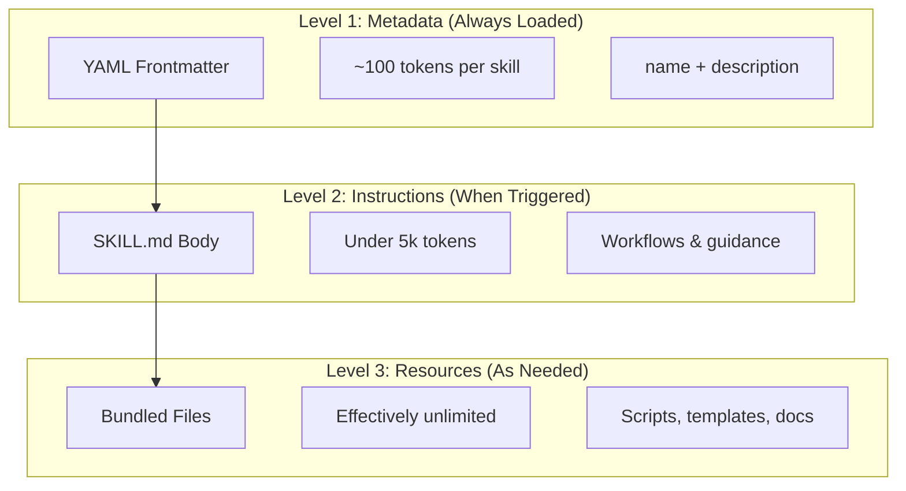
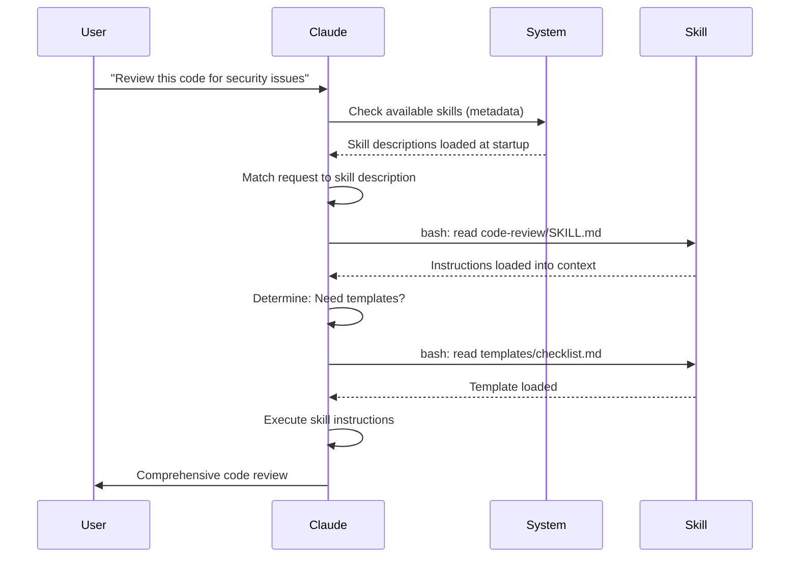

<picture>
  <source media="(prefers-color-scheme: dark)" srcset="../resources/logos/claude-howto-logo-dark.svg">
  
</picture>

# Guia de Agent Skills

Los Agent Skills son capacidades reutilizables basadas en el sistema de archivos que amplian la funcionalidad de Claude. Empaquetan expertise especifico de un dominio, workflows y buenas practicas en componentes descubribles que Claude usa automaticamente cuando son relevantes.

## Descripcion general

Los **Agent Skills** son capacidades modulares que transforman agentes de proposito general en especialistas. A diferencia de los prompts (instrucciones a nivel de conversacion para tareas puntuales), los Skills se cargan bajo demanda y eliminan la necesidad de proporcionar la misma orientacion repetidamente en multiples conversaciones.

### Beneficios clave

- **Especializar a Claude**: Adapta las capacidades para tareas especificas de un dominio
- **Reducir la repeticion**: Crea una vez, usa automaticamente en multiples conversaciones
- **Componer capacidades**: Combina Skills para construir workflows complejos
- **Escalar workflows**: Reutiliza skills en multiples proyectos y equipos
- **Mantener calidad**: Incorpora buenas practicas directamente en tu workflow

Los Skills siguen el estandar abierto [Agent Skills](https://agentskills.io), que funciona en multiples herramientas de IA. Claude Code extiende el estandar con caracteristicas adicionales como control de invocacion, ejecucion de subagentes e inyeccion dinamica de contexto.

> **Nota**: Los slash commands personalizados han sido integrados en los skills. Los archivos `.claude/commands/` siguen funcionando y admiten los mismos campos de frontmatter. Se recomienda usar Skills para nuevos desarrollos. Cuando ambos existen en la misma ruta (por ejemplo, `.claude/commands/review.md` y `.claude/skills/review/SKILL.md`), el skill tiene precedencia.

## Como funcionan los Skills: Divulgacion progresiva

Los Skills aprovechan una arquitectura de **divulgacion progresiva**: Claude carga informacion en etapas segun sea necesario, en lugar de consumir contexto de entrada. Esto permite una gestion eficiente del contexto mientras mantiene una escalabilidad ilimitada.

### Tres niveles de carga



| Nivel | Cuando se carga | Costo en tokens | Contenido |
|-------|----------------|-----------------|-----------|
| **Nivel 1: Metadata** | Siempre (al inicio) | ~100 tokens por Skill | `name` y `description` del frontmatter YAML |
| **Nivel 2: Instrucciones** | Cuando se activa el Skill | Menos de 5k tokens | Cuerpo del SKILL.md con instrucciones y orientacion |
| **Nivel 3+: Recursos** | Segun sea necesario | Practicamente ilimitado | Archivos incluidos ejecutados via bash sin cargar su contenido en el contexto |

Esto significa que podes instalar muchos Skills sin penalidad de contexto: Claude solo sabe que cada Skill existe y cuando usarlo hasta que sea activado.

## Proceso de carga de un Skill



## Tipos y ubicaciones de Skills

| Tipo | Ubicacion | Alcance | Compartido | Ideal para |
|------|-----------|---------|------------|------------|
| **Enterprise** | Configuracion gestionada | Todos los usuarios de la org | Si | Estandares de toda la organizacion |
| **Personal** | `~/.claude/skills/<skill-name>/SKILL.md` | Individual | No | Workflows personales |
| **Proyecto** | `.claude/skills/<skill-name>/SKILL.md` | Equipo | Si (via git) | Estandares del equipo |
| **Plugin** | `<plugin>/skills/<skill-name>/SKILL.md` | Donde este habilitado | Depende | Incluido con plugins |

Cuando los skills comparten el mismo nombre en distintos niveles, ganan las ubicaciones de mayor prioridad: **enterprise > personal > proyecto**. Los skills de plugin usan un espacio de nombres `plugin-name:skill-name`, por lo que no pueden generar conflictos.

### Descubrimiento automatico

**Directorios anidados**: Cuando trabajas con archivos en subdirectorios, Claude Code descubre automaticamente los skills de los directorios `.claude/skills/` anidados. Por ejemplo, si estas editando un archivo en `packages/frontend/`, Claude Code tambien busca skills en `packages/frontend/.claude/skills/`. Esto soporta configuraciones de monorepo donde los paquetes tienen sus propios skills.

**Directorios `--add-dir`**: Los skills de directorios agregados via `--add-dir` se cargan automaticamente con deteccion de cambios en vivo. Cualquier edicion a los archivos de skill en esos directorios tiene efecto inmediato sin reiniciar Claude Code.

**Presupuesto de descripcion**: Las descripciones de los Skills (metadata de Nivel 1) estan limitadas al **1% de la ventana de contexto** (valor alternativo: **8.000 caracteres**). Si tenes muchos skills instalados, las descripciones podrian acortarse. Siempre se incluyen todos los nombres de skills, pero las descripciones se recortan para caber. Pone la informacion clave al inicio de las descripciones. Podes sobrescribir el presupuesto con la variable de entorno `SLASH_COMMAND_TOOL_CHAR_BUDGET`.

## Creando Skills personalizados

### Estructura de directorio basica

```
my-skill/
├── SKILL.md           # Main instructions (required)
├── template.md        # Template for Claude to fill in
├── examples/
│   └── sample.md      # Example output showing expected format
└── scripts/
    └── validate.sh    # Script Claude can execute
```

### Formato del SKILL.md

```yaml
---
name: your-skill-name
description: Brief description of what this Skill does and when to use it
---

# Your Skill Name

## Instructions
Provide clear, step-by-step guidance for Claude.

## Examples
Show concrete examples of using this Skill.
```

### Campos requeridos

- **name**: solo letras minusculas, numeros y guiones (max 64 caracteres). No puede contener "anthropic" ni "claude".
- **description**: que hace el Skill Y cuando usarlo (max 1024 caracteres). Esto es critico para que Claude sepa cuando activar el skill.

### Campos opcionales del frontmatter

```yaml
---
name: my-skill
description: What this skill does and when to use it
argument-hint: "[filename] [format]"        # Hint for autocomplete
disable-model-invocation: true              # Only user can invoke
user-invocable: false                       # Hide from slash menu
allowed-tools: Read, Grep, Glob             # Restrict tool access
model: opus                                 # Specific model to use
effort: high                                # Effort level override (low, medium, high, max)
context: fork                               # Run in isolated subagent
agent: Explore                              # Which agent type (with context: fork)
shell: bash                                 # Shell for commands: bash (default) or powershell
hooks:                                      # Skill-scoped hooks
  PreToolUse:
    - matcher: "Bash"
      hooks:
        - type: command
          command: "./scripts/validate.sh"
paths: "src/api/**/*.ts"               # Glob patterns limiting when skill activates
---
```

| Campo | Descripcion |
|-------|-------------|
| `name` | Solo letras minusculas, numeros y guiones (max 64 caracteres). No puede contener "anthropic" ni "claude". |
| `description` | Que hace el Skill Y cuando usarlo (max 1024 caracteres). Critico para la coincidencia de auto-invocacion. |
| `argument-hint` | Sugerencia mostrada en el menu de autocompletado `/` (por ejemplo, `"[filename] [format]"`). |
| `disable-model-invocation` | `true` = solo el usuario puede invocar via `/name`. Claude nunca lo auto-invocara. |
| `user-invocable` | `false` = oculto del menu `/`. Solo Claude puede invocarlo automaticamente. |
| `allowed-tools` | Lista separada por comas de herramientas que el skill puede usar sin solicitudes de permiso. |
| `model` | Sobrescritura de modelo mientras el skill esta activo (por ejemplo, `opus`, `sonnet`). |
| `effort` | Sobrescritura del nivel de esfuerzo mientras el skill esta activo: `low`, `medium`, `high` o `max`. |
| `context` | `fork` para ejecutar el skill en un contexto de subagente bifurcado con su propia ventana de contexto. |
| `agent` | Tipo de subagente cuando `context: fork` (por ejemplo, `Explore`, `Plan`, `general-purpose`). |
| `shell` | Shell usado para las sustituciones `` !`command` `` y scripts: `bash` (por defecto) o `powershell`. |
| `hooks` | Hooks con alcance al ciclo de vida de este skill (mismo formato que los hooks globales). |
| `paths` | Patrones glob que limitan cuando el skill se activa automaticamente. String separado por comas o lista YAML. Mismo formato que las reglas especificas de ruta. |

## Tipos de contenido de un Skill

Los Skills pueden contener dos tipos de contenido, cada uno adecuado para distintos propositos:

### Contenido de referencia

Agrega conocimiento que Claude aplica a tu trabajo actual: convenciones, patrones, guias de estilo, conocimiento de dominio. Se ejecuta de forma inline en el contexto de tu conversacion.

```yaml
---
name: api-conventions
description: API design patterns for this codebase
---

When writing API endpoints:
- Use RESTful naming conventions
- Return consistent error formats
- Include request validation
```

### Contenido de tarea

Instrucciones paso a paso para acciones especificas. Con frecuencia se invoca directamente con `/skill-name`.

```yaml
---
name: deploy
description: Deploy the application to production
context: fork
disable-model-invocation: true
---

Deploy the application:
1. Run the test suite
2. Build the application
3. Push to the deployment target
```

## Controlando la invocacion de Skills

Por defecto, tanto vos como Claude pueden invocar cualquier skill. Dos campos del frontmatter controlan los tres modos de invocacion:

| Frontmatter | Vos podes invocar | Claude puede invocar |
|---|---|---|
| (por defecto) | Si | Si |
| `disable-model-invocation: true` | Si | No |
| `user-invocable: false` | No | Si |

**Usa `disable-model-invocation: true`** para workflows con efectos secundarios: `/commit`, `/deploy`, `/send-slack-message`. No queres que Claude decida hacer un deploy porque tu codigo parece listo.

**Usa `user-invocable: false`** para conocimiento de fondo que no es accionable como un comando. Un skill `legacy-system-context` explica como funciona un sistema antiguo, util para Claude, pero no una accion significativa para los usuarios.

## Sustituciones de cadenas

Los Skills admiten valores dinamicos que se resuelven antes de que el contenido del skill llegue a Claude:

| Variable | Descripcion |
|----------|-------------|
| `$ARGUMENTS` | Todos los argumentos pasados al invocar el skill |
| `$ARGUMENTS[N]` o `$N` | Accede a un argumento especifico por indice (base 0) |
| `${CLAUDE_SESSION_ID}` | ID de sesion actual |
| `${CLAUDE_SKILL_DIR}` | Directorio que contiene el archivo SKILL.md del skill |
| `` !`command` `` | Inyeccion de contexto dinamico: ejecuta un comando shell e incluye la salida inline |

**Ejemplo:**

```yaml
---
name: fix-issue
description: Fix a GitHub issue
---

Fix GitHub issue $ARGUMENTS following our coding standards.
1. Read the issue description
2. Implement the fix
3. Write tests
4. Create a commit
```

Ejecutar `/fix-issue 123` reemplaza `$ARGUMENTS` con `123`.

## Inyectando contexto dinamico

La sintaxis `` !`command` `` ejecuta comandos shell antes de que el contenido del skill sea enviado a Claude:

```yaml
---
name: pr-summary
description: Summarize changes in a pull request
context: fork
agent: Explore
---

## Pull request context
- PR diff: !`gh pr diff`
- PR comments: !`gh pr view --comments`
- Changed files: !`gh pr diff --name-only`

## Your task
Summarize this pull request...
```

Los comandos se ejecutan de inmediato; Claude solo ve la salida final. Por defecto, los comandos se ejecutan en `bash`. Configura `shell: powershell` en el frontmatter para usar PowerShell en su lugar.

## Ejecutando Skills en subagentes

Agrega `context: fork` para ejecutar un skill en un contexto de subagente aislado. El contenido del skill se convierte en la tarea para un subagente dedicado con su propia ventana de contexto, manteniendo la conversacion principal sin ruido.

El campo `agent` especifica que tipo de agente usar:

| Tipo de agente | Ideal para |
|---|---|
| `Explore` | Investigacion de solo lectura, analisis de codebase |
| `Plan` | Crear planes de implementacion |
| `general-purpose` | Tareas amplias que requieren todas las herramientas |
| Agentes personalizados | Agentes especializados definidos en tu configuracion |

**Ejemplo de frontmatter:**

```yaml
---
context: fork
agent: Explore
---
```

**Ejemplo completo de skill:**

```yaml
---
name: deep-research
description: Research a topic thoroughly
context: fork
agent: Explore
---

Research $ARGUMENTS thoroughly:
1. Find relevant files using Glob and Grep
2. Read and analyze the code
3. Summarize findings with specific file references
```

## Ejemplos practicos

### Ejemplo 1: Skill de revision de codigo

**Estructura de directorio:**

```
~/.claude/skills/code-review/
├── SKILL.md
├── templates/
│   ├── review-checklist.md
│   └── finding-template.md
└── scripts/
    ├── analyze-metrics.py
    └── compare-complexity.py
```

**Archivo:** `~/.claude/skills/code-review/SKILL.md`

```yaml
---
name: code-review-specialist
description: Comprehensive code review with security, performance, and quality analysis. Use when users ask to review code, analyze code quality, evaluate pull requests, or mention code review, security analysis, or performance optimization.
---

# Code Review Skill

This skill provides comprehensive code review capabilities focusing on:

1. **Security Analysis**
   - Authentication/authorization issues
   - Data exposure risks
   - Injection vulnerabilities
   - Cryptographic weaknesses

2. **Performance Review**
   - Algorithm efficiency (Big O analysis)
   - Memory optimization
   - Database query optimization
   - Caching opportunities

3. **Code Quality**
   - SOLID principles
   - Design patterns
   - Naming conventions
   - Test coverage

4. **Maintainability**
   - Code readability
   - Function size (should be < 50 lines)
   - Cyclomatic complexity
   - Type safety

## Review Template

For each piece of code reviewed, provide:

### Summary
- Overall quality assessment (1-5)
- Key findings count
- Recommended priority areas

### Critical Issues (if any)
- **Issue**: Clear description
- **Location**: File and line number
- **Impact**: Why this matters
- **Severity**: Critical/High/Medium
- **Fix**: Code example

For detailed checklists, see [templates/review-checklist.md](templates/review-checklist.md).
```

### Ejemplo 2: Skill de visualizacion de codebase

Un skill que genera visualizaciones HTML interactivas:

**Estructura de directorio:**

```
~/.claude/skills/codebase-visualizer/
├── SKILL.md
└── scripts/
    └── visualize.py
```

**Archivo:** `~/.claude/skills/codebase-visualizer/SKILL.md`

````yaml
---
name: codebase-visualizer
description: Generate an interactive collapsible tree visualization of your codebase. Use when exploring a new repo, understanding project structure, or identifying large files.
allowed-tools: Bash(python *)
---

# Codebase Visualizer

Generate an interactive HTML tree view showing your project's file structure.

## Usage

Run the visualization script from your project root:

```bash
python ~/.claude/skills/codebase-visualizer/scripts/visualize.py .
```

This creates `codebase-map.html` and opens it in your default browser.

## What the visualization shows

- **Collapsible directories**: Click folders to expand/collapse
- **File sizes**: Displayed next to each file
- **Colors**: Different colors for different file types
- **Directory totals**: Shows aggregate size of each folder
````

El script Python incluido hace el trabajo pesado mientras Claude se encarga de la orquestacion.

### Ejemplo 3: Skill de deploy (solo invocable por el usuario)

```yaml
---
name: deploy
description: Deploy the application to production
disable-model-invocation: true
allowed-tools: Bash(npm *), Bash(git *)
---

Deploy $ARGUMENTS to production:

1. Run the test suite: `npm test`
2. Build the application: `npm run build`
3. Push to the deployment target
4. Verify the deployment succeeded
5. Report deployment status
```

### Ejemplo 4: Skill de voz de marca (conocimiento de fondo)

```yaml
---
name: brand-voice
description: Ensure all communication matches brand voice and tone guidelines. Use when creating marketing copy, customer communications, or public-facing content.
user-invocable: false
---

## Tone of Voice
- **Friendly but professional** - approachable without being casual
- **Clear and concise** - avoid jargon
- **Confident** - we know what we're doing
- **Empathetic** - understand user needs

## Writing Guidelines
- Use "you" when addressing readers
- Use active voice
- Keep sentences under 20 words
- Start with value proposition

For templates, see [templates/](templates/).
```

### Ejemplo 5: Skill generador de CLAUDE.md

```yaml
---
name: claude-md
description: Create or update CLAUDE.md files following best practices for optimal AI agent onboarding. Use when users mention CLAUDE.md, project documentation, or AI onboarding.
---

## Core Principles

**LLMs are stateless**: CLAUDE.md is the only file automatically included in every conversation.

### The Golden Rules

1. **Less is More**: Keep under 300 lines (ideally under 100)
2. **Universal Applicability**: Only include information relevant to EVERY session
3. **Don't Use Claude as a Linter**: Use deterministic tools instead
4. **Never Auto-Generate**: Craft it manually with careful consideration

## Essential Sections

- **Project Name**: Brief one-line description
- **Tech Stack**: Primary language, frameworks, database
- **Development Commands**: Install, test, build commands
- **Critical Conventions**: Only non-obvious, high-impact conventions
- **Known Issues / Gotchas**: Things that trip up developers
```

### Ejemplo 6: Skill de refactorizacion con scripts

**Estructura de directorio:**

```
refactor/
├── SKILL.md
├── references/
│   ├── code-smells.md
│   └── refactoring-catalog.md
├── templates/
│   └── refactoring-plan.md
└── scripts/
    ├── analyze-complexity.py
    └── detect-smells.py
```

**Archivo:** `refactor/SKILL.md`

```yaml
---
name: code-refactor
description: Systematic code refactoring based on Martin Fowler's methodology. Use when users ask to refactor code, improve code structure, reduce technical debt, or eliminate code smells.
---

# Code Refactoring Skill

A phased approach emphasizing safe, incremental changes backed by tests.

## Workflow

Phase 1: Research & Analysis → Phase 2: Test Coverage Assessment →
Phase 3: Code Smell Identification → Phase 4: Refactoring Plan Creation →
Phase 5: Incremental Implementation → Phase 6: Review & Iteration

## Core Principles

1. **Behavior Preservation**: External behavior must remain unchanged
2. **Small Steps**: Make tiny, testable changes
3. **Test-Driven**: Tests are the safety net
4. **Continuous**: Refactoring is ongoing, not a one-time event

For code smell catalog, see [references/code-smells.md](references/code-smells.md).
For refactoring techniques, see [references/refactoring-catalog.md](references/refactoring-catalog.md).
```

## Archivos de soporte

Los Skills pueden incluir multiples archivos en su directorio ademas de `SKILL.md`. Estos archivos de soporte (templates, ejemplos, scripts, documentos de referencia) te permiten mantener el archivo principal del skill enfocado, mientras le provees a Claude recursos adicionales que puede cargar segun sea necesario.

```
my-skill/
├── SKILL.md              # Main instructions (required, keep under 500 lines)
├── templates/            # Templates for Claude to fill in
│   └── output-format.md
├── examples/             # Example outputs showing expected format
│   └── sample-output.md
├── references/           # Domain knowledge and specifications
│   └── api-spec.md
└── scripts/              # Scripts Claude can execute
    └── validate.sh
```

Pautas para los archivos de soporte:

- Manten `SKILL.md` en menos de **500 lineas**. Mueve el material de referencia detallado, los ejemplos grandes y las especificaciones a archivos separados.
- Referencia los archivos adicionales desde `SKILL.md` usando **rutas relativas** (por ejemplo, `[API reference](references/api-spec.md)`).
- Los archivos de soporte se cargan en el Nivel 3 (segun sea necesario), por lo que no consumen contexto hasta que Claude los lee efectivamente.

## Administrando Skills

### Ver los Skills disponibles

Preguntale directamente a Claude:
```
What Skills are available?
```

O revisa el sistema de archivos:
```bash
# List personal Skills
ls ~/.claude/skills/

# List project Skills
ls .claude/skills/
```

### Probar un Skill

Dos formas de probarlo:

**Deja que Claude lo invoque automaticamente** pidiendo algo que coincida con la descripcion:
```
Can you help me review this code for security issues?
```

**O invocalo directamente** con el nombre del skill:
```
/code-review src/auth/login.ts
```

### Actualizar un Skill

Edita el archivo `SKILL.md` directamente. Los cambios tienen efecto al proximo inicio de Claude Code.

```bash
# Personal Skill
code ~/.claude/skills/my-skill/SKILL.md

# Project Skill
code .claude/skills/my-skill/SKILL.md
```

### Restringir el acceso de Claude a los Skills

Tres formas de controlar que skills puede invocar Claude:

**Deshabilitar todos los skills** en `/permissions`:
```
# Add to deny rules:
Skill
```

**Permitir o denegar skills especificos**:
```
# Allow only specific skills
Skill(commit)
Skill(review-pr *)

# Deny specific skills
Skill(deploy *)
```

**Ocultar skills individuales** agregando `disable-model-invocation: true` a su frontmatter.

## Buenas practicas

### 1. Hacer las descripciones especificas

- **Mal (vaga)**: "Helps with documents"
- **Bien (especifica)**: "Extract text and tables from PDF files, fill forms, merge documents. Use when working with PDF files or when the user mentions PDFs, forms, or document extraction."

### 2. Mantener los Skills enfocados

- Un Skill = una capacidad
- Correcto: "PDF form filling"
- Incorrecto: "Document processing" (demasiado amplio)

### 3. Incluir terminos de activacion

Agrega palabras clave en las descripciones que coincidan con las solicitudes de los usuarios:
```yaml
description: Analyze Excel spreadsheets, generate pivot tables, create charts. Use when working with Excel files, spreadsheets, or .xlsx files.
```

### 4. Mantener SKILL.md en menos de 500 lineas

Mueve el material de referencia detallado a archivos separados que Claude carga segun sea necesario.

### 5. Referenciar archivos de soporte

```markdown
## Additional resources

- For complete API details, see [reference.md](reference.md)
- For usage examples, see [examples.md](examples.md)
```

### Lo que se debe hacer

- Usar nombres claros y descriptivos
- Incluir instrucciones completas
- Agregar ejemplos concretos
- Empaquetar scripts y templates relacionados
- Probar con escenarios reales
- Documentar las dependencias

### Lo que no se debe hacer

- No crear skills para tareas de una sola vez
- No duplicar funcionalidades existentes
- No hacer los skills demasiado amplios
- No omitir el campo de descripcion
- No instalar skills de fuentes no confiables sin auditarlos

## Solucion de problemas

### Referencia rapida

| Problema | Solucion |
|----------|----------|
| Claude no usa el Skill | Hacer la descripcion mas especifica con terminos de activacion |
| Archivo del Skill no encontrado | Verificar la ruta: `~/.claude/skills/name/SKILL.md` |
| Errores de YAML | Verificar marcadores `---`, indentacion, sin tabulaciones |
| Los Skills entran en conflicto | Usar terminos de activacion distintos en las descripciones |
| Los scripts no se ejecutan | Verificar permisos: `chmod +x scripts/*.py` |
| Claude no ve todos los skills | Demasiados skills; revisar `/context` por advertencias |

### El Skill no se activa

Si Claude no usa tu skill cuando se espera:

1. Verifica que la descripcion incluya palabras clave que los usuarios dirian naturalmente
2. Confirma que el skill aparece al preguntar "What skills are available?"
3. Intenta reformular tu solicitud para que coincida con la descripcion
4. Invocalo directamente con `/skill-name` para probarlo

### El Skill se activa con demasiada frecuencia

Si Claude usa tu skill cuando no queres:

1. Hace la descripcion mas especifica
2. Agrega `disable-model-invocation: true` para invocacion solo manual

### Claude no ve todos los Skills

Las descripciones de los Skills se cargan al **1% de la ventana de contexto** (valor alternativo: **8.000 caracteres**). Cada entrada tiene un limite de 250 caracteres independientemente del presupuesto. Ejecuta `/context` para verificar advertencias sobre skills excluidos. Podes sobrescribir el presupuesto con la variable de entorno `SLASH_COMMAND_TOOL_CHAR_BUDGET`.

## Consideraciones de seguridad

**Solo usa Skills de fuentes confiables.** Los Skills le proveen a Claude capacidades a traves de instrucciones y codigo; un Skill malicioso puede dirigir a Claude a invocar herramientas o ejecutar codigo de maneras perjudiciales.

**Consideraciones clave de seguridad:**

- **Auditar en profundidad**: Revisa todos los archivos en el directorio del Skill
- **Las fuentes externas son riesgosas**: Los Skills que obtienen datos de URLs externas pueden ser comprometidos
- **Uso indebido de herramientas**: Los Skills maliciosos pueden invocar herramientas de maneras perjudiciales
- **Tratalos como si instalaras software**: Solo usa Skills de fuentes confiables

## Skills vs otras funcionalidades

| Funcionalidad | Invocacion | Ideal para |
|---------------|------------|------------|
| **Skills** | Automatica o `/name` | Expertise y workflows reutilizables |
| **Slash Commands** | Iniciado por el usuario `/name` | Atajos rapidos (integrados en skills) |
| **Subagentes** | Delegacion automatica | Ejecucion aislada de tareas |
| **Memory (CLAUDE.md)** | Siempre cargado | Contexto persistente del proyecto |
| **MCP** | En tiempo real | Acceso a datos/servicios externos |
| **Hooks** | Basados en eventos | Efectos secundarios automatizados |

## Skills incluidos

Claude Code viene con varios skills integrados que estan siempre disponibles sin necesidad de instalacion:

| Skill | Descripcion |
|-------|-------------|
| `/simplify` | Revisa los archivos modificados en busca de reutilizacion, calidad y eficiencia; lanza 3 agentes de revision en paralelo |
| `/batch <instruction>` | Orquesta cambios paralelos a gran escala en el codebase usando git worktrees |
| `/debug [description]` | Diagnostica la sesion actual leyendo el log de depuracion |
| `/loop [interval] <prompt>` | Ejecuta un prompt repetidamente en un intervalo (por ejemplo, `/loop 5m check the deploy`) |
| `/claude-api` | Carga la referencia de la API/SDK de Claude; se activa automaticamente con imports de `anthropic`/`@anthropic-ai/sdk` |

Estos skills estan disponibles de fabrica y no necesitan instalacion ni configuracion. Siguen el mismo formato SKILL.md que los skills personalizados.

## Compartiendo Skills

### Skills de proyecto (compartidos con el equipo)

1. Crear el Skill en `.claude/skills/`
2. Hacer commit a git
3. Los miembros del equipo hacen pull de los cambios: los Skills quedan disponibles de inmediato

### Skills personales

```bash
# Copy to personal directory
cp -r my-skill ~/.claude/skills/

# Make scripts executable
chmod +x ~/.claude/skills/my-skill/scripts/*.py
```

### Distribucion via Plugin

Empaqueta los skills en el directorio `skills/` de un plugin para una distribucion mas amplia.

## Yendo mas alla: una coleccion de Skills y un administrador de Skills

Cuando empezas a construir skills en serio, dos cosas se vuelven esenciales: una biblioteca de skills probados y una herramienta para gestionarlos.

**[luongnv89/skills](https://github.com/luongnv89/skills)** — Una coleccion de skills que uso a diario en casi todos mis proyectos. Destacan `logo-designer` (genera logos de proyecto al vuelo) y `ollama-optimizer` (ajusta el rendimiento de LLMs locales para tu hardware). Un excelente punto de partida si queres skills listos para usar.

**[luongnv89/asm](https://github.com/luongnv89/asm)** — Agent Skill Manager. Se encarga del desarrollo de skills, la deteccion de duplicados y las pruebas. El comando `asm link` te permite probar un skill en cualquier proyecto sin copiar archivos; es esencial cuando tenes mas de unos pocos skills.

## Recursos adicionales

- [Documentacion oficial de Skills](https://code.claude.com/docs/en/skills)
- [Blog de Arquitectura de Agent Skills](https://claude.com/blog/equipping-agents-for-the-real-world-with-agent-skills)
- [Repositorio de Skills](https://github.com/luongnv89/skills) - Coleccion de skills listos para usar
- [Guia de Slash Commands](../01-slash-commands/) - Atajos iniciados por el usuario
- [Guia de Subagentes](../04-subagents/) - Agentes de IA delegados
- [Guia de Memory](../02-memory/) - Contexto persistente
- [MCP (Model Context Protocol)](../05-mcp/) - Datos externos en tiempo real
- [Guia de Hooks](../06-hooks/) - Automatizacion basada en eventos

---
**Ultima Actualizacion**: Abril 2026
**Version de Claude Code**: 2.1+
**Modelos compatibles**: Claude Sonnet 4.6, Claude Opus 4.6, Claude Haiku 4.5
