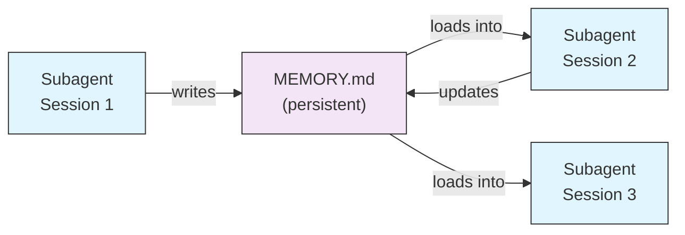
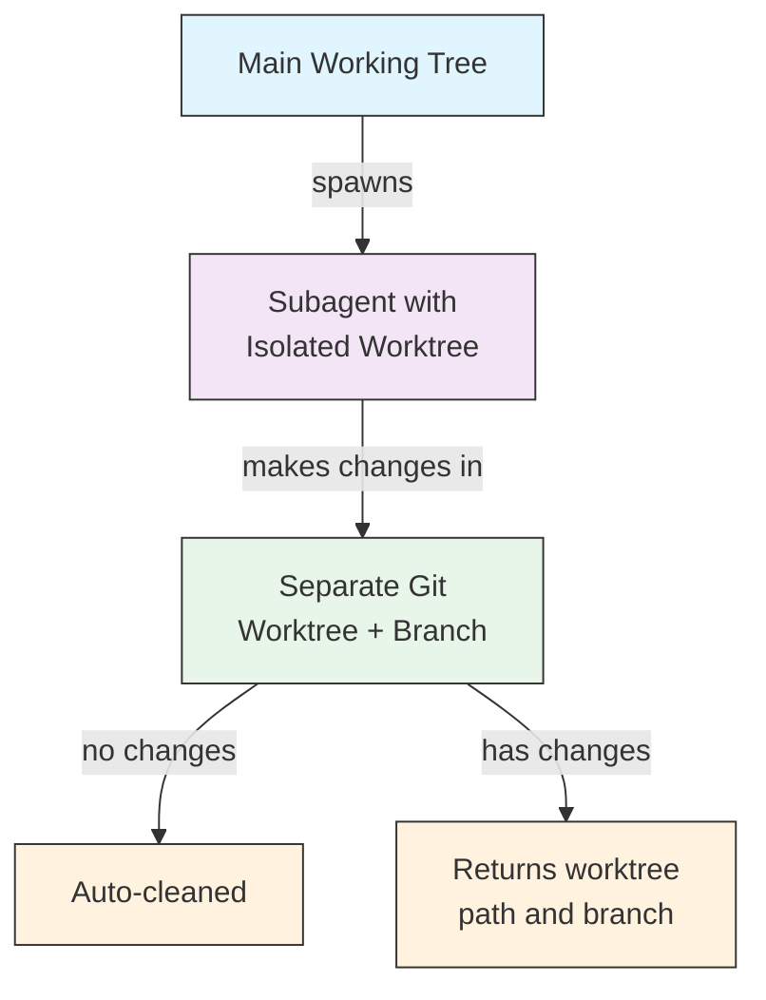
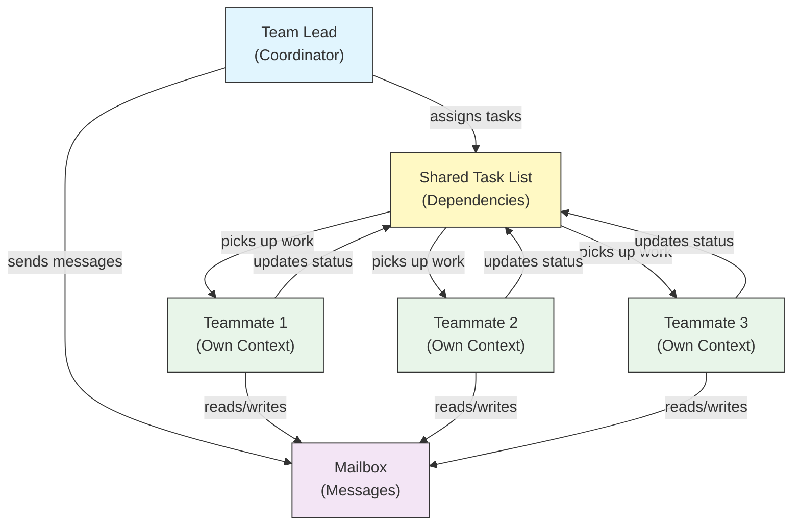
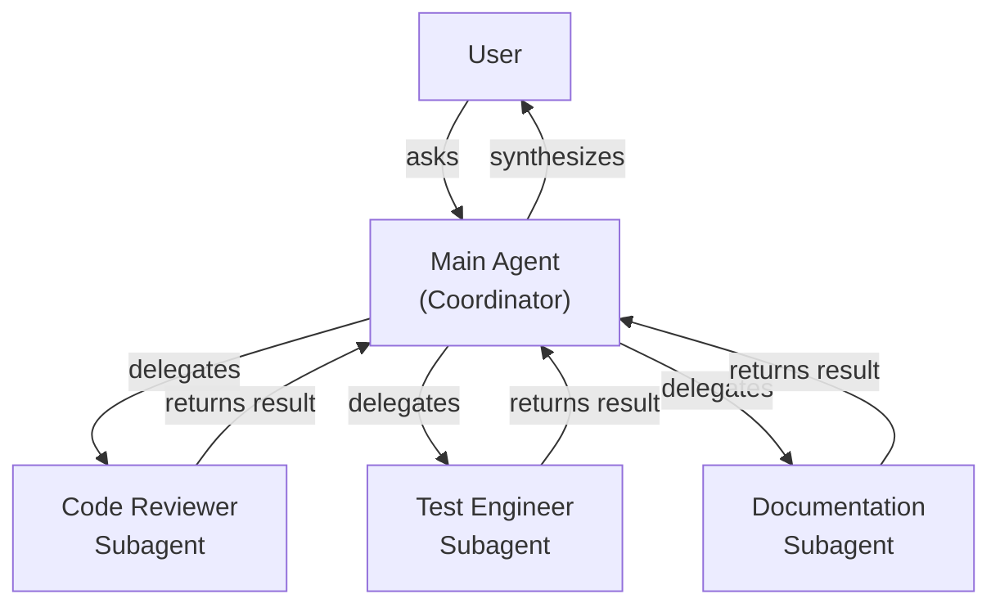
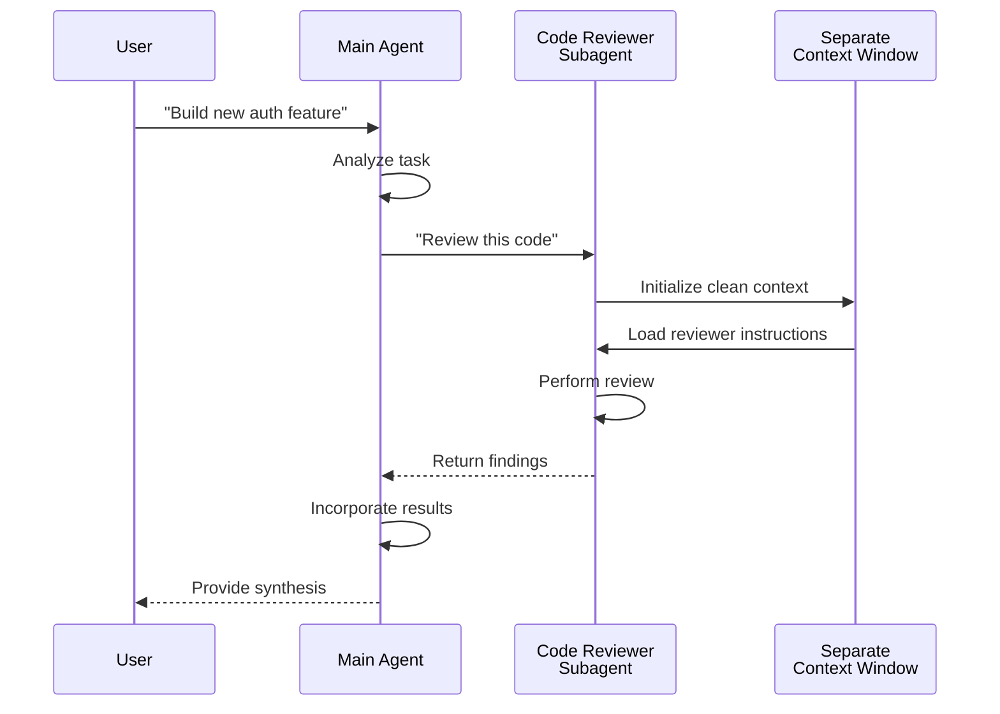
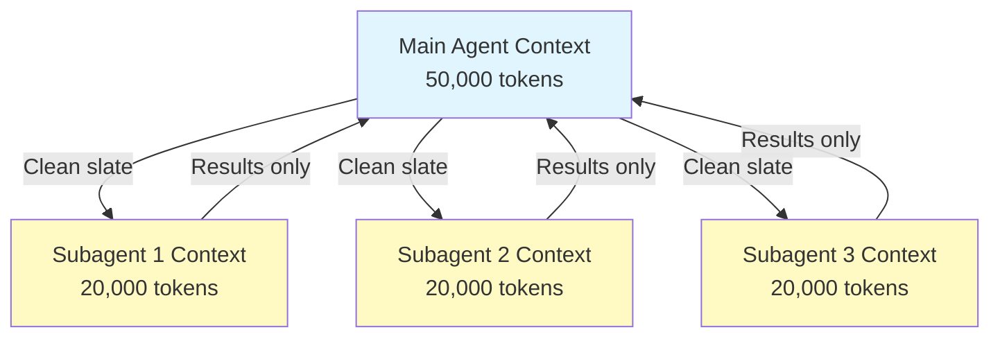
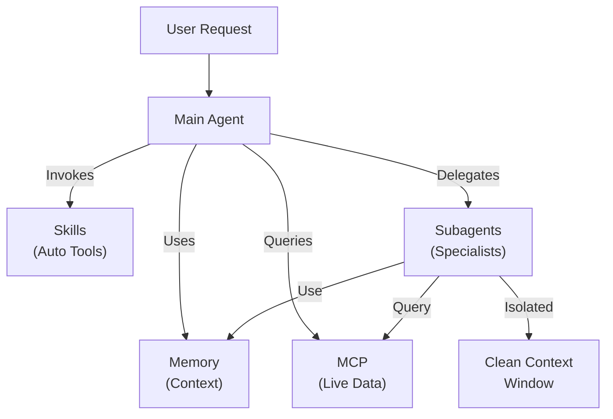

<picture>
  <source media="(prefers-color-scheme: dark)" srcset="../../resources/logos/claude-howto-logo-dark.svg">
  
</picture>

# Subagentes - Guia de Referencia Completa

Los subagentes son asistentes de IA especializados a los que Claude Code puede delegar tareas. Cada subagente tiene un proposito especifico, usa su propio context window separado de la conversacion principal, y se puede configurar con herramientas especificas y un system prompt personalizado.

## Tabla de Contenidos

1. [Descripcion General](#descripcion-general)
2. [Beneficios Principales](#beneficios-principales)
3. [Ubicacion de Archivos](#ubicacion-de-archivos)
4. [Configuracion](#configuracion)
5. [Subagentes Integrados](#subagentes-integrados)
6. [Administrar Subagentes](#administrar-subagentes)
7. [Usar Subagentes](#usar-subagentes)
8. [Agentes Reanudables](#agentes-reanudables)
9. [Encadenamiento de Subagentes](#encadenamiento-de-subagentes)
10. [Memoria Persistente para Subagentes](#memoria-persistente-para-subagentes)
11. [Subagentes en Segundo Plano](#subagentes-en-segundo-plano)
12. [Aislamiento con Worktree](#aislamiento-con-worktree)
13. [Restringir Subagentes Invocables](#restringir-subagentes-invocables)
14. [Comando CLI `claude agents`](#comando-cli-claude-agents)
15. [Equipos de Agentes (Experimental)](#equipos-de-agentes-experimental)
16. [Seguridad de Subagentes de Plugin](#seguridad-de-subagentes-de-plugin)
17. [Arquitectura](#arquitectura)
18. [Gestion del Contexto](#gestion-del-contexto)
19. [Cuando Usar Subagentes](#cuando-usar-subagentes)
20. [Buenas Practicas](#buenas-practicas)
21. [Subagentes de Ejemplo en Esta Carpeta](#subagentes-de-ejemplo-en-esta-carpeta)
22. [Instrucciones de Instalacion](#instrucciones-de-instalacion)
23. [Conceptos Relacionados](#conceptos-relacionados)

---

## Descripcion General

Los subagentes habilitan la ejecucion delegada de tareas en Claude Code mediante:

- La creacion de **asistentes de IA aislados** con context windows separados
- La provision de **system prompts personalizados** para experiencia especializada
- El control de **acceso a herramientas** para limitar capacidades
- La prevencion de **contaminacion del contexto** en tareas complejas
- La habilitacion de **ejecucion paralela** de multiples tareas especializadas

Cada subagente opera de forma independiente con un contexto limpio, recibiendo solo el contexto especifico necesario para su tarea, y luego devuelve los resultados al agente principal para su sintesis.

**Inicio Rapido**: Usa el comando `/agents` para crear, ver, editar y administrar tus subagentes de forma interactiva.

---

## Beneficios Principales

| Beneficio | Descripcion |
|-----------|-------------|
| **Preservacion del contexto** | Opera en un contexto separado, evitando contaminar la conversacion principal |
| **Experiencia especializada** | Ajustado para dominios especificos con mayores tasas de exito |
| **Reutilizabilidad** | Se puede usar en distintos proyectos y compartir con equipos |
| **Permisos flexibles** | Distintos niveles de acceso a herramientas segun el tipo de subagente |
| **Escalabilidad** | Multiples agentes trabajan en diferentes aspectos de forma simultanea |

---

## Ubicacion de Archivos

Los archivos de subagentes pueden almacenarse en multiples ubicaciones con distintos alcances:

| Prioridad | Tipo | Ubicacion | Alcance |
|-----------|------|-----------|---------|
| 1 (mas alta) | **Definido por CLI** | Via flag `--agents` (JSON) | Solo la sesion |
| 2 | **Subagentes de proyecto** | `.claude/agents/` | Proyecto actual |
| 3 | **Subagentes de usuario** | `~/.claude/agents/` | Todos los proyectos |
| 4 (mas baja) | **Agentes de plugin** | Directorio `agents/` del plugin | Via plugins |

Cuando existen nombres duplicados, las fuentes de mayor prioridad tienen precedencia.

---

## Configuracion

### Formato de Archivo

Los subagentes se definen en frontmatter YAML seguido del system prompt en markdown:

```yaml
---
name: your-sub-agent-name
description: Description of when this subagent should be invoked
tools: tool1, tool2, tool3  # Optional - inherits all tools if omitted
disallowedTools: tool4  # Optional - explicitly disallowed tools
model: sonnet  # Optional - sonnet, opus, haiku, or inherit
permissionMode: default  # Optional - permission mode
maxTurns: 20  # Optional - limit agentic turns
skills: skill1, skill2  # Optional - skills to preload into context
mcpServers: server1  # Optional - MCP servers to make available
memory: user  # Optional - persistent memory scope (user, project, local)
background: false  # Optional - run as background task
effort: high  # Optional - reasoning effort (low, medium, high, max)
isolation: worktree  # Optional - git worktree isolation
initialPrompt: "Start by analyzing the codebase"  # Optional - auto-submitted first turn
hooks:  # Optional - component-scoped hooks
  PreToolUse:
    - matcher: "Bash"
      hooks:
        - type: command
          command: "./scripts/security-check.sh"
---

Your subagent's system prompt goes here. This can be multiple paragraphs
and should clearly define the subagent's role, capabilities, and approach
to solving problems.
```

### Campos de Configuracion

| Campo | Requerido | Descripcion |
|-------|-----------|-------------|
| `name` | Si | Identificador unico (letras minusculas y guiones) |
| `description` | Si | Descripcion en lenguaje natural del proposito. Incluir "use PROACTIVELY" para fomentar la invocacion automatica |
| `tools` | No | Lista separada por comas de herramientas especificas. Omitir para heredar todas. Soporta sintaxis `Agent(agent_name)` para restringir subagentes invocables |
| `disallowedTools` | No | Lista separada por comas de herramientas que el subagente no puede usar |
| `model` | No | Modelo a usar: `sonnet`, `opus`, `haiku`, ID de modelo completo, o `inherit`. Por defecto usa el modelo de subagente configurado |
| `permissionMode` | No | `default`, `acceptEdits`, `dontAsk`, `bypassPermissions`, `plan` |
| `maxTurns` | No | Numero maximo de turnos agenticos que el subagente puede tomar |
| `skills` | No | Lista de skills separada por comas para precargar. Inyecta el contenido completo del skill en el contexto del subagente al inicio |
| `mcpServers` | No | Servidores MCP disponibles para el subagente |
| `hooks` | No | Hooks de alcance de componente (PreToolUse, PostToolUse, Stop) |
| `memory` | No | Alcance del directorio de memoria persistente: `user`, `project`, o `local` |
| `background` | No | Establecer en `true` para ejecutar siempre este subagente como background task |
| `effort` | No | Nivel de esfuerzo de razonamiento: `low`, `medium`, `high`, o `max` |
| `isolation` | No | Establecer en `worktree` para darle al subagente su propio git worktree |
| `initialPrompt` | No | Primer turno enviado automaticamente cuando el subagente se ejecuta como agente principal |

### Opciones de Configuracion de Herramientas

**Opcion 1: Heredar Todas las Herramientas (omitir el campo)**
```yaml
---
name: full-access-agent
description: Agent with all available tools
---
```

**Opcion 2: Especificar Herramientas Individuales**
```yaml
---
name: limited-agent
description: Agent with specific tools only
tools: Read, Grep, Glob, Bash
---
```

**Opcion 3: Acceso Condicional a Herramientas**
```yaml
---
name: conditional-agent
description: Agent with filtered tool access
tools: Read, Bash(npm:*), Bash(test:*)
---
```

### Configuracion via CLI

Define subagentes para una sola sesion usando el flag `--agents` con formato JSON:

```bash
claude --agents '{
  "code-reviewer": {
    "description": "Expert code reviewer. Use proactively after code changes.",
    "prompt": "You are a senior code reviewer. Focus on code quality, security, and best practices.",
    "tools": ["Read", "Grep", "Glob", "Bash"],
    "model": "sonnet"
  }
}'
```

**Formato JSON para el flag `--agents`:**

```json
{
  "agent-name": {
    "description": "Required: when to invoke this agent",
    "prompt": "Required: system prompt for the agent",
    "tools": ["Optional", "array", "of", "tools"],
    "model": "optional: sonnet|opus|haiku"
  }
}
```

**Prioridad de Definiciones de Agentes:**

Las definiciones de agentes se cargan con este orden de prioridad (gana la primera coincidencia):
1. **Definidos por CLI** - flag `--agents` (solo sesion, JSON)
2. **A nivel de proyecto** - `.claude/agents/` (proyecto actual)
3. **A nivel de usuario** - `~/.claude/agents/` (todos los proyectos)
4. **A nivel de plugin** - Directorio `agents/` del plugin

Esto permite que las definiciones de CLI anulen todas las otras fuentes para una sola sesion.

---

## Subagentes Integrados

Claude Code incluye varios subagentes integrados que siempre estan disponibles:

| Agente | Modelo | Proposito |
|--------|--------|-----------|
| **general-purpose** | Hereda | Tareas complejas de multiples pasos |
| **Plan** | Hereda | Investigacion para el modo plan |
| **Explore** | Haiku | Exploracion de codigo base de solo lectura (rapida/media/muy detallada) |
| **Bash** | Hereda | Comandos de terminal en contexto separado |
| **statusline-setup** | Sonnet | Configurar la linea de estado |
| **Claude Code Guide** | Haiku | Responder preguntas sobre funcionalidades de Claude Code |

### Subagente General

| Propiedad | Valor |
|-----------|-------|
| **Modelo** | Hereda del padre |
| **Herramientas** | Todas las herramientas |
| **Proposito** | Tareas de investigacion complejas, operaciones de multiples pasos, modificaciones de codigo |

**Cuando se usa**: Tareas que requieren tanto exploracion como modificacion con razonamiento complejo.

### Subagente Plan

| Propiedad | Valor |
|-----------|-------|
| **Modelo** | Hereda del padre |
| **Herramientas** | Read, Glob, Grep, Bash |
| **Proposito** | Usado automaticamente en el modo plan para investigar el codigo base |

**Cuando se usa**: Cuando Claude necesita entender el codigo base antes de presentar un plan.

### Subagente Explore

| Propiedad | Valor |
|-----------|-------|
| **Modelo** | Haiku (rapido, baja latencia) |
| **Modo** | Estrictamente de solo lectura |
| **Herramientas** | Glob, Grep, Read, Bash (solo comandos de lectura) |
| **Proposito** | Busqueda y analisis rapidos del codigo base |

**Cuando se usa**: Al buscar o entender codigo sin realizar cambios.

**Niveles de Profundidad** - Especifica el nivel de exploracion:
- **"quick"** - Busquedas rapidas con exploracion minima, ideal para encontrar patrones especificos
- **"medium"** - Exploracion moderada, equilibrio entre velocidad y profundidad, enfoque por defecto
- **"very thorough"** - Analisis completo en multiples ubicaciones y convenciones de nombres, puede tomar mas tiempo

### Subagente Bash

| Propiedad | Valor |
|-----------|-------|
| **Modelo** | Hereda del padre |
| **Herramientas** | Bash |
| **Proposito** | Ejecutar comandos de terminal en un context window separado |

**Cuando se usa**: Al ejecutar comandos de shell que se benefician de un contexto aislado.

### Subagente de Configuracion de Linea de Estado

| Propiedad | Valor |
|-----------|-------|
| **Modelo** | Sonnet |
| **Herramientas** | Read, Write, Bash |
| **Proposito** | Configurar la visualizacion de la linea de estado de Claude Code |

**Cuando se usa**: Al configurar o personalizar la linea de estado.

### Subagente Guia de Claude Code

| Propiedad | Valor |
|-----------|-------|
| **Modelo** | Haiku (rapido, baja latencia) |
| **Herramientas** | Solo lectura |
| **Proposito** | Responder preguntas sobre funcionalidades y uso de Claude Code |

**Cuando se usa**: Cuando los usuarios hacen preguntas sobre como funciona Claude Code o como usar funciones especificas.

---

## Administrar Subagentes

### Usando el Comando `/agents` (Recomendado)

```bash
/agents
```

Esto proporciona un menu interactivo para:
- Ver todos los subagentes disponibles (integrados, de usuario y de proyecto)
- Crear nuevos subagentes con configuracion guiada
- Editar subagentes personalizados existentes y su acceso a herramientas
- Eliminar subagentes personalizados
- Ver cuales subagentes estan activos cuando existen duplicados

### Administracion Directa de Archivos

```bash
# Create a project subagent
mkdir -p .claude/agents
cat > .claude/agents/test-runner.md << 'EOF'
---
name: test-runner
description: Use proactively to run tests and fix failures
---

You are a test automation expert. When you see code changes, proactively
run the appropriate tests. If tests fail, analyze the failures and fix
them while preserving the original test intent.
EOF

# Create a user subagent (available in all projects)
mkdir -p ~/.claude/agents
```

---

## Usar Subagentes

### Delegacion Automatica

Claude delega tareas proactivamente segun:
- La descripcion de la tarea en tu solicitud
- El campo `description` en las configuraciones de subagentes
- El contexto actual y las herramientas disponibles

Para fomentar el uso proactivo, incluye "use PROACTIVELY" o "MUST BE USED" en tu campo `description`:

```yaml
---
name: code-reviewer
description: Expert code review specialist. Use PROACTIVELY after writing or modifying code.
---
```

### Invocacion Explicita

Podes solicitar explicitamente un subagente especifico:

```
> Use the test-runner subagent to fix failing tests
> Have the code-reviewer subagent look at my recent changes
> Ask the debugger subagent to investigate this error
```

### Invocacion con @-Mencion

Usa el prefijo `@` para garantizar que se invoque un subagente especifico (omite la heuristica de delegacion automatica):

```
> @"code-reviewer (agent)" review the auth module
```

### Agente para Toda la Sesion

Ejecuta una sesion completa usando un agente especifico como agente principal:

```bash
# Via CLI flag
claude --agent code-reviewer

# Via settings.json
{
  "agent": "code-reviewer"
}
```

### Listar Agentes Disponibles

Usa el comando `claude agents` para listar todos los agentes configurados de todas las fuentes:

```bash
claude agents
```

---

## Agentes Reanudables

Los subagentes pueden continuar conversaciones previas con el contexto completo preservado:

```bash
# Initial invocation
> Use the code-analyzer agent to start reviewing the authentication module
# Returns agentId: "abc123"

# Resume the agent later
> Resume agent abc123 and now analyze the authorization logic as well
```

**Casos de uso**:
- Investigacion de larga duracion a traves de multiples sesiones
- Refinamiento iterativo sin perder contexto
- Flujos de trabajo de multiples pasos manteniendo el contexto

---

## Encadenamiento de Subagentes

Ejecuta multiples subagentes en secuencia:

```bash
> First use the code-analyzer subagent to find performance issues,
  then use the optimizer subagent to fix them
```

Esto habilita flujos de trabajo complejos donde la salida de un subagente se convierte en la entrada de otro.

---

## Memoria Persistente para Subagentes

El campo `memory` le da a los subagentes un directorio persistente que sobrevive entre conversaciones. Esto permite que los subagentes acumulen conocimiento a lo largo del tiempo, almacenando notas, hallazgos y contexto que persisten entre sesiones.

### Alcances de Memoria

| Alcance | Directorio | Caso de Uso |
|---------|------------|-------------|
| `user` | `~/.claude/agent-memory/<name>/` | Notas y preferencias personales en todos los proyectos |
| `project` | `.claude/agent-memory/<name>/` | Conocimiento especifico del proyecto compartido con el equipo |
| `local` | `.claude/agent-memory-local/<name>/` | Conocimiento local del proyecto no enviado al control de versiones |

### Como Funciona

- Las primeras 200 lineas de `MEMORY.md` en el directorio de memoria se cargan automaticamente en el system prompt del subagente
- Las herramientas `Read`, `Write` y `Edit` se habilitan automaticamente para que el subagente administre sus archivos de memoria
- El subagente puede crear archivos adicionales en su directorio de memoria segun sea necesario

### Configuracion de Ejemplo

```yaml
---
name: researcher
memory: user
---

You are a research assistant. Use your memory directory to store findings,
track progress across sessions, and build up knowledge over time.

Check your MEMORY.md file at the start of each session to recall previous context.
```



---

## Subagentes en Segundo Plano

Los subagentes pueden ejecutarse en segundo plano, liberando la conversacion principal para otras tareas.

### Configuracion

Establece `background: true` en el frontmatter para ejecutar siempre el subagente como background task:

```yaml
---
name: long-runner
background: true
description: Performs long-running analysis tasks in the background
---
```

### Atajos de Teclado

| Atajo | Accion |
|-------|--------|
| `Ctrl+B` | Enviar al segundo plano una tarea de subagente en ejecucion |
| `Ctrl+F` | Terminar todos los agentes en segundo plano (presionar dos veces para confirmar) |

### Deshabilitar Tareas en Segundo Plano

Establece la variable de entorno para deshabilitar completamente el soporte de background tasks:

```bash
export CLAUDE_CODE_DISABLE_BACKGROUND_TASKS=1
```

---

## Aislamiento con Worktree

La configuracion `isolation: worktree` le da a un subagente su propio git worktree, permitiendole realizar cambios de forma independiente sin afectar el arbol de trabajo principal.

### Configuracion

```yaml
---
name: feature-builder
isolation: worktree
description: Implements features in an isolated git worktree
tools: Read, Write, Edit, Bash, Grep, Glob
---
```

### Como Funciona



- El subagente opera en su propio git worktree en una branch separada
- Si el subagente no realiza cambios, el worktree se limpia automaticamente
- Si hay cambios, la ruta del worktree y el nombre de la branch se devuelven al agente principal para revision o merge

---

## Restringir Subagentes Invocables

Podes controlar cuales subagentes puede invocar un subagente dado usando la sintaxis `Agent(agent_type)` en el campo `tools`. Esto proporciona una forma de crear una lista permitida de subagentes especificos para delegacion.

> **Nota**: En v2.1.63, la herramienta `Task` fue renombrada a `Agent`. Las referencias existentes a `Task(...)` siguen funcionando como alias.

### Ejemplo

```yaml
---
name: coordinator
description: Coordinates work between specialized agents
tools: Agent(worker, researcher), Read, Bash
---

You are a coordinator agent. You can delegate work to the "worker" and
"researcher" subagents only. Use Read and Bash for your own exploration.
```

En este ejemplo, el subagente `coordinator` solo puede invocar los subagentes `worker` y `researcher`. No puede invocar ningun otro subagente, aunque esten definidos en otro lugar.

---

## Comando CLI `claude agents`

El comando `claude agents` lista todos los agentes configurados agrupados por fuente (integrados, nivel de usuario, nivel de proyecto):

```bash
claude agents
```

Este comando:
- Muestra todos los agentes disponibles de todas las fuentes
- Agrupa los agentes segun su ubicacion de origen
- Indica **anulaciones** cuando un agente de mayor prioridad reemplaza a uno de menor prioridad (por ejemplo, un agente de nivel de proyecto con el mismo nombre que uno de nivel de usuario)

---

## Equipos de Agentes (Experimental)

Los Equipos de Agentes coordinan multiples instancias de Claude Code trabajando juntas en tareas complejas. A diferencia de los subagentes (que son subtareas delegadas que devuelven resultados), los integrantes del equipo trabajan de forma independiente con sus propios context windows y pueden enviarse mensajes directamente a traves de un sistema de mailbox compartido.

> **Documentacion Oficial**: [code.claude.com/docs/en/agent-teams](https://code.claude.com/docs/en/agent-teams)

> **Nota**: Los Equipos de Agentes son experimentales y estan deshabilitados por defecto. Requieren Claude Code v2.1.32+. Habilitarlos antes de usar.

### Subagentes vs Equipos de Agentes

| Aspecto | Subagentes | Equipos de Agentes |
|---------|------------|-------------------|
| **Modelo de delegacion** | El padre delega una subtarea y espera el resultado | El lider del equipo coordina el trabajo, los integrantes ejecutan de forma independiente |
| **Contexto** | Contexto nuevo por subtarea, resultados destilados de vuelta | Cada integrante mantiene su propio context window persistente |
| **Coordinacion** | Secuencial o paralela, gestionada por el padre | Lista de tareas compartida con gestion automatica de dependencias |
| **Comunicacion** | Resultados devueltos solo al padre (sin mensajeria entre agentes) | Los integrantes pueden enviarse mensajes directamente via mailbox |
| **Reanudacion de sesion** | Soportada | No soportada con integrantes en proceso |
| **Ideal para** | Subtareas enfocadas y bien definidas | Trabajo complejo que requiere comunicacion entre agentes y ejecucion paralela |

### Habilitar Equipos de Agentes

Establece la variable de entorno o agregala a tu `settings.json`:

```bash
export CLAUDE_CODE_EXPERIMENTAL_AGENT_TEAMS=1
```

O en `settings.json`:

```json
{
  "env": {
    "CLAUDE_CODE_EXPERIMENTAL_AGENT_TEAMS": "1"
  }
}
```

### Iniciar un equipo

Una vez habilitado, pide a Claude que trabaje con integrantes del equipo en tu prompt:

```
User: Build the authentication module. Use a team — one teammate for the API endpoints,
      one for the database schema, and one for the test suite.
```

Claude creara el equipo, asignara tareas y coordinara el trabajo automaticamente.

### Modos de visualizacion

Controla como se muestra la actividad de los integrantes del equipo:

| Modo | Flag | Descripcion |
|------|------|-------------|
| **Auto** | `--teammate-mode auto` | Elige automaticamente el mejor modo de visualizacion para tu terminal |
| **En proceso** (por defecto) | `--teammate-mode in-process` | Muestra la salida de los integrantes en linea en la terminal actual |
| **Paneles divididos** | `--teammate-mode tmux` | Abre cada integrante en un panel separado de tmux o iTerm2 |

```bash
claude --teammate-mode tmux
```

Tambien podes configurar el modo de visualizacion en `settings.json`:

```json
{
  "teammateMode": "tmux"
}
```

> **Nota**: El modo de paneles divididos requiere tmux o iTerm2. No esta disponible en la terminal de VS Code, Windows Terminal ni Ghostty.

### Navegacion

Usa `Shift+Down` para navegar entre integrantes en el modo de paneles divididos.

### Configuracion del Equipo

Las configuraciones de equipo se almacenan en `~/.claude/teams/{team-name}/config.json`.

### Arquitectura



**Componentes clave**:

- **Lider del Equipo**: La sesion principal de Claude Code que crea el equipo, asigna tareas y coordina
- **Lista de Tareas Compartida**: Una lista sincronizada de tareas con seguimiento automatico de dependencias
- **Mailbox**: Un sistema de mensajeria entre agentes para que los integrantes comuniquen estado y coordinen
- **Integrantes**: Instancias independientes de Claude Code, cada una con su propio context window

### Asignacion de tareas y mensajeria

El lider del equipo divide el trabajo en tareas y las asigna a los integrantes. La lista de tareas compartida gestiona:

- **Gestion automatica de dependencias** — las tareas esperan a que se completen sus dependencias
- **Seguimiento de estado** — los integrantes actualizan el estado de las tareas mientras trabajan
- **Mensajeria entre agentes** — los integrantes envian mensajes via mailbox para coordinarse (por ejemplo, "El esquema de base de datos esta listo, ya podes empezar a escribir consultas")

### Flujo de aprobacion del plan

Para tareas complejas, el lider del equipo crea un plan de ejecucion antes de que los integrantes comiencen a trabajar. El usuario revisa y aprueba el plan, asegurando que el enfoque del equipo este alineado con las expectativas antes de que se realice cualquier cambio en el codigo.

### Eventos de hook para equipos

Los Equipos de Agentes introducen dos [eventos de hook](../06-hooks/) adicionales:

| Evento | Se dispara cuando | Caso de Uso |
|--------|-------------------|-------------|
| `TeammateIdle` | Un integrante termina su tarea actual y no tiene trabajo pendiente | Disparar notificaciones, asignar tareas de seguimiento |
| `TaskCompleted` | Una tarea en la lista compartida se marca como completada | Ejecutar validacion, actualizar paneles, encadenar trabajo dependiente |

### Buenas practicas

- **Tamano del equipo**: Mantene los equipos en 3-5 integrantes para una coordinacion optima
- **Tamano de las tareas**: Divide el trabajo en tareas que tomen entre 5 y 15 minutos — suficientemente pequenas para paralelizar, suficientemente grandes para ser significativas
- **Evitar conflictos de archivos**: Asigna distintos archivos o directorios a diferentes integrantes para evitar conflictos de merge
- **Empezar simple**: Usa el modo en proceso para tu primer equipo; cambia a paneles divididos una vez que te sientas comodo
- **Descripciones de tareas claras**: Proporciona descripciones de tareas especificas y accionables para que los integrantes puedan trabajar de forma independiente

### Limitaciones

- **Experimental**: El comportamiento de la funcionalidad puede cambiar en versiones futuras
- **Sin reanudacion de sesion**: Los integrantes en proceso no pueden reanudarse despues de que finaliza una sesion
- **Un equipo por sesion**: No se pueden crear equipos anidados ni multiples equipos en una sola sesion
- **Liderazgo fijo**: El rol de lider del equipo no puede transferirse a un integrante
- **Restricciones de paneles divididos**: Se requiere tmux o iTerm2; no disponible en la terminal de VS Code, Windows Terminal ni Ghostty
- **Sin equipos entre sesiones**: Los integrantes solo existen dentro de la sesion actual

> **Advertencia**: Los Equipos de Agentes son experimentales. Proba primero con trabajo no critico y monitoreate la coordinacion de los integrantes ante comportamientos inesperados.

---

## Seguridad de Subagentes de Plugin

Los subagentes provistos por plugins tienen capacidades de frontmatter restringidas por seguridad. Los siguientes campos **no estan permitidos** en las definiciones de subagentes de plugin:

- `hooks` - No puede definir hooks de ciclo de vida
- `mcpServers` - No puede configurar servidores MCP
- `permissionMode` - No puede anular configuraciones de permisos

Esto evita que los plugins escalen privilegios o ejecuten comandos arbitrarios a traves de hooks de subagentes.

---

## Arquitectura

### Arquitectura de Alto Nivel



### Ciclo de Vida del Subagente



---

## Gestion del Contexto



### Puntos Clave

- Cada subagente obtiene un **context window limpio** sin el historial de la conversacion principal
- Solo el **contexto relevante** se pasa al subagente para su tarea especifica
- Los resultados se **destilan** de vuelta al agente principal
- Esto evita el **agotamiento de tokens de contexto** en proyectos largos

### Consideraciones de Rendimiento

- **Eficiencia del contexto** - Los agentes preservan el contexto principal, habilitando sesiones mas largas
- **Latencia** - Los subagentes comienzan con un contexto limpio y pueden agregar latencia al reunir el contexto inicial

### Comportamientos Clave

- **Sin invocacion anidada** - Los subagentes no pueden invocar otros subagentes
- **Permisos en segundo plano** - Los subagentes en segundo plano deniegan automaticamente cualquier permiso que no este pre-aprobado
- **Envio al segundo plano** - Presiona `Ctrl+B` para enviar al segundo plano una tarea en ejecucion
- **Transcripciones** - Las transcripciones de subagentes se almacenan en `~/.claude/projects/{project}/{sessionId}/subagents/agent-{agentId}.jsonl`
- **Compactacion automatica** - El contexto del subagente se compacta automaticamente al ~95% de capacidad (sobreescribir con la variable de entorno `CLAUDE_AUTOCOMPACT_PCT_OVERRIDE`)

---

## Cuando Usar Subagentes

| Escenario | Usar Subagente | Por que |
|-----------|---------------|---------|
| Funcionalidad compleja con muchos pasos | Si | Separar responsabilidades, evitar contaminacion del contexto |
| Revision de codigo rapida | No | Sobrecarga innecesaria |
| Ejecucion de tareas en paralelo | Si | Cada subagente tiene su propio contexto |
| Se necesita experiencia especializada | Si | System prompts personalizados |
| Analisis de larga duracion | Si | Evita el agotamiento del contexto principal |
| Tarea unica | No | Agrega latencia innecesariamente |

---

## Buenas Practicas

### Principios de Diseno

**Hacer:**
- Empezar con agentes generados por Claude - Genera el subagente inicial con Claude y luego itera para personalizarlo
- Disenar subagentes enfocados - Responsabilidades unicas y claras en lugar de uno que haga todo
- Escribir prompts detallados - Incluir instrucciones especificas, ejemplos y restricciones
- Limitar el acceso a herramientas - Otorgar solo las herramientas necesarias para el proposito del subagente
- Control de versiones - Incluir los subagentes de proyecto en el control de versiones para la colaboracion del equipo

**No hacer:**
- Crear subagentes superpuestos con los mismos roles
- Dar a los subagentes acceso innecesario a herramientas
- Usar subagentes para tareas simples de un solo paso
- Mezclar responsabilidades en el prompt de un subagente
- Olvidar pasar el contexto necesario

### Buenas Practicas para el System Prompt

1. **Ser especifico sobre el rol**
   ```
   You are an expert code reviewer specializing in [specific areas]
   ```

2. **Definir prioridades claramente**
   ```
   Review priorities (in order):
   1. Security Issues
   2. Performance Problems
   3. Code Quality
   ```

3. **Especificar el formato de salida**
   ```
   For each issue provide: Severity, Category, Location, Description, Fix, Impact
   ```

4. **Incluir pasos de accion**
   ```
   When invoked:
   1. Run git diff to see recent changes
   2. Focus on modified files
   3. Begin review immediately
   ```

### Estrategia de Acceso a Herramientas

1. **Empezar Restrictivo**: Comenzar solo con las herramientas esenciales
2. **Expandir Solo Cuando sea Necesario**: Agregar herramientas segun lo requieran los requisitos
3. **Solo Lectura Cuando sea Posible**: Usar Read/Grep para agentes de analisis
4. **Ejecucion en Sandbox**: Limitar los comandos Bash a patrones especificos

---

## Subagentes de Ejemplo en Esta Carpeta

Esta carpeta contiene subagentes de ejemplo listos para usar:

### 1. Revisor de Codigo (`code-reviewer.md`)

**Proposito**: Analisis completo de calidad y mantenibilidad del codigo

**Herramientas**: Read, Grep, Glob, Bash

**Especializacion**:
- Deteccion de vulnerabilidades de seguridad
- Identificacion de oportunidades de optimizacion de rendimiento
- Evaluacion de mantenibilidad del codigo
- Analisis de cobertura de tests

**Usar cuando**: Necesitas revisiones de codigo automatizadas con enfoque en calidad y seguridad

---

### 2. Ingeniero de Tests (`test-engineer.md`)

**Proposito**: Estrategia de tests, analisis de cobertura y testing automatizado

**Herramientas**: Read, Write, Bash, Grep

**Especializacion**:
- Creacion de tests unitarios
- Diseno de tests de integracion
- Identificacion de casos extremos
- Analisis de cobertura (objetivo >80%)

**Usar cuando**: Necesitas crear una suite de tests completa o analizar la cobertura

---

### 3. Escritor de Documentacion (`documentation-writer.md`)

**Proposito**: Documentacion tecnica, docs de API y guias de usuario

**Herramientas**: Read, Write, Grep

**Especializacion**:
- Documentacion de endpoints de API
- Creacion de guias de usuario
- Documentacion de arquitectura
- Mejora de comentarios en el codigo

**Usar cuando**: Necesitas crear o actualizar la documentacion del proyecto

---

### 4. Revisor Seguro (`secure-reviewer.md`)

**Proposito**: Revision de codigo con enfoque en seguridad y permisos minimos

**Herramientas**: Read, Grep

**Especializacion**:
- Deteccion de vulnerabilidades de seguridad
- Problemas de autenticacion y autorizacion
- Riesgos de exposicion de datos
- Identificacion de ataques de inyeccion

**Usar cuando**: Necesitas auditorias de seguridad sin capacidades de modificacion

---

### 5. Agente de Implementacion (`implementation-agent.md`)

**Proposito**: Capacidades completas de implementacion para el desarrollo de funcionalidades

**Herramientas**: Read, Write, Edit, Bash, Grep, Glob

**Especializacion**:
- Implementacion de funcionalidades
- Generacion de codigo
- Ejecucion de builds y tests
- Modificacion del codigo base

**Usar cuando**: Necesitas que un subagente implemente funcionalidades de principio a fin

---

### 6. Depurador (`debugger.md`)

**Proposito**: Especialista en depuracion para errores, fallos de tests y comportamientos inesperados

**Herramientas**: Read, Edit, Bash, Grep, Glob

**Especializacion**:
- Analisis de causa raiz
- Investigacion de errores
- Resolucion de fallos de tests
- Implementacion de correcciones minimas

**Usar cuando**: Encontras bugs, errores o comportamientos inesperados

---

### 7. Cientifico de Datos (`data-scientist.md`)

**Proposito**: Experto en analisis de datos para consultas SQL e insights de datos

**Herramientas**: Bash, Read, Write

**Especializacion**:
- Optimizacion de consultas SQL
- Operaciones con BigQuery
- Analisis y visualizacion de datos
- Insights estadisticos

**Usar cuando**: Necesitas analisis de datos, consultas SQL u operaciones con BigQuery

---

## Instrucciones de Instalacion

### Metodo 1: Usando el Comando /agents (Recomendado)

```bash
/agents
```

Luego:
1. Selecciona 'Create New Agent'
2. Elige nivel de proyecto o nivel de usuario
3. Describe tu subagente en detalle
4. Selecciona las herramientas para otorgar acceso (o deja en blanco para heredar todas)
5. Guarda y usa

### Metodo 2: Copiar al Proyecto

Copia los archivos del agente al directorio `.claude/agents/` de tu proyecto:

```bash
# Navigate to your project
cd /path/to/your/project

# Create agents directory if it doesn't exist
mkdir -p .claude/agents

# Copy all agent files from this folder
cp /path/to/04-subagents/*.md .claude/agents/

# Remove the README (not needed in .claude/agents)
rm .claude/agents/README.md
```

### Metodo 3: Copiar al Directorio de Usuario

Para agentes disponibles en todos tus proyectos:

```bash
# Create user agents directory
mkdir -p ~/.claude/agents

# Copy agents
cp /path/to/04-subagents/code-reviewer.md ~/.claude/agents/
cp /path/to/04-subagents/debugger.md ~/.claude/agents/
# ... copy others as needed
```

### Verificacion

Despues de la instalacion, verifica que los agentes sean reconocidos:

```bash
/agents
```

Deberias ver tus agentes instalados listados junto con los integrados.

---

## Estructura de Archivos

```
project/
├── .claude/
│   └── agents/
│       ├── code-reviewer.md
│       ├── test-engineer.md
│       ├── documentation-writer.md
│       ├── secure-reviewer.md
│       ├── implementation-agent.md
│       ├── debugger.md
│       └── data-scientist.md
└── ...
```

---

## Conceptos Relacionados

### Funcionalidades Relacionadas

- **[Slash Commands](../01-slash-commands/)** - Atajos rapidos invocados por el usuario
- **[Memory](../02-memory/)** - Contexto persistente entre sesiones
- **[Skills](../03-skills/)** - Capacidades autonomas reutilizables
- **[MCP Protocol](../05-mcp/)** - Acceso a datos externos en tiempo real
- **[Hooks](../06-hooks/)** - Automatizacion de comandos de shell basada en eventos
- **[Plugins](../07-plugins/)** - Paquetes de extensiones empaquetados

### Comparacion con Otras Funcionalidades

| Funcionalidad | Invocado por Usuario | Invocado Automaticamente | Persistente | Acceso Externo | Contexto Aislado |
|---------------|---------------------|--------------------------|-------------|----------------|------------------|
| **Slash Commands** | Si | No | No | No | No |
| **Subagentes** | Si | Si | No | No | Si |
| **Memory** | Auto | Auto | Si | No | No |
| **MCP** | Auto | Si | No | Si | No |
| **Skills** | Si | Si | No | No | No |

### Patron de Integracion



---

## Recursos Adicionales

- [Documentacion Oficial de Subagentes](https://code.claude.com/docs/en/sub-agents)
- [Referencia CLI](https://code.claude.com/docs/en/cli-reference) - Flag `--agents` y otras opciones CLI
- [Guia de Plugins](../07-plugins/) - Para empaquetar agentes con otras funcionalidades
- [Guia de Skills](../03-skills/) - Para capacidades de invocacion automatica
- [Guia de Memory](../02-memory/) - Para contexto persistente
- [Guia de Hooks](../06-hooks/) - Para automatizacion basada en eventos

---
**Ultima Actualizacion**: Abril 2026
**Version de Claude Code**: 2.1+
**Modelos Compatibles**: Claude Sonnet 4.6, Claude Opus 4.6, Claude Haiku 4.5
