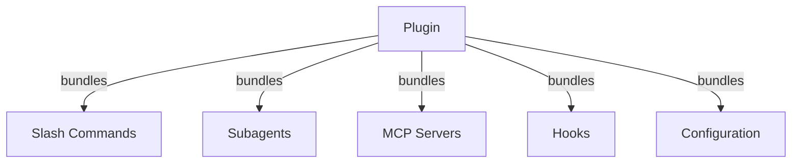
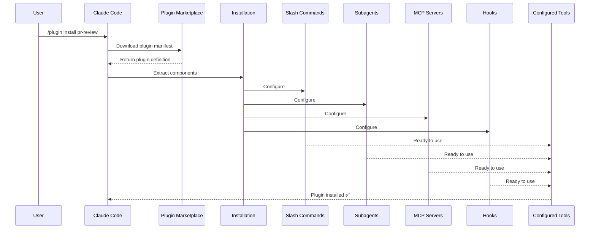
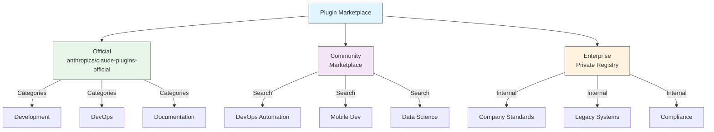
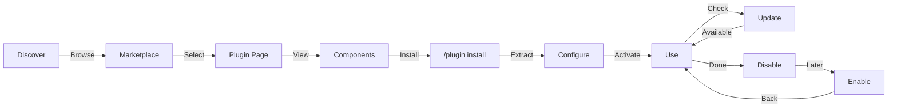
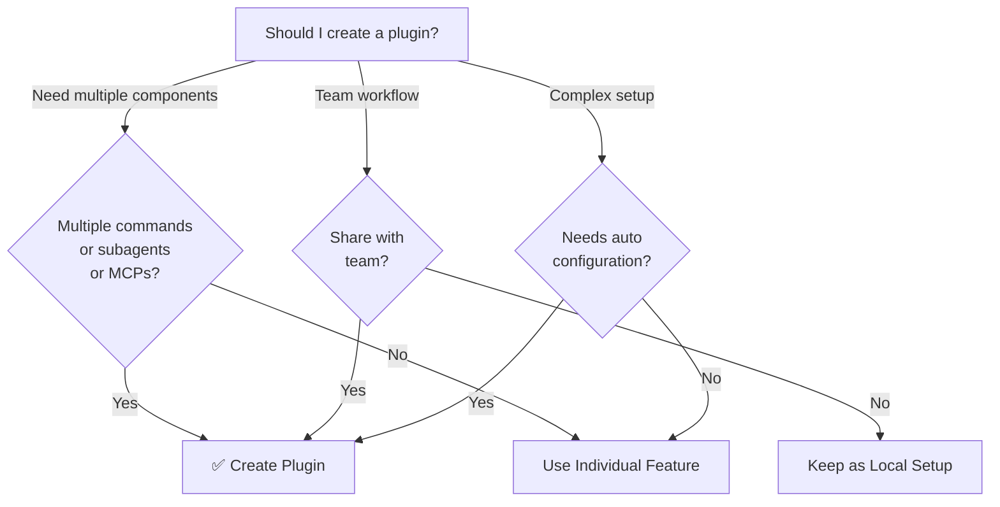

<picture>
  <source media="(prefers-color-scheme: dark)" srcset="../resources/logos/claude-howto-logo-dark.svg">
  
</picture>

# Claude Code Plugins

Esta carpeta contiene ejemplos completos de plugin que agrupan múltiples funcionalidades de Claude Code en paquetes instalables y cohesivos.

## Descripcion general

Los plugins de Claude Code son colecciones empaquetadas de personalizaciones (slash commands, subagentes, servidores MCP y hooks) que se instalan con un solo comando. Representan el mecanismo de extension de mayor nivel, combinando multiples funcionalidades en paquetes cohesivos y compartibles.

## Arquitectura de un plugin



## Proceso de carga de un plugin



## Tipos de plugins y distribucion

| Tipo | Alcance | Compartido | Autoridad | Ejemplos |
|------|---------|------------|-----------|----------|
| Oficial | Global | Todos los usuarios | Anthropic | PR Review, Security Guidance |
| Comunidad | Publico | Todos los usuarios | Comunidad | DevOps, Data Science |
| Organizacion | Interno | Miembros del equipo | Empresa | Estandares internos, herramientas |
| Personal | Individual | Usuario unico | Desarrollador | Workflows personalizados |

## Estructura de la definicion de un plugin

El manifiesto del plugin usa formato JSON en `.claude-plugin/plugin.json`:

```json
{
  "name": "my-first-plugin",
  "description": "A greeting plugin",
  "version": "1.0.0",
  "author": {
    "name": "Your Name"
  },
  "homepage": "https://example.com",
  "repository": "https://github.com/user/repo",
  "license": "MIT"
}
```

## Ejemplo de estructura de un plugin

```
my-plugin/
├── .claude-plugin/
│   └── plugin.json       # Manifest (name, description, version, author)
├── commands/             # Skills as Markdown files
│   ├── task-1.md
│   ├── task-2.md
│   └── workflows/
├── agents/               # Custom agent definitions
│   ├── specialist-1.md
│   ├── specialist-2.md
│   └── configs/
├── skills/               # Agent Skills with SKILL.md files
│   ├── skill-1.md
│   └── skill-2.md
├── hooks/                # Event handlers in hooks.json
│   └── hooks.json
├── .mcp.json             # MCP server configurations
├── .lsp.json             # LSP server configurations for code intelligence
├── bin/                  # Executables added to Bash tool's PATH while plugin is enabled
├── settings.json         # Default settings applied when plugin is enabled (currently only `agent` key supported)
├── templates/
│   └── issue-template.md
├── scripts/
│   ├── helper-1.sh
│   └── helper-2.py
├── docs/
│   ├── README.md
│   └── USAGE.md
└── tests/
    └── plugin.test.js
```

### Configuracion del servidor LSP

Los plugins pueden incluir soporte de Language Server Protocol (LSP) para inteligencia de codigo en tiempo real. Los servidores LSP proveen diagnosticos, navegacion de codigo e informacion de simbolos mientras trabajas.

**Ubicaciones de configuracion**:
- Archivo `.lsp.json` en el directorio raiz del plugin
- Clave `lsp` en linea dentro de `plugin.json`

#### Referencia de campos

| Campo | Requerido | Descripcion |
|-------|-----------|-------------|
| `command` | Si | Binario del servidor LSP (debe estar en PATH) |
| `extensionToLanguage` | Si | Mapea extensiones de archivo a IDs de lenguaje |
| `args` | No | Argumentos de linea de comandos para el servidor |
| `transport` | No | Metodo de comunicacion: `stdio` (por defecto) o `socket` |
| `env` | No | Variables de entorno para el proceso del servidor |
| `initializationOptions` | No | Opciones enviadas durante la inicializacion LSP |
| `settings` | No | Configuracion del workspace enviada al servidor |
| `workspaceFolder` | No | Sobreescribe la ruta del workspace folder |
| `startupTimeout` | No | Tiempo maximo (ms) para esperar el inicio del servidor |
| `shutdownTimeout` | No | Tiempo maximo (ms) para el cierre ordenado |
| `restartOnCrash` | No | Reiniciar automaticamente si el servidor falla |
| `maxRestarts` | No | Maximos intentos de reinicio antes de rendirse |

#### Ejemplos de configuracion

**Go (gopls)**:

```json
{
  "go": {
    "command": "gopls",
    "args": ["serve"],
    "extensionToLanguage": {
      ".go": "go"
    }
  }
}
```

**Python (pyright)**:

```json
{
  "python": {
    "command": "pyright-langserver",
    "args": ["--stdio"],
    "extensionToLanguage": {
      ".py": "python",
      ".pyi": "python"
    }
  }
}
```

**TypeScript**:

```json
{
  "typescript": {
    "command": "typescript-language-server",
    "args": ["--stdio"],
    "extensionToLanguage": {
      ".ts": "typescript",
      ".tsx": "typescriptreact",
      ".js": "javascript",
      ".jsx": "javascriptreact"
    }
  }
}
```

#### Plugins LSP disponibles

El marketplace oficial incluye plugins LSP preconfigurados:

| Plugin | Lenguaje | Binario del servidor | Comando de instalacion |
|--------|----------|----------------------|------------------------|
| `pyright-lsp` | Python | `pyright-langserver` | `pip install pyright` |
| `typescript-lsp` | TypeScript/JavaScript | `typescript-language-server` | `npm install -g typescript-language-server typescript` |
| `rust-lsp` | Rust | `rust-analyzer` | Instalar via `rustup component add rust-analyzer` |

#### Capacidades LSP

Una vez configurados, los servidores LSP proveen:

- **Diagnosticos instantaneos** — errores y advertencias aparecen inmediatamente despues de editar
- **Navegacion de codigo** — ir a la definicion, buscar referencias, implementaciones
- **Informacion al pasar el cursor** — firmas de tipo y documentacion al hacer hover
- **Listado de simbolos** — explorar simbolos en el archivo actual o en el workspace

## Opciones de plugin (v2.1.83+)

Los plugins pueden declarar opciones configurables por el usuario en el manifiesto mediante `userConfig`. Los valores marcados con `sensitive: true` se almacenan en el keychain del sistema en lugar de archivos de configuracion en texto plano:

```json
{
  "name": "my-plugin",
  "version": "1.0.0",
  "userConfig": {
    "apiKey": {
      "description": "API key for the service",
      "sensitive": true
    },
    "region": {
      "description": "Deployment region",
      "default": "us-east-1"
    }
  }
}
```

## Datos persistentes del plugin (`${CLAUDE_PLUGIN_DATA}`) (v2.1.78+)

Los plugins tienen acceso a un directorio de estado persistente mediante la variable de entorno `${CLAUDE_PLUGIN_DATA}`. Este directorio es unico por plugin y sobrevive entre sesiones, lo que lo hace adecuado para caches, bases de datos y otro estado persistente:

```json
{
  "hooks": {
    "PostToolUse": [
      {
        "command": "node ${CLAUDE_PLUGIN_DATA}/track-usage.js"
      }
    ]
  }
}
```

El directorio se crea automaticamente cuando se instala el plugin. Los archivos almacenados aqui persisten hasta que el plugin sea desinstalado.

## Plugin en linea via Settings (`source: 'settings'`) (v2.1.80+)

Los plugins pueden definirse en linea en archivos de settings como entradas de marketplace usando el campo `source: 'settings'`. Esto permite embeber una definicion de plugin directamente sin requerir un repositorio o marketplace separado:

```json
{
  "pluginMarketplaces": [
    {
      "name": "inline-tools",
      "source": "settings",
      "plugins": [
        {
          "name": "quick-lint",
          "source": "./local-plugins/quick-lint"
        }
      ]
    }
  ]
}
```

## Settings del plugin

Los plugins pueden incluir un archivo `settings.json` para proveer configuracion por defecto. Actualmente esto soporta la clave `agent`, que establece el agente del hilo principal para el plugin:

```json
{
  "agent": "agents/specialist-1.md"
}
```

Cuando un plugin incluye `settings.json`, sus valores por defecto se aplican en la instalacion. Los usuarios pueden sobreescribir estos settings en su propia configuracion de proyecto o de usuario.

## Enfoque standalone vs plugin

| Enfoque | Nombres de comandos | Configuracion | Mejor para |
|---------|---------------------|---------------|-----------|
| **Standalone** | `/hello` | Configuracion manual en CLAUDE.md | Personal, especifico del proyecto |
| **Plugins** | `/plugin-name:hello` | Automatizado via plugin.json | Compartir, distribuir, uso en equipo |

Usa **slash commands standalone** para workflows personales rapidos. Usa **plugins** cuando quieras agrupar multiples funcionalidades, compartir con un equipo, o publicar para distribucion.

## Ejemplos practicos

### Ejemplo 1: Plugin PR Review

**Archivo:** `.claude-plugin/plugin.json`

```json
{
  "name": "pr-review",
  "version": "1.0.0",
  "description": "Complete PR review workflow with security, testing, and docs",
  "author": {
    "name": "Anthropic"
  },
  "repository": "https://github.com/your-org/pr-review",
  "license": "MIT"
}
```

**Archivo:** `commands/review-pr.md`

```markdown
---
name: Review PR
description: Start comprehensive PR review with security and testing checks
---

# PR Review

This command initiates a complete pull request review including:

1. Security analysis
2. Test coverage verification
3. Documentation updates
4. Code quality checks
5. Performance impact assessment
```

**Archivo:** `agents/security-reviewer.md`

```yaml
---
name: security-reviewer
description: Security-focused code review
tools: read, grep, diff
---

# Security Reviewer

Specializes in finding security vulnerabilities:
- Authentication/authorization issues
- Data exposure
- Injection attacks
- Secure configuration
```

**Instalacion:**

```bash
/plugin install pr-review

# Result:
# ✅ 3 slash commands installed
# ✅ 3 subagents configured
# ✅ 2 MCP servers connected
# ✅ 4 hooks registered
# ✅ Ready to use!
```

### Ejemplo 2: Plugin DevOps

**Componentes:**

```
devops-automation/
├── commands/
│   ├── deploy.md
│   ├── rollback.md
│   ├── status.md
│   └── incident.md
├── agents/
│   ├── deployment-specialist.md
│   ├── incident-commander.md
│   └── alert-analyzer.md
├── mcp/
│   ├── github-config.json
│   ├── kubernetes-config.json
│   └── prometheus-config.json
├── hooks/
│   ├── pre-deploy.js
│   ├── post-deploy.js
│   └── on-error.js
└── scripts/
    ├── deploy.sh
    ├── rollback.sh
    └── health-check.sh
```

### Ejemplo 3: Plugin de documentacion

**Componentes incluidos:**

```
documentation/
├── commands/
│   ├── generate-api-docs.md
│   ├── generate-readme.md
│   ├── sync-docs.md
│   └── validate-docs.md
├── agents/
│   ├── api-documenter.md
│   ├── code-commentator.md
│   └── example-generator.md
├── mcp/
│   ├── github-docs-config.json
│   └── slack-announce-config.json
└── templates/
    ├── api-endpoint.md
    ├── function-docs.md
    └── adr-template.md
```

## Marketplace de plugins

El directorio oficial de plugins administrado por Anthropic es `anthropics/claude-plugins-official`. Los administradores de empresa tambien pueden crear marketplaces de plugins privados para distribucion interna.



### Configuracion del marketplace

Los usuarios avanzados y empresas pueden controlar el comportamiento del marketplace mediante settings:

| Setting | Descripcion |
|---------|-------------|
| `extraKnownMarketplaces` | Agregar fuentes de marketplace adicionales mas alla de los predeterminados |
| `strictKnownMarketplaces` | Controlar cuales marketplaces pueden agregar los usuarios |
| `deniedPlugins` | Lista de bloqueo administrada por el admin para evitar que se instalen plugins especificos |

### Funcionalidades adicionales del marketplace

- **Tiempo de espera de git por defecto**: Aumentado de 30s a 120s para repositorios de plugins grandes
- **Registros npm personalizados**: Los plugins pueden especificar URLs de registros npm personalizados para la resolucion de dependencias
- **Fijacion de version**: Bloquear plugins a versiones especificas para entornos reproducibles

### Esquema de definicion del marketplace

Los marketplaces de plugins se definen en `.claude-plugin/marketplace.json`:

```json
{
  "name": "my-team-plugins",
  "owner": "my-org",
  "plugins": [
    {
      "name": "code-standards",
      "source": "./plugins/code-standards",
      "description": "Enforce team coding standards",
      "version": "1.2.0",
      "author": "platform-team"
    },
    {
      "name": "deploy-helper",
      "source": {
        "source": "github",
        "repo": "my-org/deploy-helper",
        "ref": "v2.0.0"
      },
      "description": "Deployment automation workflows"
    }
  ]
}
```

| Campo | Requerido | Descripcion |
|-------|-----------|-------------|
| `name` | Si | Nombre del marketplace en kebab-case |
| `owner` | Si | Organizacion o usuario que mantiene el marketplace |
| `plugins` | Si | Array de entradas de plugins |
| `plugins[].name` | Si | Nombre del plugin (kebab-case) |
| `plugins[].source` | Si | Fuente del plugin (ruta como string u objeto fuente) |
| `plugins[].description` | No | Descripcion breve del plugin |
| `plugins[].version` | No | Cadena de version semantica |
| `plugins[].author` | No | Nombre del autor del plugin |

### Tipos de fuentes de plugins

Los plugins pueden provenir de multiples ubicaciones:

| Fuente | Sintaxis | Ejemplo |
|--------|----------|---------|
| **Ruta relativa** | Ruta como string | `"./plugins/my-plugin"` |
| **GitHub** | `{ "source": "github", "repo": "owner/repo" }` | `{ "source": "github", "repo": "acme/lint-plugin", "ref": "v1.0" }` |
| **URL de Git** | `{ "source": "url", "url": "..." }` | `{ "source": "url", "url": "https://git.internal/plugin.git" }` |
| **Subdirectorio Git** | `{ "source": "git-subdir", "url": "...", "path": "..." }` | `{ "source": "git-subdir", "url": "https://github.com/org/monorepo.git", "path": "packages/plugin" }` |
| **npm** | `{ "source": "npm", "package": "..." }` | `{ "source": "npm", "package": "@acme/claude-plugin", "version": "^2.0" }` |
| **pip** | `{ "source": "pip", "package": "..." }` | `{ "source": "pip", "package": "claude-data-plugin", "version": ">=1.0" }` |

Las fuentes GitHub y git soportan campos opcionales `ref` (branch/tag) y `sha` (hash de commit) para fijar versiones.

### Metodos de distribucion

**GitHub (recomendado)**:
```bash
# Los usuarios agregan tu marketplace
/plugin marketplace add owner/repo-name
```

**Otros servicios de git** (se requiere URL completa):
```bash
/plugin marketplace add https://gitlab.com/org/marketplace-repo.git
```

**Repositorios privados**: Soportados via git credential helpers o tokens de entorno. Los usuarios deben tener acceso de lectura al repositorio.

**Envio al marketplace oficial**: Envia plugins al marketplace curado por Anthropic para distribucion amplia via [claude.ai/settings/plugins/submit](https://claude.ai/settings/plugins/submit) o [platform.claude.com/plugins/submit](https://platform.claude.com/plugins/submit).

### Modo estricto

Controla como las definiciones del marketplace interactuan con los archivos `plugin.json` locales:

| Setting | Comportamiento |
|---------|----------------|
| `strict: true` (por defecto) | El `plugin.json` local es autoritativo; la entrada del marketplace lo complementa |
| `strict: false` | La entrada del marketplace es la definicion completa del plugin |

**Restricciones de organizacion** con `strictKnownMarketplaces`:

| Valor | Efecto |
|-------|--------|
| No definido | Sin restricciones — los usuarios pueden agregar cualquier marketplace |
| Array vacio `[]` | Bloqueo total — no se permiten marketplaces |
| Array de patrones | Lista de permitidos — solo los marketplaces que coincidan pueden agregarse |

```json
{
  "strictKnownMarketplaces": [
    "my-org/*",
    "github.com/trusted-vendor/*"
  ]
}
```

> **Advertencia**: En modo estricto con `strictKnownMarketplaces`, los usuarios solo pueden instalar plugins de marketplaces en la lista de permitidos. Esto es util para entornos empresariales que requieren distribucion controlada de plugins.

## Instalacion y ciclo de vida del plugin



## Comparacion de funcionalidades de plugins

| Funcionalidad | Slash Command | Skill | Subagent | Plugin |
|---------------|---------------|-------|----------|--------|
| **Instalacion** | Copia manual | Copia manual | Config manual | Un comando |
| **Tiempo de configuracion** | 5 minutos | 10 minutos | 15 minutos | 2 minutos |
| **Agrupacion** | Archivo unico | Archivo unico | Archivo unico | Multiple |
| **Versionado** | Manual | Manual | Manual | Automatico |
| **Compartir con equipo** | Copiar archivo | Copiar archivo | Copiar archivo | ID de instalacion |
| **Actualizaciones** | Manual | Manual | Manual | Disponibles automaticamente |
| **Dependencias** | Ninguna | Ninguna | Ninguna | Puede incluir |
| **Marketplace** | No | No | No | Si |
| **Distribucion** | Repositorio | Repositorio | Repositorio | Marketplace |

## Comandos CLI del plugin

Todas las operaciones de plugin estan disponibles como comandos CLI:

```bash
claude plugin install <name>@<marketplace>   # Install from a marketplace
claude plugin uninstall <name>               # Remove a plugin
claude plugin list                           # List installed plugins
claude plugin enable <name>                  # Enable a disabled plugin
claude plugin disable <name>                 # Disable a plugin
claude plugin validate                       # Validate plugin structure
```

## Metodos de instalacion

### Desde el marketplace
```bash
/plugin install plugin-name
# or from CLI:
claude plugin install plugin-name@marketplace-name
```

### Habilitar / Deshabilitar (con alcance detectado automaticamente)
```bash
/plugin enable plugin-name
/plugin disable plugin-name
```

### Plugin local (para desarrollo)
```bash
# CLI flag for local testing (repeatable for multiple plugins)
claude --plugin-dir ./path/to/plugin
claude --plugin-dir ./plugin-a --plugin-dir ./plugin-b
```

### Desde un repositorio Git
```bash
/plugin install github:username/repo
```

## Cuando crear un plugin



### Casos de uso de plugins

| Caso de uso | Recomendacion | Por que |
|-------------|---------------|---------|
| **Incorporacion de equipo** | ✅ Usar Plugin | Configuracion instantanea, todas las configuraciones |
| **Configuracion de framework** | ✅ Usar Plugin | Agrupa comandos especificos del framework |
| **Estandares empresariales** | ✅ Usar Plugin | Distribucion centralizada, control de versiones |
| **Automatizacion de tareas rapidas** | ❌ Usar Command | Complejidad innecesaria |
| **Expertise en un solo dominio** | ❌ Usar Skill | Demasiado pesado, mejor usar skill |
| **Analisis especializado** | ❌ Usar Subagent | Crear manualmente o usar skill |
| **Acceso a datos en tiempo real** | ❌ Usar MCP | Standalone, no agrupar |

## Probar un plugin

Antes de publicar, proba tu plugin localmente usando el flag CLI `--plugin-dir` (se puede repetir para multiples plugins):

```bash
claude --plugin-dir ./my-plugin
claude --plugin-dir ./my-plugin --plugin-dir ./another-plugin
```

Esto inicia Claude Code con tu plugin cargado, lo que te permite:
- Verificar que todos los slash commands esten disponibles
- Probar que los subagentes y agentes funcionen correctamente
- Confirmar que los servidores MCP se conecten correctamente
- Validar la ejecucion de hooks
- Verificar las configuraciones del servidor LSP
- Detectar cualquier error de configuracion

## Hot-Reload

Los plugins soportan hot-reload durante el desarrollo. Cuando modificas archivos del plugin, Claude Code puede detectar los cambios automaticamente. Tambien podes forzar una recarga con:

```bash
/reload-plugins
```

Esto vuelve a leer todos los manifiestos de plugins, comandos, agentes, skills, hooks y configuraciones MCP/LSP sin reiniciar la sesion.

## Settings administrados para plugins

Los administradores pueden controlar el comportamiento de los plugins en toda una organizacion usando settings administrados:

| Setting | Descripcion |
|---------|-------------|
| `enabledPlugins` | Lista de permitidos de plugins habilitados por defecto |
| `deniedPlugins` | Lista de bloqueados de plugins que no pueden instalarse |
| `extraKnownMarketplaces` | Agregar fuentes de marketplace adicionales mas alla de los predeterminados |
| `strictKnownMarketplaces` | Restringir cuales marketplaces pueden agregar los usuarios |
| `allowedChannelPlugins` | Controlar que plugins estan permitidos por canal de lanzamiento |

Estos settings se pueden aplicar a nivel de organizacion mediante archivos de configuracion administrados y tienen precedencia sobre los settings de nivel de usuario.

## Seguridad del plugin

Los subagentes de los plugins se ejecutan en un sandbox restringido. Las siguientes claves de frontmatter **no estan permitidas** en las definiciones de subagentes de plugins:

- `hooks` -- Los subagentes no pueden registrar manejadores de eventos
- `mcpServers` -- Los subagentes no pueden configurar servidores MCP
- `permissionMode` -- Los subagentes no pueden sobreescribir el modelo de permisos

Esto garantiza que los plugins no puedan escalar privilegios ni modificar el entorno host mas alla de su alcance declarado.

## Publicar un plugin

**Pasos para publicar:**

1. Crear la estructura del plugin con todos sus componentes
2. Escribir el manifiesto `.claude-plugin/plugin.json`
3. Crear el `README.md` con documentacion
4. Probar localmente con `claude --plugin-dir ./my-plugin`
5. Enviar al marketplace de plugins
6. Ser revisado y aprobado
7. Publicado en el marketplace
8. Los usuarios pueden instalarlo con un solo comando

**Ejemplo de envio:**

```markdown
# PR Review Plugin

## Description
Complete PR review workflow with security, testing, and documentation checks.

## What's Included
- 3 slash commands for different review types
- 3 specialized subagents
- GitHub and CodeQL MCP integration
- Automated security scanning hooks

## Installation
```bash
/plugin install pr-review
```

## Features
✅ Security analysis
✅ Test coverage checking
✅ Documentation verification
✅ Code quality assessment
✅ Performance impact analysis

## Usage
```bash
/review-pr
/check-security
/check-tests
```

## Requirements
- Claude Code 1.0+
- GitHub access
- CodeQL (optional)
```

## Plugin vs configuracion manual

**Configuracion manual (2+ horas):**
- Instalar slash commands uno por uno
- Crear subagentes individualmente
- Configurar MCPs por separado
- Configurar hooks manualmente
- Documentar todo
- Compartir con el equipo (esperando que configuren correctamente)

**Con Plugin (2 minutos):**
```bash
/plugin install pr-review
# ✅ Everything installed and configured
# ✅ Ready to use immediately
# ✅ Team can reproduce exact setup
```

## Buenas practicas

### Hacer ✅
- Usar nombres de plugin claros y descriptivos
- Incluir un README completo
- Versionar el plugin correctamente (semver)
- Probar todos los componentes juntos
- Documentar los requisitos con claridad
- Proveer ejemplos de uso
- Incluir manejo de errores
- Etiquetar adecuadamente para facilitar el descubrimiento
- Mantener compatibilidad con versiones anteriores
- Mantener los plugins enfocados y cohesivos
- Incluir tests completos
- Documentar todas las dependencias

### No hacer ❌
- No agrupar funcionalidades no relacionadas
- No hardcodear credenciales
- No saltarse las pruebas
- No olvidar la documentacion
- No crear plugins redundantes
- No ignorar el versionado
- No complicar demasiado las dependencias entre componentes
- No olvidar manejar los errores correctamente

## Instrucciones de instalacion

### Instalar desde el marketplace

1. **Ver plugins disponibles:**
   ```bash
   /plugin list
   ```

2. **Ver detalles de un plugin:**
   ```bash
   /plugin info plugin-name
   ```

3. **Instalar un plugin:**
   ```bash
   /plugin install plugin-name
   ```

### Instalar desde una ruta local

```bash
/plugin install ./path/to/plugin-directory
```

### Instalar desde GitHub

```bash
/plugin install github:username/repo
```

### Listar plugins instalados

```bash
/plugin list --installed
```

### Actualizar un plugin

```bash
/plugin update plugin-name
```

### Deshabilitar/Habilitar un plugin

```bash
# Deshabilitar temporalmente
/plugin disable plugin-name

# Volver a habilitar
/plugin enable plugin-name
```

### Desinstalar un plugin

```bash
/plugin uninstall plugin-name
```

## Conceptos relacionados

Las siguientes funcionalidades de Claude Code trabajan junto con los plugins:

- **[Slash Commands](../01-slash-commands/)** - Comandos individuales agrupados en plugins
- **[Memory](../02-memory/)** - Contexto persistente para plugins
- **[Skills](../03-skills/)** - Expertise de dominio que puede empaquetarse en plugins
- **[Subagents](../04-subagents/)** - Agentes especializados incluidos como componentes de plugin
- **[MCP Servers](../05-mcp/)** - Integraciones de Model Context Protocol agrupadas en plugins
- **[Hooks](../06-hooks/)** - Manejadores de eventos que disparan workflows de plugins

## Ejemplo completo de workflow

### Workflow completo del plugin PR Review

```
1. User: /review-pr

2. Plugin executes:
   ├── pre-review.js hook validates git repo
   ├── GitHub MCP fetches PR data
   ├── security-reviewer subagent analyzes security
   ├── test-checker subagent verifies coverage
   └── performance-analyzer subagent checks performance

3. Results synthesized and presented:
   ✅ Security: No critical issues
   ⚠️  Testing: Coverage 65% (recommend 80%+)
   ✅ Performance: No significant impact
   📝 12 recommendations provided
```

## Solucion de problemas

### El plugin no se instala
- Verificar compatibilidad de version de Claude Code: `/version`
- Validar la sintaxis de `plugin.json` con un validador JSON
- Verificar la conexion a internet (para plugins remotos)
- Revisar permisos: `ls -la plugin/`

### Los componentes no cargan
- Verificar que las rutas en `plugin.json` coincidan con la estructura real de directorios
- Verificar permisos de archivos: `chmod +x scripts/`
- Revisar la sintaxis de los archivos de componentes
- Revisar los logs: `/plugin debug plugin-name`

### Fallo de conexion MCP
- Verificar que las variables de entorno esten configuradas correctamente
- Verificar la instalacion y salud del servidor MCP
- Probar la conexion MCP de forma independiente con `/mcp test`
- Revisar la configuracion MCP en el directorio `mcp/`

### Los comandos no estan disponibles despues de instalar
- Asegurarse de que el plugin se instalo correctamente: `/plugin list --installed`
- Verificar que el plugin este habilitado: `/plugin status plugin-name`
- Reiniciar Claude Code: `exit` y volver a abrir
- Verificar conflictos de nombres con comandos existentes

### Problemas de ejecucion de hooks
- Verificar que los archivos de hook tengan los permisos correctos
- Verificar la sintaxis del hook y los nombres de eventos
- Revisar los logs del hook para detalles del error
- Probar los hooks manualmente si es posible

## Recursos adicionales

- [Official Plugins Documentation](https://code.claude.com/docs/en/plugins)
- [Discover Plugins](https://code.claude.com/docs/en/discover-plugins)
- [Plugin Marketplaces](https://code.claude.com/docs/en/plugin-marketplaces)
- [Plugins Reference](https://code.claude.com/docs/en/plugins-reference)
- [MCP Server Reference](https://modelcontextprotocol.io/)
- [Subagent Configuration Guide](../04-subagents/README.md)
- [Hook System Reference](../06-hooks/README.md)

---
**Ultima Actualizacion**: Abril 2026
**Claude Code Version**: 2.1+
**Compatible Models**: Claude Sonnet 4.6, Claude Opus 4.6, Claude Haiku 4.5
