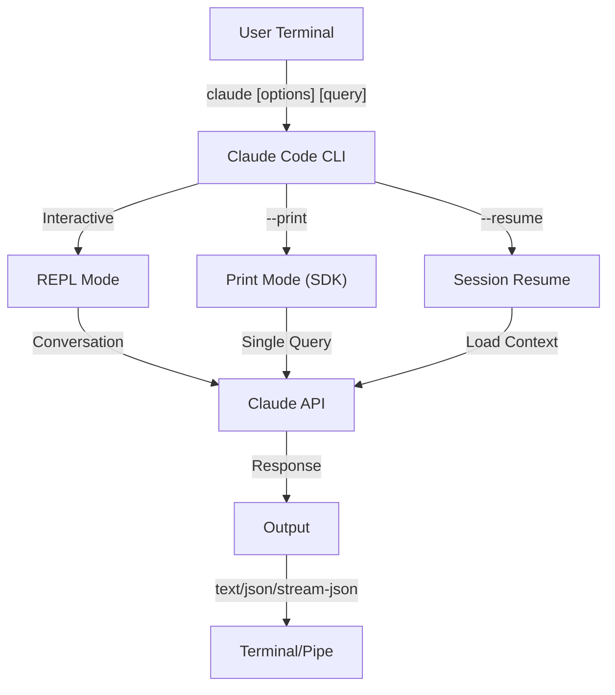
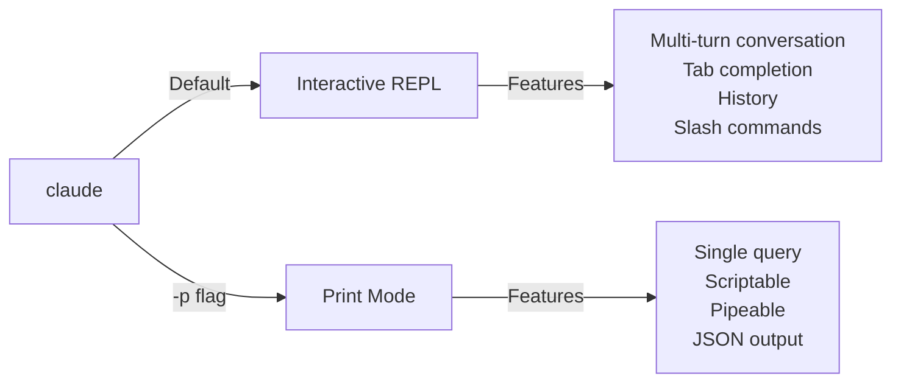

<picture>
  <source media="(prefers-color-scheme: dark)" srcset="../../resources/logos/claude-howto-logo-dark.svg">
  
</picture>

# Referencia del CLI

## Descripcion general

El CLI (Command Line Interface) de Claude Code es la forma principal de interactuar con Claude Code. Ofrece opciones potentes para ejecutar consultas, gestionar sesiones, configurar modelos e integrar Claude en tus workflows de desarrollo.

## Arquitectura



## Comandos del CLI

| Comando | Descripcion | Ejemplo |
|---------|-------------|---------|
| `claude` | Iniciar REPL interactivo | `claude` |
| `claude "query"` | Iniciar REPL con prompt inicial | `claude "explain this project"` |
| `claude -p "query"` | Modo print - consulta y sale | `claude -p "explain this function"` |
| `cat file \| claude -p "query"` | Procesar contenido por pipe | `cat logs.txt \| claude -p "explain"` |
| `claude -c` | Continuar la conversacion mas reciente | `claude -c` |
| `claude -c -p "query"` | Continuar en modo print | `claude -c -p "check for type errors"` |
| `claude -r "<session>" "query"` | Retomar sesion por ID o nombre | `claude -r "auth-refactor" "finish this PR"` |
| `claude update` | Actualizar a la ultima version | `claude update` |
| `claude mcp` | Configurar servidores MCP | Ver [documentacion MCP](../05-mcp/) |
| `claude mcp serve` | Ejecutar Claude Code como servidor MCP | `claude mcp serve` |
| `claude agents` | Listar todos los subagentes configurados | `claude agents` |
| `claude auto-mode defaults` | Mostrar reglas predeterminadas del modo auto como JSON | `claude auto-mode defaults` |
| `claude remote-control` | Iniciar servidor Remote Control | `claude remote-control` |
| `claude plugin` | Gestionar plugins (instalar, habilitar, deshabilitar) | `claude plugin install my-plugin` |
| `claude auth login` | Iniciar sesion (admite `--email`, `--sso`) | `claude auth login --email user@example.com` |
| `claude auth logout` | Cerrar sesion de la cuenta actual | `claude auth logout` |
| `claude auth status` | Verificar estado de autenticacion (exit 0 si conectado, 1 si no) | `claude auth status` |

## Flags principales

| Flag | Descripcion | Ejemplo |
|------|-------------|---------|
| `-p, --print` | Imprimir respuesta sin modo interactivo | `claude -p "query"` |
| `-c, --continue` | Cargar la conversacion mas reciente | `claude --continue` |
| `-r, --resume` | Retomar sesion especifica por ID o nombre | `claude --resume auth-refactor` |
| `-v, --version` | Mostrar numero de version | `claude -v` |
| `-w, --worktree` | Iniciar en git worktree aislado | `claude -w` |
| `-n, --name` | Nombre de visualizacion de la sesion | `claude -n "auth-refactor"` |
| `--from-pr <number>` | Retomar sesiones vinculadas a un PR de GitHub | `claude --from-pr 42` |
| `--remote "task"` | Crear sesion web en claude.ai | `claude --remote "implement API"` |
| `--remote-control, --rc` | Sesion interactiva con Remote Control | `claude --rc` |
| `--teleport` | Retomar sesion web localmente | `claude --teleport` |
| `--teammate-mode` | Modo de visualizacion de equipo de agentes | `claude --teammate-mode tmux` |
| `--bare` | Modo minimo (omite hooks, skills, plugins, MCP, auto memory, CLAUDE.md) | `claude --bare` |
| `--enable-auto-mode` | Habilitar modo de permisos automatico | `claude --enable-auto-mode` |
| `--channels` | Suscribirse a plugins de canal MCP | `claude --channels discord,telegram` |
| `--chrome` / `--no-chrome` | Habilitar/deshabilitar integracion con Chrome | `claude --chrome` |
| `--effort` | Establecer nivel de esfuerzo de razonamiento | `claude --effort high` |
| `--init` / `--init-only` | Ejecutar hooks de inicializacion | `claude --init` |
| `--maintenance` | Ejecutar hooks de mantenimiento y salir | `claude --maintenance` |
| `--disable-slash-commands` | Deshabilitar todos los skills y slash commands | `claude --disable-slash-commands` |
| `--no-session-persistence` | Deshabilitar guardado de sesion (modo print) | `claude -p --no-session-persistence "query"` |

### Modo interactivo vs modo print



**Modo interactivo** (predeterminado):
```bash
# Iniciar sesion interactiva
claude

# Iniciar con prompt inicial
claude "explain the authentication flow"
```

**Modo print** (no interactivo):
```bash
# Consulta unica, luego sale
claude -p "what does this function do?"

# Procesar contenido de archivo
cat error.log | claude -p "explain this error"

# Encadenar con otras herramientas
claude -p "list todos" | grep "URGENT"
```

## Modelo y configuracion

| Flag | Descripcion | Ejemplo |
|------|-------------|---------|
| `--model` | Establecer modelo (sonnet, opus, haiku, o nombre completo) | `claude --model opus` |
| `--fallback-model` | Modelo de respaldo automatico cuando hay sobrecarga | `claude -p --fallback-model sonnet "query"` |
| `--agent` | Especificar agente para la sesion | `claude --agent my-custom-agent` |
| `--agents` | Definir subagentes personalizados via JSON | Ver [Configuracion de agentes](#configuracion-de-agentes) |
| `--effort` | Establecer nivel de esfuerzo (low, medium, high, max) | `claude --effort high` |

### Ejemplos de seleccion de modelo

```bash
# Usar Opus 4.6 para tareas complejas
claude --model opus "design a caching strategy"

# Usar Haiku 4.5 para tareas rapidas
claude --model haiku -p "format this JSON"

# Nombre completo del modelo
claude --model claude-sonnet-4-6-20250929 "review this code"

# Con fallback para mayor confiabilidad
claude -p --model opus --fallback-model sonnet "analyze architecture"

# Usar opusplan (Opus planifica, Sonnet ejecuta)
claude --model opusplan "design and implement the caching layer"
```

## Personalizacion del system prompt

| Flag | Descripcion | Ejemplo |
|------|-------------|---------|
| `--system-prompt` | Reemplazar todo el prompt predeterminado | `claude --system-prompt "You are a Python expert"` |
| `--system-prompt-file` | Cargar prompt desde archivo (modo print) | `claude -p --system-prompt-file ./prompt.txt "query"` |
| `--append-system-prompt` | Agregar al prompt predeterminado | `claude --append-system-prompt "Always use TypeScript"` |

### Ejemplos de system prompt

```bash
# Persona completamente personalizada
claude --system-prompt "You are a senior security engineer. Focus on vulnerabilities."

# Agregar instrucciones especificas
claude --append-system-prompt "Always include unit tests with code examples"

# Cargar prompt complejo desde archivo
claude -p --system-prompt-file ./prompts/code-reviewer.txt "review main.py"
```

### Comparacion de flags de system prompt

| Flag | Comportamiento | Interactivo | Print |
|------|----------|-------------|-------|
| `--system-prompt` | Reemplaza todo el system prompt predeterminado | ✅ | ✅ |
| `--system-prompt-file` | Reemplaza con el prompt de un archivo | ❌ | ✅ |
| `--append-system-prompt` | Agrega al system prompt predeterminado | ✅ | ✅ |

**Usa `--system-prompt-file` solo en modo print. Para el modo interactivo, usa `--system-prompt` o `--append-system-prompt`.**

## Gestion de herramientas y permisos

| Flag | Descripcion | Ejemplo |
|------|-------------|---------|
| `--tools` | Restringir herramientas integradas disponibles | `claude -p --tools "Bash,Edit,Read" "query"` |
| `--allowedTools` | Herramientas que se ejecutan sin solicitar confirmacion | `"Bash(git log:*)" "Read"` |
| `--disallowedTools` | Herramientas eliminadas del contexto | `"Bash(rm:*)" "Edit"` |
| `--dangerously-skip-permissions` | Omitir todas las solicitudes de permisos | `claude --dangerously-skip-permissions` |
| `--permission-mode` | Iniciar en el modo de permisos especificado | `claude --permission-mode auto` |
| `--permission-prompt-tool` | Herramienta MCP para gestionar permisos | `claude -p --permission-prompt-tool mcp_auth "query"` |
| `--enable-auto-mode` | Habilitar modo de permisos automatico | `claude --enable-auto-mode` |

### Ejemplos de permisos

```bash
# Modo solo lectura para revision de codigo
claude --permission-mode plan "review this codebase"

# Restringir a herramientas seguras solamente
claude --tools "Read,Grep,Glob" -p "find all TODO comments"

# Permitir comandos git especificos sin confirmacion
claude --allowedTools "Bash(git status:*)" "Bash(git log:*)"

# Bloquear operaciones peligrosas
claude --disallowedTools "Bash(rm -rf:*)" "Bash(git push --force:*)"
```

## Salida y formato

| Flag | Descripcion | Opciones | Ejemplo |
|------|-------------|---------|---------|
| `--output-format` | Especificar formato de salida (modo print) | `text`, `json`, `stream-json` | `claude -p --output-format json "query"` |
| `--input-format` | Especificar formato de entrada (modo print) | `text`, `stream-json` | `claude -p --input-format stream-json` |
| `--verbose` | Habilitar registro detallado | | `claude --verbose` |
| `--include-partial-messages` | Incluir eventos de streaming | Requiere `stream-json` | `claude -p --output-format stream-json --include-partial-messages "query"` |
| `--json-schema` | Obtener JSON validado que coincida con el esquema | | `claude -p --json-schema '{"type":"object"}' "query"` |
| `--max-budget-usd` | Gasto maximo para modo print | | `claude -p --max-budget-usd 5.00 "query"` |

### Ejemplos de formato de salida

```bash
# Texto plano (predeterminado)
claude -p "explain this code"

# JSON para uso programatico
claude -p --output-format json "list all functions in main.py"

# JSON en streaming para procesamiento en tiempo real
claude -p --output-format stream-json "generate a long report"

# Salida estructurada con validacion de esquema
claude -p --json-schema '{"type":"object","properties":{"bugs":{"type":"array"}}}' \
  "find bugs in this code and return as JSON"
```

## Workspace y directorio

| Flag | Descripcion | Ejemplo |
|------|-------------|---------|
| `--add-dir` | Agregar directorios de trabajo adicionales | `claude --add-dir ../apps ../lib` |
| `--setting-sources` | Fuentes de configuracion separadas por coma | `claude --setting-sources user,project` |
| `--settings` | Cargar configuracion desde archivo o JSON | `claude --settings ./settings.json` |
| `--plugin-dir` | Cargar plugins desde directorio (repetible) | `claude --plugin-dir ./my-plugin` |

### Ejemplo con multiples directorios

```bash
# Trabajar en multiples directorios de proyecto
claude --add-dir ../frontend ../backend ../shared "find all API endpoints"

# Cargar configuracion personalizada
claude --settings '{"model":"opus","verbose":true}' "complex task"
```

## Configuracion MCP

| Flag | Descripcion | Ejemplo |
|------|-------------|---------|
| `--mcp-config` | Cargar servidores MCP desde JSON | `claude --mcp-config ./mcp.json` |
| `--strict-mcp-config` | Usar solo la configuracion MCP especificada | `claude --strict-mcp-config --mcp-config ./mcp.json` |
| `--channels` | Suscribirse a plugins de canal MCP | `claude --channels discord,telegram` |

### Ejemplos de MCP

```bash
# Cargar servidor MCP de GitHub
claude --mcp-config ./github-mcp.json "list open PRs"

# Modo estricto - solo servidores especificados
claude --strict-mcp-config --mcp-config ./production-mcp.json "deploy to staging"
```

## Gestion de sesiones

| Flag | Descripcion | Ejemplo |
|------|-------------|---------|
| `--session-id` | Usar ID de sesion especifica (UUID) | `claude --session-id "550e8400-..."` |
| `--fork-session` | Crear nueva sesion al retomar | `claude --resume abc123 --fork-session` |

### Ejemplos de sesion

```bash
# Continuar la ultima conversacion
claude -c

# Retomar sesion con nombre
claude -r "feature-auth" "continue implementing login"

# Bifurcar sesion para experimentar
claude --resume feature-auth --fork-session "try alternative approach"

# Usar ID de sesion especifica
claude --session-id "550e8400-e29b-41d4-a716-446655440000" "continue"
```

### Bifurcacion de sesion

Crea una rama desde una sesion existente para experimentar:

```bash
# Bifurcar una sesion para probar un enfoque diferente
claude --resume abc123 --fork-session "try alternative implementation"

# Bifurcar con un mensaje personalizado
claude -r "feature-auth" --fork-session "test with different architecture"
```

**Casos de uso:**
- Probar implementaciones alternativas sin perder la sesion original
- Experimentar con diferentes enfoques en paralelo
- Crear ramas desde trabajo exitoso para variaciones
- Probar cambios disruptivos sin afectar la sesion principal

La sesion original permanece sin cambios y la bifurcacion se convierte en una nueva sesion independiente.

## Funcionalidades avanzadas

| Flag | Descripcion | Ejemplo |
|------|-------------|---------|
| `--chrome` | Habilitar integracion con Chrome | `claude --chrome` |
| `--no-chrome` | Deshabilitar integracion con Chrome | `claude --no-chrome` |
| `--ide` | Conectar automaticamente al IDE si esta disponible | `claude --ide` |
| `--max-turns` | Limitar turnos agénticos (no interactivo) | `claude -p --max-turns 3 "query"` |
| `--debug` | Habilitar modo debug con filtrado | `claude --debug "api,mcp"` |
| `--enable-lsp-logging` | Habilitar registro LSP detallado | `claude --enable-lsp-logging` |
| `--betas` | Headers beta para solicitudes API | `claude --betas interleaved-thinking` |
| `--plugin-dir` | Cargar plugins desde directorio (repetible) | `claude --plugin-dir ./my-plugin` |
| `--enable-auto-mode` | Habilitar modo de permisos automatico | `claude --enable-auto-mode` |
| `--effort` | Establecer nivel de esfuerzo de razonamiento | `claude --effort high` |
| `--bare` | Modo minimo (omite hooks, skills, plugins, MCP, auto memory, CLAUDE.md) | `claude --bare` |
| `--channels` | Suscribirse a plugins de canal MCP | `claude --channels discord` |
| `--tmux` | Crear sesion tmux para worktree | `claude --tmux` |
| `--fork-session` | Crear nuevo ID de sesion al retomar | `claude --resume abc --fork-session` |
| `--max-budget-usd` | Gasto maximo (modo print) | `claude -p --max-budget-usd 5.00 "query"` |
| `--json-schema` | Salida JSON validada | `claude -p --json-schema '{"type":"object"}' "q"` |

### Ejemplos avanzados

```bash
# Limitar acciones autonomas
claude -p --max-turns 5 "refactor this module"

# Depurar llamadas API
claude --debug "api" "test query"

# Habilitar integracion con IDE
claude --ide "help me with this file"
```

## Configuracion de agentes

El flag `--agents` acepta un objeto JSON que define subagentes personalizados para una sesion.

### Formato JSON de agentes

```json
{
  "agent-name": {
    "description": "Required: when to invoke this agent",
    "prompt": "Required: system prompt for the agent",
    "tools": ["Optional", "array", "of", "tools"],
    "model": "optional: sonnet|opus|haiku"
  }
}
```

**Campos requeridos:**
- `description` - Descripcion en lenguaje natural de cuando usar este agente
- `prompt` - System prompt que define el rol y comportamiento del agente

**Campos opcionales:**
- `tools` - Array de herramientas disponibles (hereda todas si se omite)
  - Formato: `["Read", "Grep", "Glob", "Bash"]`
- `model` - Modelo a usar: `sonnet`, `opus`, o `haiku`

### Ejemplo completo de agentes

```json
{
  "code-reviewer": {
    "description": "Expert code reviewer. Use proactively after code changes.",
    "prompt": "You are a senior code reviewer. Focus on code quality, security, and best practices.",
    "tools": ["Read", "Grep", "Glob", "Bash"],
    "model": "sonnet"
  },
  "debugger": {
    "description": "Debugging specialist for errors and test failures.",
    "prompt": "You are an expert debugger. Analyze errors, identify root causes, and provide fixes.",
    "tools": ["Read", "Edit", "Bash", "Grep"],
    "model": "opus"
  },
  "documenter": {
    "description": "Documentation specialist for generating guides.",
    "prompt": "You are a technical writer. Create clear, comprehensive documentation.",
    "tools": ["Read", "Write"],
    "model": "haiku"
  }
}
```

### Ejemplos de comandos con agentes

```bash
# Definir agentes personalizados inline
claude --agents '{
  "security-auditor": {
    "description": "Security specialist for vulnerability analysis",
    "prompt": "You are a security expert. Find vulnerabilities and suggest fixes.",
    "tools": ["Read", "Grep", "Glob"],
    "model": "opus"
  }
}' "audit this codebase for security issues"

# Cargar agentes desde archivo
claude --agents "$(cat ~/.claude/agents.json)" "review the auth module"

# Combinar con otros flags
claude -p --agents "$(cat agents.json)" --model sonnet "analyze performance"
```

### Prioridad de agentes

Cuando existen multiples definiciones de agentes, se cargan en este orden de prioridad:
1. **Definidos por CLI** (flag `--agents`) - Especificos de la sesion
2. **Nivel de usuario** (`~/.claude/agents/`) - Todos los proyectos
3. **Nivel de proyecto** (`.claude/agents/`) - Proyecto actual

Los agentes definidos por CLI sobrescriben tanto los agentes de usuario como los de proyecto para la sesion.

---

## Casos de uso de alto valor

### 1. Integracion CI/CD

Usa Claude Code en tus pipelines de CI/CD para revision automatizada de codigo, testing y documentacion.

**Ejemplo con GitHub Actions:**

```yaml
name: AI Code Review

on: [pull_request]

jobs:
  review:
    runs-on: ubuntu-latest
    steps:
      - uses: actions/checkout@v4

      - name: Install Claude Code
        run: npm install -g @anthropic-ai/claude-code

      - name: Run Code Review
        env:
          ANTHROPIC_API_KEY: ${{ secrets.ANTHROPIC_API_KEY }}
        run: |
          claude -p --output-format json \
            --max-turns 1 \
            "Review the changes in this PR for:
            - Security vulnerabilities
            - Performance issues
            - Code quality
            Output as JSON with 'issues' array" > review.json

      - name: Post Review Comment
        uses: actions/github-script@v7
        with:
          script: |
            const fs = require('fs');
            const review = JSON.parse(fs.readFileSync('review.json', 'utf8'));
            // Process and post review comments
```

**Pipeline de Jenkins:**

```groovy
pipeline {
    agent any
    stages {
        stage('AI Review') {
            steps {
                sh '''
                    claude -p --output-format json \
                      --max-turns 3 \
                      "Analyze test coverage and suggest missing tests" \
                      > coverage-analysis.json
                '''
            }
        }
    }
}
```

### 2. Procesamiento por pipe en scripts

Procesa archivos, logs y datos a traves de Claude para analisis.

**Analisis de logs:**

```bash
# Analizar logs de error
tail -1000 /var/log/app/error.log | claude -p "summarize these errors and suggest fixes"

# Encontrar patrones en logs de acceso
cat access.log | claude -p "identify suspicious access patterns"

# Analizar historial de git
git log --oneline -50 | claude -p "summarize recent development activity"
```

**Procesamiento de codigo:**

```bash
# Revisar un archivo especifico
cat src/auth.ts | claude -p "review this authentication code for security issues"

# Generar documentacion
cat src/api/*.ts | claude -p "generate API documentation in markdown"

# Encontrar TODOs y priorizarlos
grep -r "TODO" src/ | claude -p "prioritize these TODOs by importance"
```

### 3. Workflows con multiples sesiones

Gestiona proyectos complejos con multiples hilos de conversacion.

```bash
# Iniciar sesion de rama de funcionalidad
claude -r "feature-auth" "let's implement user authentication"

# Mas tarde, continuar la sesion
claude -r "feature-auth" "add password reset functionality"

# Bifurcar para probar un enfoque alternativo
claude --resume feature-auth --fork-session "try OAuth instead"

# Cambiar entre diferentes sesiones de funcionalidad
claude -r "feature-payments" "continue with Stripe integration"
```

### 4. Configuracion personalizada de agentes

Define agentes especializados para los workflows de tu equipo.

```bash
# Guardar configuracion de agentes en archivo
cat > ~/.claude/agents.json << 'EOF'
{
  "reviewer": {
    "description": "Code reviewer for PR reviews",
    "prompt": "Review code for quality, security, and maintainability.",
    "model": "opus"
  },
  "documenter": {
    "description": "Documentation specialist",
    "prompt": "Generate clear, comprehensive documentation.",
    "model": "sonnet"
  },
  "refactorer": {
    "description": "Code refactoring expert",
    "prompt": "Suggest and implement clean code refactoring.",
    "tools": ["Read", "Edit", "Glob"]
  }
}
EOF

# Usar agentes en la sesion
claude --agents "$(cat ~/.claude/agents.json)" "review the auth module"
```

### 5. Procesamiento por lotes

Procesa multiples consultas con configuracion consistente.

```bash
# Procesar multiples archivos
for file in src/*.ts; do
  echo "Processing $file..."
  claude -p --model haiku "summarize this file: $(cat $file)" >> summaries.md
done

# Revision de codigo por lotes
find src -name "*.py" -exec sh -c '
  echo "## $1" >> review.md
  cat "$1" | claude -p "brief code review" >> review.md
' _ {} \;

# Generar tests para todos los modulos
for module in $(ls src/modules/); do
  claude -p "generate unit tests for src/modules/$module" > "tests/$module.test.ts"
done
```

### 6. Desarrollo consciente de la seguridad

Usa controles de permisos para una operacion segura.

```bash
# Auditoria de seguridad en modo solo lectura
claude --permission-mode plan \
  --tools "Read,Grep,Glob" \
  "audit this codebase for security vulnerabilities"

# Bloquear comandos peligrosos
claude --disallowedTools "Bash(rm:*)" "Bash(curl:*)" "Bash(wget:*)" \
  "help me clean up this project"

# Automatizacion restringida
claude -p --max-turns 2 \
  --allowedTools "Read" "Glob" \
  "find all hardcoded credentials"
```

### 7. Integracion de API JSON

Usa Claude como una API programable para tus herramientas con parseo de `jq`.

```bash
# Obtener analisis estructurado
claude -p --output-format json \
  --json-schema '{"type":"object","properties":{"functions":{"type":"array"},"complexity":{"type":"string"}}}' \
  "analyze main.py and return function list with complexity rating"

# Integrar con jq para procesamiento
claude -p --output-format json "list all API endpoints" | jq '.endpoints[]'

# Usar en scripts
RESULT=$(claude -p --output-format json "is this code secure? answer with {secure: boolean, issues: []}" < code.py)
if echo "$RESULT" | jq -e '.secure == false' > /dev/null; then
  echo "Security issues found!"
  echo "$RESULT" | jq '.issues[]'
fi
```

### Ejemplos de parseo con jq

Parsea y procesa la salida JSON de Claude usando `jq`:

```bash
# Extraer campos especificos
claude -p --output-format json "analyze this code" | jq '.result'

# Filtrar elementos de array
claude -p --output-format json "list issues" | jq -r '.issues[] | select(.severity=="high")'

# Extraer multiples campos
claude -p --output-format json "describe the project" | jq -r '.{name, version, description}'

# Convertir a CSV
claude -p --output-format json "list functions" | jq -r '.functions[] | [.name, .lineCount] | @csv'

# Procesamiento condicional
claude -p --output-format json "check security" | jq 'if .vulnerabilities | length > 0 then "UNSAFE" else "SAFE" end'

# Extraer valores anidados
claude -p --output-format json "analyze performance" | jq '.metrics.cpu.usage'

# Procesar array completo
claude -p --output-format json "find todos" | jq '.todos | length'

# Transformar salida
claude -p --output-format json "list improvements" | jq 'map({title: .title, priority: .priority})'
```

---

## Modelos

Claude Code admite multiples modelos con diferentes capacidades:

| Modelo | ID | Ventana de contexto | Notas |
|-------|-----|----------------|-------|
| Opus 4.6 | `claude-opus-4-6` | 1M tokens | El mas capaz, niveles de esfuerzo adaptativos |
| Sonnet 4.6 | `claude-sonnet-4-6` | 1M tokens | Equilibrio entre velocidad y capacidad |
| Haiku 4.5 | `claude-haiku-4-5` | 1M tokens | El mas rapido, ideal para tareas rapidas |

### Seleccion de modelo

```bash
# Usar nombres cortos
claude --model opus "complex architectural review"
claude --model sonnet "implement this feature"
claude --model haiku -p "format this JSON"

# Usar alias opusplan (Opus planifica, Sonnet ejecuta)
claude --model opusplan "design and implement the API"

# Activar modo rapido durante la sesion
/fast
```

### Niveles de esfuerzo (Opus 4.6)

Opus 4.6 admite razonamiento adaptativo con niveles de esfuerzo:

```bash
# Establecer nivel de esfuerzo via flag CLI
claude --effort high "complex review"

# Establecer nivel de esfuerzo via slash command
/effort high

# Establecer nivel de esfuerzo via variable de entorno
export CLAUDE_CODE_EFFORT_LEVEL=high   # low, medium, high, or max (Opus 4.6 only)
```

La palabra clave "ultrathink" en los prompts activa el razonamiento profundo. El nivel de esfuerzo `max` es exclusivo de Opus 4.6.

---

## Variables de entorno clave

| Variable | Descripcion |
|----------|-------------|
| `ANTHROPIC_API_KEY` | Clave API para autenticacion |
| `ANTHROPIC_MODEL` | Reemplazar el modelo predeterminado |
| `ANTHROPIC_CUSTOM_MODEL_OPTION` | Opcion de modelo personalizado para la API |
| `ANTHROPIC_DEFAULT_OPUS_MODEL` | Reemplazar ID del modelo Opus predeterminado |
| `ANTHROPIC_DEFAULT_SONNET_MODEL` | Reemplazar ID del modelo Sonnet predeterminado |
| `ANTHROPIC_DEFAULT_HAIKU_MODEL` | Reemplazar ID del modelo Haiku predeterminado |
| `MAX_THINKING_TOKENS` | Establecer presupuesto de tokens para razonamiento extendido |
| `CLAUDE_CODE_EFFORT_LEVEL` | Establecer nivel de esfuerzo (`low`/`medium`/`high`/`max`) |
| `CLAUDE_CODE_SIMPLE` | Modo minimo, establecido por el flag `--bare` |
| `CLAUDE_CODE_DISABLE_AUTO_MEMORY` | Deshabilitar actualizaciones automaticas de CLAUDE.md |
| `CLAUDE_CODE_DISABLE_BACKGROUND_TASKS` | Deshabilitar ejecucion de tareas en segundo plano |
| `CLAUDE_CODE_DISABLE_CRON` | Deshabilitar tareas programadas/cron |
| `CLAUDE_CODE_DISABLE_GIT_INSTRUCTIONS` | Deshabilitar instrucciones relacionadas con git |
| `CLAUDE_CODE_DISABLE_TERMINAL_TITLE` | Deshabilitar actualizaciones del titulo del terminal |
| `CLAUDE_CODE_DISABLE_1M_CONTEXT` | Deshabilitar ventana de contexto de 1M tokens |
| `CLAUDE_CODE_DISABLE_NONSTREAMING_FALLBACK` | Deshabilitar fallback sin streaming |
| `CLAUDE_CODE_ENABLE_TASKS` | Habilitar funcion de lista de tareas |
| `CLAUDE_CODE_TASK_LIST_ID` | Directorio de tareas con nombre compartido entre sesiones |
| `CLAUDE_CODE_ENABLE_PROMPT_SUGGESTION` | Activar/desactivar sugerencias de prompt (`true`/`false`) |
| `CLAUDE_CODE_EXPERIMENTAL_AGENT_TEAMS` | Habilitar equipos de agentes experimentales |
| `CLAUDE_CODE_NEW_INIT` | Usar nuevo flujo de inicializacion |
| `CLAUDE_CODE_SUBAGENT_MODEL` | Modelo para ejecucion de subagentes |
| `CLAUDE_CODE_PLUGIN_SEED_DIR` | Directorio para archivos seed de plugins |
| `CLAUDE_CODE_SUBPROCESS_ENV_SCRUB` | Variables de entorno a eliminar de subprocesos |
| `CLAUDE_AUTOCOMPACT_PCT_OVERRIDE` | Reemplazar porcentaje de autocompactacion |
| `CLAUDE_STREAM_IDLE_TIMEOUT_MS` | Tiempo de espera inactivo del stream en milisegundos |
| `SLASH_COMMAND_TOOL_CHAR_BUDGET` | Presupuesto de caracteres para herramientas de slash command |
| `ENABLE_TOOL_SEARCH` | Habilitar capacidad de busqueda de herramientas |
| `MAX_MCP_OUTPUT_TOKENS` | Maxima cantidad de tokens para salida de herramientas MCP |

---

## Referencia rapida

### Comandos mas comunes

```bash
# Sesion interactiva
claude

# Pregunta rapida
claude -p "how do I..."

# Continuar conversacion
claude -c

# Procesar un archivo
cat file.py | claude -p "review this"

# Salida JSON para scripts
claude -p --output-format json "query"
```

### Combinaciones de flags

| Caso de uso | Comando |
|----------|---------|
| Revision rapida de codigo | `cat file | claude -p "review"` |
| Salida estructurada | `claude -p --output-format json "query"` |
| Exploracion segura | `claude --permission-mode plan` |
| Autonomo con seguridad | `claude --enable-auto-mode --permission-mode auto` |
| Integracion CI/CD | `claude -p --max-turns 3 --output-format json` |
| Retomar trabajo | `claude -r "session-name"` |
| Modelo personalizado | `claude --model opus "complex task"` |
| Modo minimo | `claude --bare "quick query"` |
| Ejecucion con presupuesto limitado | `claude -p --max-budget-usd 2.00 "analyze code"` |

---

## Solucion de problemas

### Comando no encontrado

**Problema:** `claude: command not found`

**Soluciones:**
- Instalar Claude Code: `npm install -g @anthropic-ai/claude-code`
- Verificar que el PATH incluya el directorio bin global de npm
- Intentar ejecutar con la ruta completa: `npx claude`

### Problemas con la clave API

**Problema:** Autenticacion fallida

**Soluciones:**
- Establecer la clave API: `export ANTHROPIC_API_KEY=your-key`
- Verificar que la clave sea valida y tenga creditos suficientes
- Comprobar los permisos de la clave para el modelo solicitado

### Sesion no encontrada

**Problema:** No se puede retomar la sesion

**Soluciones:**
- Listar las sesiones disponibles para encontrar el nombre/ID correcto
- Las sesiones pueden expirar despues de un periodo de inactividad
- Usar `-c` para continuar la sesion mas reciente

### Problemas con el formato de salida

**Problema:** La salida JSON tiene formato incorrecto

**Soluciones:**
- Usar `--json-schema` para imponer estructura
- Agregar instrucciones JSON explicitas en el prompt
- Usar `--output-format json` (no solo pedir JSON en el prompt)

### Permiso denegado

**Problema:** Ejecucion de herramienta bloqueada

**Soluciones:**
- Revisar la configuracion de `--permission-mode`
- Verificar los flags `--allowedTools` y `--disallowedTools`
- Usar `--dangerously-skip-permissions` para automatizacion (con precaucion)

---

## Recursos adicionales

- **[Referencia oficial del CLI](https://code.claude.com/docs/en/cli-reference)** - Referencia completa de comandos
- **[Documentacion de modo headless](https://code.claude.com/docs/en/headless)** - Ejecucion automatizada
- **[Slash Commands](../01-slash-commands/)** - Atajos personalizados dentro de Claude
- **[Guia de memoria](../02-memory/)** - Contexto persistente via CLAUDE.md
- **[Protocolo MCP](../05-mcp/)** - Integraciones de herramientas externas
- **[Funcionalidades avanzadas](../09-advanced-features/)** - Modo de planificacion, razonamiento extendido
- **[Guia de subagentes](../04-subagents/)** - Ejecucion delegada de tareas

---

*Parte de la serie de guias [Claude How To](../)*

---
**Ultima Actualizacion**: Abril 2026
**Claude Code Version**: 2.1+
**Compatible Models**: Claude Sonnet 4.6, Claude Opus 4.6, Claude Haiku 4.5
