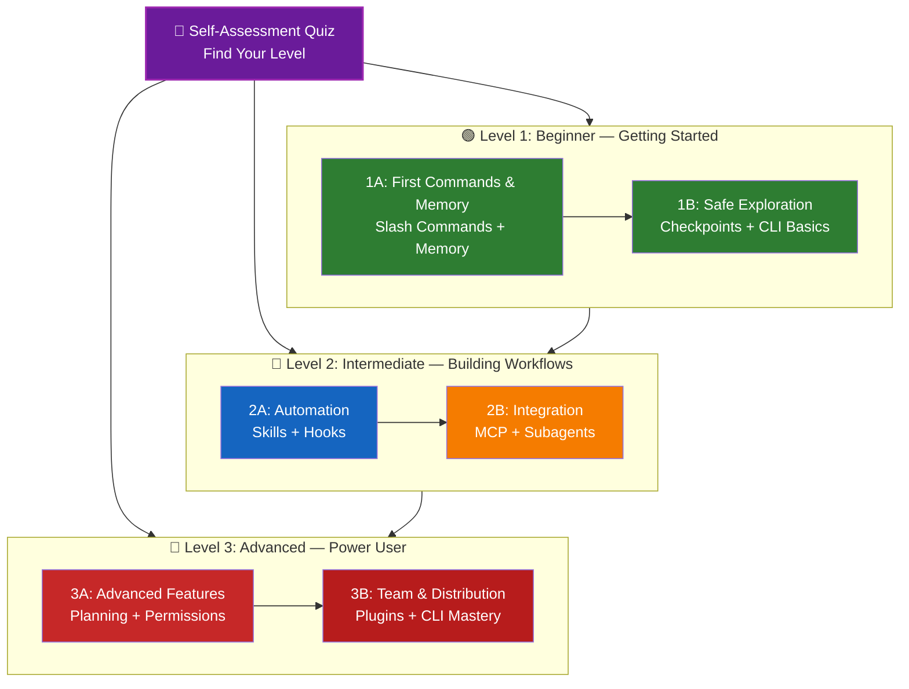

<picture>
  <source media="(prefers-color-scheme: dark)" srcset="resources/logos/claude-howto-logo-dark.svg">
  
</picture>

# Roadmap de Aprendizaje de Claude Code

**¿Eres nuevo en Claude Code?** Esta guía te ayuda a dominar las funcionalidades de Claude Code a tu propio ritmo. Tanto si eres un principiante completo como un desarrollador con experiencia, empieza con el quiz de autoevaluación de abajo para encontrar el camino correcto para ti.

---

## Encuentra tu nivel

No todo el mundo empieza desde el mismo lugar. Haz esta autoevaluación rápida para encontrar el punto de entrada correcto.

**Respondé estas preguntas con honestidad:**

- [ ] Puedo iniciar Claude Code y tener una conversación (`claude`)
- [ ] He creado o editado un archivo CLAUDE.md
- [ ] He usado al menos 3 slash commands integrados (ej. /help, /compact, /model)
- [ ] He creado un slash command personalizado o un skill (SKILL.md)
- [ ] He configurado un servidor MCP (ej. GitHub, base de datos)
- [ ] He configurado hooks en ~/.claude/settings.json
- [ ] He creado o usado subagentes personalizados (.claude/agents/)
- [ ] He usado print mode (`claude -p`) para scripting o CI/CD

**Tu nivel:**

| Respuestas | Nivel | Empieza aquí | Tiempo para completar |
|--------|-------|----------|------------------|
| 0-2 | **Nivel 1: Principiante** — Empezando | [Milestone 1A](#milestone-1a-primeros-comandos-y-memory) | ~3 horas |
| 3-5 | **Nivel 2: Intermedio** — Construyendo Workflows | [Milestone 2A](#milestone-2a-automatizacin-skills--hooks) | ~5 horas |
| 6-8 | **Nivel 3: Avanzado** — Usuario Experto y Líder de Equipo | [Milestone 3A](#milestone-3a-funcionalidades-avanzadas) | ~5 horas |

> **Consejo**: Si no estás seguro, empieza un nivel más abajo. Es mejor repasar material conocido rápido que saltarse conceptos fundamentales.

> **Versión interactiva**: Ejecuta `/self-assessment` en Claude Code para un quiz guiado e interactivo que evalúa tu nivel en las 10 áreas de funcionalidades y genera un camino de aprendizaje personalizado.

---

## Filosofía de aprendizaje

Las carpetas de este repositorio están numeradas en el **orden de aprendizaje recomendado** según tres principios clave:

1. **Dependencias** — Los conceptos fundamentales van primero
2. **Complejidad** — Las funcionalidades más simples antes que las avanzadas
3. **Frecuencia de uso** — Las funcionalidades más comunes se enseñan temprano

Este enfoque garantiza que construyas una base sólida mientras obtienes beneficios inmediatos de productividad.

---

## Tu camino de aprendizaje



**Leyenda de colores:**
- Violeta: Quiz de autoevaluación
- Verde: Nivel 1 — Camino de principiante
- Azul / Dorado: Nivel 2 — Camino intermedio
- Rojo: Nivel 3 — Camino avanzado

---

## Tabla completa del roadmap

| Paso | Funcionalidad | Complejidad | Tiempo | Nivel | Dependencias | Por qué aprenderlo | Beneficios clave |
|------|---------|-----------|------|-------|--------------|----------------|--------------|
| **1** | [Slash Commands](../01-slash-commands/) | ⭐ Principiante | 30 min | Nivel 1 | Ninguna | Ganancias rápidas de productividad (55+ integrados + 5 skills incluidos) | Automatización instantánea, estándares del equipo |
| **2** | [Memory](../02-memory/) | ⭐⭐ Principiante+ | 45 min | Nivel 1 | Ninguna | Esencial para todas las funcionalidades | Contexto persistente, preferencias |
| **3** | [Checkpoints](../08-checkpoints/) | ⭐⭐ Intermedio | 45 min | Nivel 1 | Gestión de sesiones | Exploración segura | Experimentación, recuperación |
| **4** | [CLI Básico](../10-cli/) | ⭐⭐ Principiante+ | 30 min | Nivel 1 | Ninguna | Uso fundamental del CLI | Modo interactivo y print |
| **5** | [Skills](../03-skills/) | ⭐⭐ Intermedio | 1 hora | Nivel 2 | Slash Commands | Expertise automático | Capacidades reutilizables, consistencia |
| **6** | [Hooks](../06-hooks/) | ⭐⭐ Intermedio | 1 hora | Nivel 2 | Herramientas, Comandos | Automatización de workflows (25 eventos, 4 tipos) | Validación, quality gates |
| **7** | [MCP](../05-mcp/) | ⭐⭐⭐ Intermedio+ | 1 hora | Nivel 2 | Configuración | Acceso a datos en vivo | Integración en tiempo real, APIs |
| **8** | [Subagentes](../04-subagents/) | ⭐⭐⭐ Intermedio+ | 1,5 horas | Nivel 2 | Memory, Comandos | Manejo de tareas complejas (6 integrados incluyendo Bash) | Delegación, expertise especializado |
| **9** | [Funcionalidades Avanzadas](../09-advanced-features/) | ⭐⭐⭐⭐⭐ Avanzado | 2-3 horas | Nivel 3 | Todos los anteriores | Herramientas de usuario experto | Planning, Auto Mode, Channels, Voice Dictation, permisos |
| **10** | [Plugins](../07-plugins/) | ⭐⭐⭐⭐ Avanzado | 2 horas | Nivel 3 | Todos los anteriores | Soluciones completas | Onboarding del equipo, distribución |
| **11** | [CLI Avanzado](../10-cli/) | ⭐⭐⭐ Avanzado | 1 hora | Nivel 3 | Recomendado: Todos | Dominar el uso de línea de comandos | Scripting, CI/CD, automatización |

**Tiempo total de aprendizaje**: ~11-13 horas (o salta a tu nivel y ahorra tiempo)

---

## Nivel 1: Principiante — Empezando

**Para**: Usuarios con 0-2 respuestas en el quiz
**Tiempo**: ~3 horas
**Enfoque**: Productividad inmediata, entender los fundamentos
**Resultado**: Usuario diario cómodo, listo para el Nivel 2

### Milestone 1A: Primeros comandos y Memory

**Temas**: Slash Commands + Memory
**Tiempo**: 1-2 horas
**Complejidad**: ⭐ Principiante
**Objetivo**: Impulso inmediato de productividad con comandos personalizados y contexto persistente

#### Qué vas a lograr
✅ Crear slash commands personalizados para tareas repetitivas
✅ Configurar la project memory para los estándares del equipo
✅ Configurar preferencias personales
✅ Entender cómo Claude carga el contexto automáticamente

#### Ejercicios prácticos

```bash
# Ejercicio 1: Instalar tu primer slash command
mkdir -p .claude/commands
cp 01-slash-commands/optimize.md .claude/commands/

# Ejercicio 2: Crear project memory
cp 02-memory/project-CLAUDE.md ./CLAUDE.md

# Ejercicio 3: Probarlo
# En Claude Code, escribe: /optimize
```

#### Criterios de éxito
- [ ] Invocar exitosamente el comando `/optimize`
- [ ] Claude recuerda los estándares del proyecto desde CLAUDE.md
- [ ] Entiendes cuándo usar slash commands vs. memory

#### Próximos pasos
Una vez que te sientas cómodo, lee:
- [01-slash-commands/README.md](../01-slash-commands/README.md)
- [02-memory/README.md](../02-memory/README.md)

> **Comprueba tu comprensión**: Ejecuta `/lesson-quiz slash-commands` o `/lesson-quiz memory` en Claude Code para probar lo que aprendiste.

---

### Milestone 1B: Exploración segura

**Temas**: Checkpoints + CLI Básico
**Tiempo**: 1 hora
**Complejidad**: ⭐⭐ Principiante+
**Objetivo**: Aprender a experimentar con seguridad y usar los comandos CLI fundamentales

#### Qué vas a lograr
✅ Crear y restaurar checkpoints para experimentación segura
✅ Entender los modos interactivo vs. print
✅ Usar flags y opciones básicas del CLI
✅ Procesar archivos via piping

#### Ejercicios prácticos

```bash
# Ejercicio 1: Probar el workflow de checkpoints
# En Claude Code:
# Haz algunos cambios experimentales, luego presiona Esc+Esc o usa /rewind
# Seleccioná el checkpoint anterior a tu experimento
# Elegí "Restore code and conversation" para volver

# Ejercicio 2: Modo interactivo vs. print
claude "explain this project"           # Modo interactivo
claude -p "explain this function"       # Modo print (no interactivo)

# Ejercicio 3: Procesar contenido de archivo via piping
cat error.log | claude -p "explain this error"
```

#### Criterios de éxito
- [ ] Creaste y volviste a un checkpoint
- [ ] Usaste tanto el modo interactivo como el print
- [ ] Le pasaste un archivo a Claude para análisis
- [ ] Entiendes cuándo usar checkpoints para experimentación segura

#### Próximos pasos
- Leer: [08-checkpoints/README.md](../08-checkpoints/README.md)
- Leer: [10-cli/README.md](../10-cli/README.md)
- **¡Listo para el Nivel 2!** Continúa con el [Milestone 2A](#milestone-2a-automatizacin-skills--hooks)

> **Comprueba tu comprensión**: Ejecuta `/lesson-quiz checkpoints` o `/lesson-quiz cli` para verificar que estás listo para el Nivel 2.

---

## Nivel 2: Intermedio — Construyendo Workflows

**Para**: Usuarios con 3-5 respuestas en el quiz
**Tiempo**: ~5 horas
**Enfoque**: Automatización, integración, delegación de tareas
**Resultado**: Workflows automatizados, integraciones externas, listo para el Nivel 3

### Verificación de prerequisitos

Antes de empezar el Nivel 2, asegúrate de estar cómodo con estos conceptos del Nivel 1:

- [ ] Puedes crear y usar slash commands ([01-slash-commands/](../01-slash-commands/))
- [ ] Configuraste la project memory via CLAUDE.md ([02-memory/](../02-memory/))
- [ ] Sabes cómo crear y restaurar checkpoints ([08-checkpoints/](../08-checkpoints/))
- [ ] Puedes usar `claude` y `claude -p` desde la línea de comandos ([10-cli/](../10-cli/))

> **¿Tienes brechas?** Revisa los tutoriales enlazados arriba antes de continuar.

---

### Milestone 2A: Automatización (Skills + Hooks)

**Temas**: Skills + Hooks
**Tiempo**: 2-3 horas
**Complejidad**: ⭐⭐ Intermedio
**Objetivo**: Automatizar workflows comunes y verificaciones de calidad

#### Qué vas a lograr
✅ Invocar capacidades especializadas automáticamente con YAML frontmatter (incluyendo campos `effort` y `shell`)
✅ Configurar automatización basada en eventos a través de 25 eventos de hook
✅ Usar los 4 tipos de hook (command, http, prompt, agent)
✅ Aplicar estándares de calidad de código
✅ Crear hooks personalizados para tu workflow

#### Ejercicios prácticos

```bash
# Ejercicio 1: Instalar un skill
cp -r 03-skills/code-review ~/.claude/skills/

# Ejercicio 2: Configurar hooks
mkdir -p ~/.claude/hooks
cp 06-hooks/pre-tool-check.sh ~/.claude/hooks/
chmod +x ~/.claude/hooks/pre-tool-check.sh

# Ejercicio 3: Configurar hooks en settings
# Agregar a ~/.claude/settings.json:
{
  "hooks": {
    "PreToolUse": [
      {
        "matcher": "Bash",
        "hooks": [
          {
            "type": "command",
            "command": "~/.claude/hooks/pre-tool-check.sh"
          }
        ]
      }
    ]
  }
}
```

#### Criterios de éxito
- [ ] El skill de code review se invoca automáticamente cuando es relevante
- [ ] El hook PreToolUse corre antes de la ejecución de herramientas
- [ ] Entiendes la invocación automática de skills vs. los disparadores de eventos de hook

#### Próximos pasos
- Crea tu propio skill personalizado
- Configura hooks adicionales para tu workflow
- Leer: [03-skills/README.md](../03-skills/README.md)
- Leer: [06-hooks/README.md](../06-hooks/README.md)

> **Comprueba tu comprensión**: Ejecuta `/lesson-quiz skills` o `/lesson-quiz hooks` para probar tu conocimiento antes de continuar.

---

### Milestone 2B: Integración (MCP + Subagentes)

**Temas**: MCP + Subagentes
**Tiempo**: 2-3 horas
**Complejidad**: ⭐⭐⭐ Intermedio+
**Objetivo**: Integrar servicios externos y delegar tareas complejas

#### Qué vas a lograr
✅ Acceder a datos en vivo desde GitHub, bases de datos, etc.
✅ Delegar trabajo a agentes de IA especializados
✅ Entender cuándo usar MCP vs. subagentes
✅ Construir workflows integrados

#### Ejercicios prácticos

```bash
# Ejercicio 1: Configurar GitHub MCP
export GITHUB_TOKEN="tu_github_token"
claude mcp add github -- npx -y @modelcontextprotocol/server-github

# Ejercicio 2: Probar la integración MCP
# En Claude Code: /mcp__github__list_prs

# Ejercicio 3: Instalar subagentes
mkdir -p .claude/agents
cp 04-subagents/*.md .claude/agents/
```

#### Ejercicio de integración
Prueba este workflow completo:
1. Usa MCP para obtener un PR de GitHub
2. Deja que Claude delegue la revisión al subagente code-reviewer
3. Usa hooks para ejecutar tests automáticamente

#### Criterios de éxito
- [ ] Consultaste exitosamente datos de GitHub via MCP
- [ ] Claude delega tareas complejas a los subagentes
- [ ] Entiendes la diferencia entre MCP y subagentes
- [ ] Combinaste MCP + subagentes + hooks en un workflow

#### Próximos pasos
- Configura servidores MCP adicionales (base de datos, Slack, etc.)
- Crea subagentes personalizados para tu dominio
- Leer: [05-mcp/README.md](../05-mcp/README.md)
- Leer: [04-subagents/README.md](../04-subagents/README.md)
- **¡Listo para el Nivel 3!** Continúa con el [Milestone 3A](#milestone-3a-funcionalidades-avanzadas)

> **Comprueba tu comprensión**: Ejecuta `/lesson-quiz mcp` o `/lesson-quiz subagents` para verificar que estás listo para el Nivel 3.

---

## Nivel 3: Avanzado — Usuario Experto y Líder de Equipo

**Para**: Usuarios con 6-8 respuestas en el quiz
**Tiempo**: ~5 horas
**Enfoque**: Herramientas de equipo, CI/CD, funcionalidades enterprise, desarrollo de plugins
**Resultado**: Usuario experto, capaz de configurar workflows de equipo y CI/CD

### Verificación de prerequisitos

Antes de empezar el Nivel 3, asegúrate de estar cómodo con estos conceptos del Nivel 2:

- [ ] Puedes crear y usar skills con invocación automática ([03-skills/](../03-skills/))
- [ ] Configuraste hooks para automatización basada en eventos ([06-hooks/](../06-hooks/))
- [ ] Puedes configurar servidores MCP para datos externos ([05-mcp/](../05-mcp/))
- [ ] Sabes cómo usar subagentes para delegación de tareas ([04-subagents/](../04-subagents/))

> **¿Tienes brechas?** Revisa los tutoriales enlazados arriba antes de continuar.

---

### Milestone 3A: Funcionalidades Avanzadas

**Temas**: Funcionalidades Avanzadas (Planning, Permisos, Extended Thinking, Auto Mode, Channels, Voice Dictation, Remote/Desktop/Web)
**Tiempo**: 2-3 horas
**Complejidad**: ⭐⭐⭐⭐⭐ Avanzado
**Objetivo**: Dominar workflows avanzados y herramientas de usuario experto

#### Qué vas a lograr
✅ Planning mode para funcionalidades complejas
✅ Control de permisos granular con 6 modos (default, acceptEdits, plan, auto, dontAsk, bypassPermissions)
✅ Extended thinking via el toggle Alt+T / Option+T
✅ Gestión de tareas en segundo plano
✅ Auto Memory para preferencias aprendidas
✅ Auto Mode con clasificador de seguridad en segundo plano
✅ Channels para workflows multi-sesión estructurados
✅ Voice Dictation para interacción manos libres
✅ Control remoto, app desktop y sesiones web
✅ Agent Teams para colaboración multi-agente

#### Ejercicios prácticos

```bash
# Ejercicio 1: Usar planning mode
/plan Implement user authentication system

# Ejercicio 2: Probar modos de permiso (6 disponibles: default, acceptEdits, plan, auto, dontAsk, bypassPermissions)
claude --permission-mode plan "analyze this codebase"
claude --permission-mode acceptEdits "refactor the auth module"
claude --permission-mode auto "implement the feature"

# Ejercicio 3: Activar extended thinking
# Presioná Alt+T (Option+T en macOS) durante una sesión para activar/desactivar

# Ejercicio 4: Workflow avanzado de checkpoints
# 1. Crear checkpoint "Estado limpio"
# 2. Usar planning mode para diseñar una funcionalidad
# 3. Implementar con delegación a subagente
# 4. Ejecutar tests en segundo plano
# 5. Si los tests fallan, hacer rewind al checkpoint
# 6. Probar enfoque alternativo

# Ejercicio 5: Probar auto mode (clasificador de seguridad en segundo plano)
claude --permission-mode auto "implement user settings page"

# Ejercicio 6: Activar agent teams
export CLAUDE_AGENT_TEAMS=1
# Pedirle a Claude: "Implement feature X using a team approach"

# Ejercicio 7: Scheduled tasks
/loop 5m /check-status
# O usar CronCreate para tareas programadas persistentes

# Ejercicio 8: Channels para workflows multi-sesión
# Usar channels para organizar el trabajo entre sesiones

# Ejercicio 9: Voice Dictation
# Usar entrada de voz para interacción manos libres con Claude Code
```

#### Criterios de éxito
- [ ] Usaste planning mode para una funcionalidad compleja
- [ ] Configuraste modos de permiso (plan, acceptEdits, auto, dontAsk)
- [ ] Activaste extended thinking con Alt+T / Option+T
- [ ] Usaste auto mode con el clasificador de seguridad en segundo plano
- [ ] Usaste tareas en segundo plano para operaciones largas
- [ ] Exploraste Channels para workflows multi-sesión
- [ ] Probaste Voice Dictation para entrada manos libres
- [ ] Entiendes Remote Control, Desktop App y sesiones Web
- [ ] Activaste y usaste Agent Teams para tareas colaborativas
- [ ] Usaste `/loop` para tareas recurrentes o monitoreo programado

#### Próximos pasos
- Leer: [09-advanced-features/README.md](../09-advanced-features/README.md)

> **Comprueba tu comprensión**: Ejecuta `/lesson-quiz advanced` para probar tu dominio de las funcionalidades de usuario experto.

---

### Milestone 3B: Equipo y Distribución (Plugins + CLI Avanzado)

**Temas**: Plugins + CLI Avanzado + CI/CD
**Tiempo**: 2-3 horas
**Complejidad**: ⭐⭐⭐⭐ Avanzado
**Objetivo**: Construir herramientas de equipo, crear plugins, dominar la integración CI/CD

#### Qué vas a lograr
✅ Instalar y crear plugins empaquetados completos
✅ Dominar el CLI para scripting y automatización
✅ Configurar integración CI/CD con `claude -p`
✅ Salida JSON para pipelines automatizados
✅ Gestión de sesiones y procesamiento por lotes

#### Ejercicios prácticos

```bash
# Ejercicio 1: Instalar un plugin completo
# En Claude Code: /plugin install pr-review

# Ejercicio 2: Print mode para CI/CD
claude -p "Run all tests and generate report"

# Ejercicio 3: Salida JSON para scripts
claude -p --output-format json "list all functions"

# Ejercicio 4: Gestión y reanudación de sesiones
claude -r "feature-auth" "continue implementation"

# Ejercicio 5: Integración CI/CD con restricciones
claude -p --max-turns 3 --output-format json "review code"

# Ejercicio 6: Procesamiento por lotes
for file in *.md; do
  claude -p --output-format json "summarize this: $(cat $file)" > ${file%.md}.summary.json
done
```

#### Ejercicio de integración CI/CD
Crea un script CI/CD simple:
1. Usa `claude -p` para revisar archivos modificados
2. Exporta los resultados como JSON
3. Procésalos con `jq` para buscar problemas específicos
4. Intégralos en un workflow de GitHub Actions

#### Criterios de éxito
- [ ] Instalaste y usaste un plugin
- [ ] Construiste o modificaste un plugin para tu equipo
- [ ] Usaste print mode (`claude -p`) en CI/CD
- [ ] Generaste salida JSON para scripting
- [ ] Reanudaste exitosamente una sesión anterior
- [ ] Creaste un script de procesamiento por lotes
- [ ] Integraste Claude en un workflow CI/CD

#### Casos de uso del mundo real para el CLI
- **Automatización de revisiones de código**: Ejecutar revisiones de código en pipelines CI/CD
- **Análisis de logs**: Analizar logs de errores y salidas del sistema
- **Generación de documentación**: Generar documentación por lotes
- **Insights de testing**: Analizar fallos de tests
- **Análisis de rendimiento**: Revisar métricas de rendimiento
- **Procesamiento de datos**: Transformar y analizar archivos de datos

#### Próximos pasos
- Leer: [07-plugins/README.md](../07-plugins/README.md)
- Leer: [10-cli/README.md](../10-cli/README.md)
- Crear atajos CLI y plugins para todo el equipo
- Configurar scripts de procesamiento por lotes

> **Comprueba tu comprensión**: Ejecuta `/lesson-quiz plugins` o `/lesson-quiz cli` para confirmar tu dominio.

---

## Poné a prueba tu conocimiento

Este repositorio incluye dos skills interactivos que puedes usar en cualquier momento en Claude Code para evaluar tu comprensión:

| Skill | Comando | Propósito |
|-------|---------|---------|
| **Self-Assessment** | `/self-assessment` | Evalúa tu nivel general en las 10 funcionalidades. Elige el modo Rápido (2 min) o Profundo (5 min) para obtener un perfil de habilidades personalizado y un camino de aprendizaje. |
| **Lesson Quiz** | `/lesson-quiz [lesson]` | Pones a prueba tu comprensión de una lección específica con 10 preguntas. Úsalo antes de una lección (pre-test), durante (verificación de progreso) o después (verificación de dominio). |

**Ejemplos:**
```
/self-assessment                  # Encontrá tu nivel general
/lesson-quiz hooks                # Quiz sobre la Lección 06: Hooks
/lesson-quiz 03                   # Quiz sobre la Lección 03: Skills
/lesson-quiz advanced-features    # Quiz sobre la Lección 09
```

---

## Caminos de inicio rápido

### Si solo tienes 15 minutos
**Objetivo**: Obtener tu primera victoria

1. Copia un slash command: `cp 01-slash-commands/optimize.md .claude/commands/`
2. Pruébalo en Claude Code: `/optimize`
3. Leer: [01-slash-commands/README.md](../01-slash-commands/README.md)

**Resultado**: Tendrás un slash command funcionando y entenderás los conceptos básicos

---

### Si tienes 1 hora
**Objetivo**: Configurar las herramientas de productividad esenciales

1. **Slash commands** (15 min): Copia y prueba `/optimize` y `/pr`
2. **Project memory** (15 min): Crea CLAUDE.md con los estándares de tu proyecto
3. **Instalar un skill** (15 min): Configura el skill code-review
4. **Pruébalos juntos** (15 min): Verás cómo funcionan en armonía

**Resultado**: Impulso básico de productividad con comandos, memory y skills automáticos

---

### Si tienes un fin de semana
**Objetivo**: Dominar la mayoría de las funcionalidades

**Sábado por la mañana** (3 horas):
- Completar Milestone 1A: Slash Commands + Memory
- Completar Milestone 1B: Checkpoints + CLI Básico

**Sábado por la tarde** (3 horas):
- Completar Milestone 2A: Skills + Hooks
- Completar Milestone 2B: MCP + Subagentes

**Domingo** (4 horas):
- Completar Milestone 3A: Funcionalidades Avanzadas
- Completar Milestone 3B: Plugins + CLI Avanzado + CI/CD
- Construir un plugin personalizado para tu equipo

**Resultado**: Serás un usuario experto de Claude Code listo para capacitar a otros y automatizar workflows complejos

---

## Consejos de aprendizaje

### Qué hacer

- **Haz el quiz primero** para encontrar tu punto de partida
- **Completa los ejercicios prácticos** de cada milestone
- **Empieza con lo simple** y agrega complejidad gradualmente
- **Prueba cada funcionalidad** antes de pasar a la siguiente
- **Toma notas** sobre lo que funciona para tu workflow
- **Vuelve** a los conceptos anteriores mientras aprendes temas avanzados
- **Experimenta con seguridad** usando checkpoints
- **Comparte el conocimiento** con tu equipo

### Qué no hacer

- **No te saltes la verificación de prerequisitos** al pasar a un nivel más alto
- **No intentes aprender todo a la vez** — es abrumador
- **No copies configuraciones sin entenderlas** — no sabrás cómo depurarlas
- **No olvides probar** — siempre verifica que las funcionalidades funcionen
- **No te apures por los milestones** — tómate el tiempo para entender
- **No ignores la documentación** — cada README tiene detalles valiosos
- **No trabajes en aislamiento** — discute con los compañeros de equipo

---

## Estilos de aprendizaje

### Aprendices visuales
- Estudia los diagramas Mermaid en cada README
- Observa el flujo de ejecución de los comandos
- Dibuja tus propios diagramas de workflow
- Usa el camino de aprendizaje visual de arriba

### Aprendices prácticos
- Completa cada ejercicio práctico
- Experimenta con variaciones
- Rompe cosas y arreglarlas (¡usa checkpoints!)
- Crea tus propios ejemplos

### Aprendices lectores
- Lee cada README detenidamente
- Estudia los ejemplos de código
- Revisa las tablas comparativas
- Lee los blog posts enlazados en los recursos

### Aprendices sociales
- Organiza sesiones de pair programming
- Enseña conceptos a los compañeros de equipo
- Únete a las discusiones de la comunidad de Claude Code
- Comparte tus configuraciones personalizadas

---

## Seguimiento del progreso

Usa estas listas de verificación para hacer seguimiento de tu progreso por nivel. Ejecuta `/self-assessment` en cualquier momento para obtener un perfil de habilidades actualizado, o `/lesson-quiz [lesson]` después de cada tutorial para verificar tu comprensión.

### Nivel 1: Principiante
- [ ] Completado [01-slash-commands](../01-slash-commands/)
- [ ] Completado [02-memory](../02-memory/)
- [ ] Creé mi primer slash command personalizado
- [ ] Configuré project memory
- [ ] **Milestone 1A logrado**
- [ ] Completado [08-checkpoints](../08-checkpoints/)
- [ ] Completado [10-cli](../10-cli/) básico
- [ ] Creé y volví a un checkpoint
- [ ] Usé los modos interactivo y print
- [ ] **Milestone 1B logrado**

### Nivel 2: Intermedio
- [ ] Completado [03-skills](../03-skills/)
- [ ] Completado [06-hooks](../06-hooks/)
- [ ] Instalé mi primer skill
- [ ] Configuré hook PreToolUse
- [ ] **Milestone 2A logrado**
- [ ] Completado [05-mcp](../05-mcp/)
- [ ] Completado [04-subagents](../04-subagents/)
- [ ] Conecté GitHub MCP
- [ ] Creé un subagente personalizado
- [ ] Combiné integraciones en un workflow
- [ ] **Milestone 2B logrado**

### Nivel 3: Avanzado
- [ ] Completado [09-advanced-features](../09-advanced-features/)
- [ ] Usé planning mode exitosamente
- [ ] Configuré modos de permiso (6 modos incluyendo auto)
- [ ] Usé auto mode con el clasificador de seguridad
- [ ] Usé el toggle de extended thinking
- [ ] Exploré Channels y Voice Dictation
- [ ] **Milestone 3A logrado**
- [ ] Completado [07-plugins](../07-plugins/)
- [ ] Completado [10-cli](../10-cli/) uso avanzado
- [ ] Configuré print mode (`claude -p`) para CI/CD
- [ ] Creé salida JSON para automatización
- [ ] Integré Claude en un pipeline CI/CD
- [ ] Creé un plugin de equipo
- [ ] **Milestone 3B logrado**

---

## Desafíos comunes de aprendizaje

### Desafío 1: "Demasiados conceptos a la vez"
**Solución**: Enfócate en un milestone a la vez. Completa todos los ejercicios antes de avanzar.

### Desafío 2: "No sé qué funcionalidad usar cuándo"
**Solución**: Consulta la [Matriz de casos de uso](ROOT-README.md#qu-puedes-construir-con-esto) en el README principal.

### Desafío 3: "La configuración no funciona"
**Solución**: Revisa la sección de [Solución de problemas](ROOT-README.md#solucin-de-problemas) y verifica las ubicaciones de los archivos.

### Desafío 4: "Los conceptos parecen superponerse"
**Solución**: Revisa la tabla de [Comparación de funcionalidades](ROOT-README.md#comparacin-de-funcionalidades) para entender las diferencias.

### Desafío 5: "Es difícil recordar todo"
**Solución**: Crea tu propia hoja de referencia. Usa checkpoints para experimentar con seguridad.

### Desafío 6: "Tengo experiencia pero no sé por dónde empezar"
**Solución**: Haz el [Quiz de autoevaluación](#encuentra-tu-nivel) de arriba. Salta a tu nivel y usa la verificación de prerequisitos para identificar brechas.

---

## ¿Qué sigue después de completarlo?

Una vez que hayas completado todos los milestones:

1. **Crea documentación del equipo** — Documenta la configuración de Claude Code de tu equipo
2. **Construye plugins personalizados** — Empaqueta los workflows de tu equipo
3. **Explora Remote Control** — Controla sesiones de Claude Code programáticamente desde herramientas externas
4. **Prueba Web Sessions** — Usa Claude Code a través de interfaces basadas en navegador para desarrollo remoto
5. **Usa la Desktop App** — Accede a las funcionalidades de Claude Code a través de la aplicación desktop nativa
6. **Usa Auto Mode** — Deja que Claude trabaje autónomamente con un clasificador de seguridad en segundo plano
7. **Aprovecha Auto Memory** — Deja que Claude aprenda tus preferencias automáticamente con el tiempo
8. **Configura Agent Teams** — Coordina múltiples agentes en tareas complejas y multifacéticas
9. **Usa Channels** — Organiza el trabajo a través de workflows multi-sesión estructurados
10. **Prueba Voice Dictation** — Usa entrada de voz manos libres para interactuar con Claude Code
11. **Usa Scheduled Tasks** — Automatiza verificaciones recurrentes con `/loop` y herramientas cron
12. **Contribuye con ejemplos** — Compártelos con la comunidad
13. **Mentoriza a otros** — Ayuda a los compañeros de equipo a aprender
14. **Optimiza los workflows** — Mejora continuamente basándote en el uso
15. **Mantente actualizado** — Sigue los releases y nuevas funcionalidades de Claude Code

---

## Recursos adicionales

### Documentación oficial
- [Documentación de Claude Code](https://code.claude.com/docs/en/overview)
- [Documentación de Anthropic](https://docs.anthropic.com)
- [Especificación del Protocolo MCP](https://modelcontextprotocol.io)

### Blog Posts
- [Discovering Claude Code Slash Commands](https://medium.com/@luongnv89/discovering-claude-code-slash-commands-cdc17f0dfb29)

### Comunidad
- [Anthropic Cookbook](https://github.com/anthropics/anthropic-cookbook)
- [Repositorio de servidores MCP](https://github.com/modelcontextprotocol/servers)

---

## Feedback y soporte

- **¿Encontraste un problema?** Crea un issue en el repositorio
- **¿Tienes una sugerencia?** Envía un pull request
- **¿Necesitas ayuda?** Consulta la documentación o pregunta a la comunidad

---

**Ultima Actualizacion**: Abril 2026
**Versión de Claude Code**: 2.1+
**Mantenido por**: Colaboradores de Claude How-To
**Licencia**: Para fines educativos, libre de usar y adaptar

---

[← Volver al README principal](ROOT-README.md)
