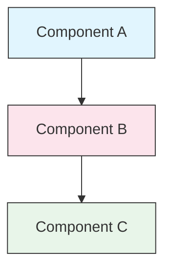

<picture>
  <source media="(prefers-color-scheme: dark)" srcset="resources/logos/claude-howto-logo-dark.svg">
  
</picture>

# Guía de estilo

> Convenciones y reglas de formato para contribuir a Claude How To. Seguí esta guía para mantener el contenido consistente, profesional y fácil de mantener.

---

## Tabla de contenidos

- [Nombres de archivos y carpetas](#nombres-de-archivos-y-carpetas)
- [Estructura del documento](#estructura-del-documento)
- [Encabezados](#encabezados)
- [Formato de texto](#formato-de-texto)
- [Listas](#listas)
- [Tablas](#tablas)
- [Bloques de código](#bloques-de-código)
- [Links y referencias cruzadas](#links-y-referencias-cruzadas)
- [Diagramas](#diagramas)
- [Uso de emojis](#uso-de-emojis)
- [YAML Frontmatter](#yaml-frontmatter)
- [Imágenes y multimedia](#imágenes-y-multimedia)
- [Tono y voz](#tono-y-voz)
- [Mensajes de commit](#mensajes-de-commit)
- [Lista de verificación para autores](#lista-de-verificación-para-autores)

---

## Nombres de archivos y carpetas

### Carpetas de lecciones

Las carpetas de lecciones usan un **prefijo numérico de dos dígitos** seguido de un descriptor en **kebab-case**:

```
01-slash-commands/
02-memory/
03-skills/
04-subagents/
05-mcp/
```

El número refleja el orden de la ruta de aprendizaje, de principiante a avanzado.

### Nombres de archivos

| Tipo | Convención | Ejemplos |
|------|-----------|----------|
| **README de lección** | `README.md` | `01-slash-commands/README.md` |
| **Archivo de funcionalidad** | Kebab-case `.md` | `code-reviewer.md`, `generate-api-docs.md` |
| **Script de shell** | Kebab-case `.sh` | `format-code.sh`, `validate-input.sh` |
| **Archivo de configuración** | Nombres estándar | `.mcp.json`, `settings.json` |
| **Archivo de memoria** | Con prefijo de alcance | `project-CLAUDE.md`, `personal-CLAUDE.md` |
| **Documentos de nivel raíz** | MAYÚSCULAS `.md` | `CATALOG.md`, `QUICK_REFERENCE.md`, `CONTRIBUTING.md` |
| **Recursos de imagen** | Kebab-case | `pr-slash-command.png`, `claude-howto-logo.svg` |

### Reglas

- Usar **minúsculas** para todos los nombres de archivos y carpetas (excepto documentos de nivel raíz como `README.md`, `CATALOG.md`)
- Usar **guiones** (`-`) como separadores de palabras, nunca guiones bajos ni espacios
- Mantener los nombres descriptivos pero concisos

---

## Estructura del documento

### README raíz

El `README.md` raíz sigue este orden:

1. Logo (elemento `<picture>` con variantes oscuro/claro)
2. Título H1
3. Blockquote introductorio (propuesta de valor en una línea)
4. Sección "¿Por qué esta guía?" con tabla comparativa
5. Regla horizontal (`---`)
6. Tabla de contenidos
7. Catálogo de funcionalidades
8. Navegación rápida
9. Ruta de aprendizaje
10. Secciones de funcionalidades
11. Primeros pasos
12. Mejores prácticas / Solución de problemas
13. Contribución / Licencia

### README de lección

Cada `README.md` de lección sigue este orden:

1. Título H1 (ej., `# Slash Commands`)
2. Párrafo de descripción general breve
3. Tabla de referencia rápida (opcional)
4. Diagrama de arquitectura (Mermaid)
5. Secciones detalladas (H2)
6. Ejemplos prácticos (numerados, 4-6 ejemplos)
7. Mejores prácticas (tablas de lo que se debe y no se debe hacer)
8. Solución de problemas
9. Guías relacionadas / Documentación oficial
10. Pie de metadatos del documento

### Archivo de funcionalidad/ejemplo

Los archivos de funcionalidades individuales (ej., `optimize.md`, `pr.md`):

1. YAML frontmatter (si aplica)
2. Título H1
3. Propósito / descripción
4. Instrucciones de uso
5. Ejemplos de código
6. Consejos de personalización

### Separadores de sección

Usar reglas horizontales (`---`) para separar las regiones principales del documento:

```markdown
---

## Nueva sección principal
```

Colocarlas después del blockquote introductorio y entre partes lógicamente distintas del documento.

---

## Encabezados

### Jerarquía

| Nivel | Uso | Ejemplo |
|-------|-----|---------|
| `#` H1 | Título de página (uno por documento) | `# Slash Commands` |
| `##` H2 | Secciones principales | `## Best Practices` |
| `###` H3 | Subsecciones | `### Adding a Skill` |
| `####` H4 | Sub-subsecciones (poco frecuente) | `#### Configuration Options` |

### Reglas

- **Un H1 por documento** — solo para el título de la página
- **Nunca saltarse niveles** — no pasar de H2 a H4
- **Mantener los encabezados concisos** — apuntar a 2-5 palabras
- **Usar mayúscula inicial** — solo la primera palabra y los nombres propios en mayúscula (excepción: los nombres de funcionalidades se mantienen tal cual)
- **Agregar prefijos de emoji solo en los encabezados de sección del README raíz** (ver [Uso de emojis](#uso-de-emojis))

---

## Formato de texto

### Énfasis

| Estilo | Cuándo usar | Ejemplo |
|-------|------------|---------|
| **Negrita** (`**texto**`) | Términos clave, etiquetas en tablas, conceptos importantes | `**Installation**:` |
| *Cursiva* (`*texto*`) | Primer uso de un término técnico, títulos de libros/docs | `*frontmatter*` |
| `Código` (`` `texto` ``) | Nombres de archivos, comandos, valores de configuración, referencias de código | `` `CLAUDE.md` `` |

### Blockquotes para llamadas de atención

Usar blockquotes con prefijos en negrita para notas importantes:

```markdown
> **Note**: Custom slash commands have been merged into skills since v2.0.

> **Important**: Never commit API keys or credentials.

> **Tip**: Combine memory with skills for maximum effectiveness.
```

Tipos de llamada de atención admitidos: **Note**, **Important**, **Tip**, **Warning**.

### Párrafos

- Mantener los párrafos cortos (2-4 oraciones)
- Agregar una línea en blanco entre párrafos
- Empezar con el punto clave y luego dar contexto
- Explicar el "por qué" y no solo el "qué"

---

## Listas

### Listas sin orden

Usar guiones (`-`) con indentación de 2 espacios para el anidado:

```markdown
- Primer elemento
- Segundo elemento
  - Elemento anidado
  - Otro elemento anidado
    - Anidado profundo (evitar ir más de 3 niveles)
- Tercer elemento
```

### Listas ordenadas

Usar listas numeradas para pasos secuenciales, instrucciones y elementos clasificados:

```markdown
1. Primer paso
2. Segundo paso
   - Detalle del subpunto
   - Otro subpunto
3. Tercer paso
```

### Listas descriptivas

Usar etiquetas en negrita para listas de tipo clave-valor:

```markdown
- **Performance bottlenecks** - identify O(n^2) operations, inefficient loops
- **Memory leaks** - find unreleased resources, circular references
- **Algorithm improvements** - suggest better algorithms or data structures
```

### Reglas

- Mantener indentación consistente (2 espacios por nivel)
- Agregar una línea en blanco antes y después de una lista
- Mantener los elementos de la lista paralelos en estructura (todos empiezan con verbo, o todos son sustantivos, etc.)
- Evitar anidar más de 3 niveles

---

## Tablas

### Formato estándar

```markdown
| Columna 1 | Columna 2 | Columna 3 |
|----------|----------|----------|
| Dato     | Dato     | Dato     |
```

### Patrones de tabla comunes

**Comparación de funcionalidades (3-4 columnas):**

```markdown
| Feature | Invocation | Persistence | Best For |
|---------|-----------|------------|----------|
| **Slash Commands** | Manual (`/cmd`) | Session only | Quick shortcuts |
| **Memory** | Auto-loaded | Cross-session | Long-term learning |
```

**Lo que se debe y no se debe hacer:**

```markdown
| Do | Don't |
|----|-------|
| Use descriptive names | Use vague names |
| Keep files focused | Overload a single file |
```

**Referencia rápida:**

```markdown
| Aspect | Details |
|--------|---------|
| **Purpose** | Generate API documentation |
| **Scope** | Project-level |
| **Complexity** | Intermediate |
```

### Reglas

- **Encabezados de tabla en negrita** cuando son etiquetas de fila (primera columna)
- Alinear las tuberías para mayor legibilidad en el código fuente (opcional pero preferido)
- Mantener el contenido de las celdas conciso; usar links para los detalles
- Usar `formato de código` para comandos y rutas de archivo dentro de las celdas

---

## Bloques de código

### Etiquetas de lenguaje

Siempre especificar una etiqueta de lenguaje para el resaltado de sintaxis:

| Lenguaje | Etiqueta | Usar para |
|----------|-----|---------|
| Shell | `bash` | Comandos de CLI, scripts |
| Python | `python` | Código Python |
| JavaScript | `javascript` | Código JS |
| TypeScript | `typescript` | Código TS |
| JSON | `json` | Archivos de configuración |
| YAML | `yaml` | Frontmatter, configuración |
| Markdown | `markdown` | Ejemplos de Markdown |
| SQL | `sql` | Consultas de base de datos |
| Texto plano | (sin etiqueta) | Salida esperada, árboles de directorios |

### Convenciones

```bash
# Comentario explicando qué hace el comando
claude mcp add notion --transport http https://mcp.notion.com/mcp
```

- Agregar una **línea de comentario** antes de los comandos no obvios
- Hacer que todos los ejemplos sean **listos para copiar y pegar**
- Mostrar versiones **simple y avanzada** cuando sea relevante
- Incluir la **salida esperada** cuando ayude a la comprensión (usar bloque de código sin etiqueta)

### Bloques de instalación

Usar este patrón para las instrucciones de instalación:

```bash
# Copy files to your project
cp 01-slash-commands/*.md .claude/commands/
```

### Workflows de varios pasos

```bash
# Step 1: Create the directory
mkdir -p .claude/commands

# Step 2: Copy the templates
cp 01-slash-commands/*.md .claude/commands/

# Step 3: Verify installation
ls .claude/commands/
```

---

## Links y referencias cruzadas

### Links internos (relativos)

Usar rutas relativas para todos los links internos:

```markdown
[Slash Commands](01-slash-commands/)
[Skills Guide](03-skills/)
[Memory Architecture](02-memory/#memory-architecture)
```

Desde una carpeta de lección hacia la raíz o a un hermano:

```markdown
[Back to main guide](../README.md)
[Related: Skills](../03-skills/)
```

### Links externos (absolutos)

Usar URLs completas con texto de ancla descriptivo:

```markdown
[Anthropic's official documentation](https://code.claude.com/docs/en/overview)
```

- Nunca usar "hacer clic aquí" o "este link" como texto de ancla
- Usar texto descriptivo que tenga sentido fuera de contexto

### Anclas de sección

Enlazar a secciones dentro del mismo documento usando anclas estilo GitHub:

```markdown
[Feature Catalog](#-feature-catalog)
[Best Practices](#best-practices)
```

### Patrón de guías relacionadas

Terminar las lecciones con una sección de guías relacionadas:

```markdown
## Related Guides

- [Slash Commands](../01-slash-commands/) - Quick shortcuts
- [Memory](../02-memory/) - Persistent context
- [Skills](../03-skills/) - Reusable capabilities
```

---

## Diagramas

### Mermaid

Usar Mermaid para todos los diagramas. Tipos admitidos:

- `graph TB` / `graph LR` — arquitectura, jerarquía, flujo
- `sequenceDiagram` — flujos de interacción
- `timeline` — secuencias cronológicas

### Convenciones de estilo

Aplicar colores consistentes usando bloques de estilo:



**Paleta de colores:**

| Color | Hex | Usar para |
|-------|-----|---------|
| Azul claro | `#e1f5fe` | Componentes primarios, entradas |
| Rosa claro | `#fce4ec` | Procesamiento, middleware |
| Verde claro | `#e8f5e9` | Salidas, resultados |
| Amarillo claro | `#fff9c4` | Configuración, opcional |
| Violeta claro | `#f3e5f5` | Orientado al usuario, UI |

### Reglas

- Usar `["Texto de etiqueta"]` para las etiquetas de nodo (permite caracteres especiales)
- Usar `<br/>` para saltos de línea dentro de las etiquetas
- Mantener los diagramas simples (máximo 10-12 nodos)
- Agregar una breve descripción de texto debajo del diagrama para accesibilidad
- Usar de arriba hacia abajo (`TB`) para jerarquías, de izquierda a derecha (`LR`) para workflows

---

## Uso de emojis

### Dónde se usan los emojis

Los emojis se usan de manera **moderada y con propósito** — solo en contextos específicos:

| Contexto | Emojis | Ejemplo |
|---------|--------|---------|
| Encabezados de sección del README raíz | Iconos de categoría | `## 📚 Learning Path` |
| Indicadores de nivel de habilidad | Círculos de colores | 🟢 Principiante, 🔵 Intermedio, 🔴 Avanzado |
| Lo que se debe y no se debe hacer | Marcas de verificación/cruz | ✅ Hacer esto, ❌ No hacer esto |
| Calificaciones de complejidad | Estrellas | ⭐⭐⭐ |

### Conjunto estándar de emojis

| Emoji | Significado |
|-------|---------|
| 📚 | Aprendizaje, guías, documentación |
| ⚡ | Primeros pasos, referencia rápida |
| 🎯 | Funcionalidades, referencia rápida |
| 🎓 | Rutas de aprendizaje |
| 📊 | Estadísticas, comparaciones |
| 🚀 | Instalación, comandos rápidos |
| 🟢 | Nivel principiante |
| 🔵 | Nivel intermedio |
| 🔴 | Nivel avanzado |
| ✅ | Práctica recomendada |
| ❌ | Evitar / anti-patrón |
| ⭐ | Unidad de calificación de complejidad |

### Reglas

- **Nunca usar emojis en el cuerpo del texto** ni en párrafos
- **Usar emojis solo en encabezados** del README raíz (no en los READMEs de lección)
- **No agregar emojis decorativos** — cada emoji debe transmitir un significado
- Mantener el uso de emojis consistente con la tabla anterior

---

## YAML Frontmatter

### Archivos de funcionalidades (Skills, Commands, Agents)

```yaml
---
name: unique-identifier
description: What this feature does and when to use it
allowed-tools: Bash, Read, Grep
---
```

### Campos opcionales

```yaml
---
name: my-feature
description: Brief description
argument-hint: "[file-path] [options]"
allowed-tools: Bash, Read, Grep, Write, Edit
model: opus                        # opus, sonnet, or haiku
disable-model-invocation: true     # User-only invocation
user-invocable: false              # Hidden from user menu
context: fork                      # Run in isolated subagent
agent: Explore                     # Agent type for context: fork
---
```

### Reglas

- Colocar el frontmatter al comienzo del archivo
- Usar **kebab-case** para el campo `name`
- Mantener `description` en una oración
- Incluir solo los campos que sean necesarios

---

## Imágenes y multimedia

### Patrón de logo

Todos los documentos que comienzan con un logo usan el elemento `<picture>` para soporte de modo oscuro/claro:

```html
<picture>
  <source media="(prefers-color-scheme: dark)" srcset="resources/logos/claude-howto-logo-dark.svg">
  
</picture>
```

### Capturas de pantalla

- Guardar en la carpeta de lección relevante (ej., `01-slash-commands/pr-slash-command.png`)
- Usar nombres de archivo en kebab-case
- Incluir texto alternativo descriptivo
- Preferir SVG para diagramas, PNG para capturas de pantalla

### Reglas

- Siempre proporcionar texto alternativo para las imágenes
- Mantener el tamaño de los archivos de imagen razonable (< 500KB para PNGs)
- Usar rutas relativas para las referencias de imágenes
- Guardar las imágenes en el mismo directorio que el documento que las referencia, o en `assets/` para imágenes compartidas

---

## Tono y voz

### Estilo de escritura

- **Profesional pero accesible** — precisión técnica sin sobrecarga de jerga
- **Voz activa** — "Crear un archivo" en lugar de "Un archivo debería ser creado"
- **Instrucciones directas** — "Ejecutá este comando" en lugar de "Tal vez quieras ejecutar este comando"
- **Amigable para principiantes** — asumir que el lector es nuevo en Claude Code, no en la programación

### Principios de contenido

| Principio | Ejemplo |
|-----------|---------|
| **Mostrar, no contar** | Proporcionar ejemplos funcionales, no descripciones abstractas |
| **Complejidad progresiva** | Comenzar simple, agregar profundidad en secciones posteriores |
| **Explicar el "por qué"** | "Usar memory para... porque..." y no solo "Usar memory para..." |
| **Listo para copiar y pegar** | Cada bloque de código debería funcionar al pegarlo directamente |
| **Contexto del mundo real** | Usar escenarios prácticos, no ejemplos artificiales |

### Vocabulario

- Usar "Claude Code" (no "Claude CLI" ni "la herramienta")
- Usar "skill" (no "custom command" — término heredado)
- Usar "lección" o "guía" para las secciones numeradas
- Usar "ejemplo" para los archivos de funcionalidades individuales

---

## Mensajes de commit

Seguir [Conventional Commits](https://www.conventionalcommits.org/):

```
type(scope): description
```

### Tipos

| Tipo | Usar para |
|------|---------|
| `feat` | Nueva funcionalidad, ejemplo o guía |
| `fix` | Corrección de error, link roto |
| `docs` | Mejoras a la documentación |
| `refactor` | Reestructuración sin cambiar el comportamiento |
| `style` | Solo cambios de formato |
| `test` | Adiciones o cambios en pruebas |
| `chore` | Build, dependencias, CI |

### Alcances

Usar el nombre de la lección o el área del archivo como alcance:

```
feat(slash-commands): Add API documentation generator
docs(memory): Improve personal preferences example
fix(README): Correct table of contents link
docs(skills): Add comprehensive code review skill
```

---

## Pie de metadatos del documento

Los READMEs de lección terminan con un bloque de metadatos:

```markdown
---
**Last Updated**: March 2026
**Claude Code Version**: 2.1+
**Compatible Models**: Claude Sonnet 4.6, Claude Opus 4.6, Claude Haiku 4.5
```

- Usar el formato mes + año (ej., "March 2026")
- Actualizar la versión cuando cambien las funcionalidades
- Listar todos los modelos compatibles

---

## Lista de verificación para autores

Antes de enviar contenido, verificar:

- [ ] Los nombres de archivos/carpetas usan kebab-case
- [ ] El documento comienza con un título H1 (uno por archivo)
- [ ] La jerarquía de encabezados es correcta (sin niveles saltados)
- [ ] Todos los bloques de código tienen etiquetas de lenguaje
- [ ] Los ejemplos de código están listos para copiar y pegar
- [ ] Los links internos usan rutas relativas
- [ ] Los links externos tienen texto de ancla descriptivo
- [ ] Las tablas están correctamente formateadas
- [ ] Los emojis siguen el conjunto estándar (si se usan)
- [ ] Los diagramas Mermaid usan la paleta de colores estándar
- [ ] Sin información sensible (claves de API, credenciales)
- [ ] El YAML frontmatter es válido (si aplica)
- [ ] Las imágenes tienen texto alternativo
- [ ] Los párrafos son cortos y enfocados
- [ ] La sección de guías relacionadas enlaza a lecciones relevantes
- [ ] El mensaje de commit sigue el formato de conventional commits

---
**Ultima Actualizacion**: Abril 2026
