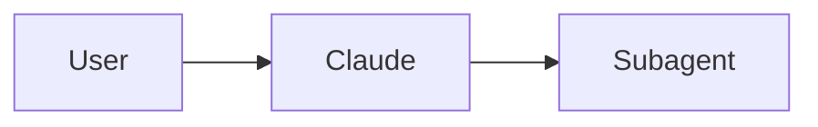
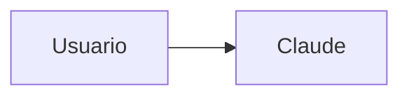

# Notas de Traduccion y Guia de Estilo

> **Nota importante:** Este documento establece las reglas para traducir la documentacion de Claude Code al castellano. Leerlo antes de empezar a traducir.

## Terminologia Tecnica / Technical Terminology

| Ingles | Castellano | Nota |
|--------|------------|------|
| slash command | slash command | Se mantiene en ingles (nombre propio de la feature) |
| hook | hook | Se mantiene (termino tecnico) |
| skill | skill | Se mantiene (termino tecnico) |
| subagent | subagente | Se traduce |
| agent | agente | Se traduce |
| memory | memoria | Se traduce |
| checkpoint | checkpoint | Se mantiene (termino propio de Claude Code) |
| plugin | plugin | Se mantiene (termino tecnico) |
| pull request / PR | pull request / PR | Se mantiene (termino de GitHub) |
| commit | commit | Se mantiene (termino de Git) |
| branch | branch | Se mantiene (termino de Git) |
| merge | merge | Se mantiene (termino de Git) |
| MCP (Model Context Protocol) | MCP | Se mantiene (nombre del protocolo) |
| CLAUDE.md | CLAUDE.md | Se mantiene (nombre del archivo de config) |
| prompt | prompt | Se mantiene (termino de IA) |
| workflow | workflow | Se mantiene o "flujo de trabajo" segun contexto |
| repository | repositorio | Se traduce |
| issue | issue | Se mantiene (termino de GitHub) |
| release | release | Se mantiene o "version" segun contexto |
| API | API | Se mantiene |
| CLI | CLI | Se mantiene (Command-Line Interface) |
| CI/CD | CI/CD | Se mantiene |
| pre-commit hook | pre-commit hook | Se mantiene (termino de Git) |
| environment variable | variable de entorno | Se traduce |
| dependencies | dependencias | Se traduce |
| template | plantilla / template | Se puede traducir o mantener segun contexto |

## Reglas de Traduccion

### 1. Codigo y Comandos

**REGLA DE ORO:** Mantener al 100% el codigo ejecutable. Solo traducir comentarios y explicaciones.

**Correcto:**

````markdown
Para usar este comando, ejecuta:

```bash
/optimize
```

Este comando analiza tu codigo.
````

**Incorrecto:**

````markdown
Para usar este comando, ejecuta:

```bash
/optimizar  # NUNCA traducir comandos
```
````

### 2. Comentarios en Codigo

Traducir los comentarios al castellano para facilitar la comprension:

```python
# Correcto - Traducir comentario
# Este slash command optimiza tu codigo
def optimize_code():
    pass

# Incorrecto - No traducir nombres de funciones
def optimizar_codigo():  # NO traducir function names
    pass
```

### 3. Nombres de Funciones, Variables y Clases

Mantener siempre en ingles:

```python
# Correcto
def create_subagent(name: str, system_prompt: str):
    pass

# Incorrecto
def crear_subagente(nombre: str, prompt_sistema: str):
    pass
```

### 4. Diagramas Mermaid

**Mantener al 100% los diagramas Mermaid.** No traducir ningun texto dentro de los bloques diagram.

````markdown
<!-- Correcto -->


<!-- Incorrecto -->

````

### 5. Nombres de Archivo y Paths

Mantener tal cual:

```markdown
<!-- Correcto -->
Copia el archivo `.claude/commands/optimize.md` en tu proyecto.

<!-- Incorrecto -->
Copia el archivo `.claude/commands/optimizar.md` en tu proyecto.
```

### 6. Enlaces (Links)

**Enlaces internos (dentro de es/):** Mantener relative paths:

```markdown
<!-- Correcto -->
Consulta [Slash Commands](01-slash-commands/README.md) para mas detalles.
```

**Enlaces entre idiomas (de es/ a en/):** Usar relative path correcto:

```markdown
<!-- Dentro de un archivo en castellano -->
Ver la [version en ingles](../../README.md) para mas detalles.
```

**Enlaces externos:** Mantener las URLs tal cual.

### 7. Nombres de Modulos y Features

Mantener los nombres de modulos y features ya que son terminos propios:

```markdown
<!-- Correcto -->
- 01-slash-commands/ - Slash Commands
- 03-skills/ - Skills
- 04-subagents/ - Subagentes

<!-- Incorrecto -->
- 01-comandos-slash/ - Comandos Slash
- 03-habilidades/ - Habilidades
```

## Guia de Estilo

### 1. Tratamiento

- Usar **"tu/vos"** de forma natural (tuteo informal)
- Evitar el "usted" salvo en contextos muy formales
- Castellano neutro/internacional: evitar regionalismos fuertes

**Ejemplo:**

```markdown
<!-- Correcto -->
Podes usar este comando para optimizar tu codigo.

<!-- Demasiado formal -->
Usted puede utilizar este comando para optimizar su codigo.
```

### 2. Tono

- **Profesional pero accesible:** Evitar lenguaje excesivamente academico
- **Tecnico pero claro:** Explicar con claridad, dar ejemplos
- **Directo:** Ir al punto sin rodeos

### 3. Estructura de oraciones

- **Conciso:** Evitar oraciones largas y complicadas
- **Claro:** Ir directo al tema
- **Logico:** Usar conectores apropiados (porque, sin embargo, por lo tanto)

### 4. Formato

- **Mantener el formato Markdown:** headings, listas, tablas, code blocks
- **Usar negrita para enfasis:** **importante**, **atencion**
- **Usar code blocks para ejemplos:** File paths, comandos, fragmentos de codigo

## Flujo de Trabajo de Traduccion

### Paso 1: Leer y Comprender

1. Leer el archivo en ingles completo antes de traducir
2. Entender el contexto y proposito del documento
3. Identificar los terminos que deben mantenerse en ingles

### Paso 2: Traducir

1. Traducir seccion por seccion de forma sistematica
2. Seguir el glosario y la guia de estilo
3. Mantener codigo, comandos y diagramas Mermaid
4. Traducir comentarios en codigo al castellano

### Paso 3: Revisar

1. Leer la traduccion de principio a fin
2. Verificar precision tecnica
3. Asegurar que fluya de forma natural en castellano
4. Verificar que todos los links funcionen
5. Confirmar que los ejemplos de codigo estan intactos

### Paso 4: Validar

1. Ejecutar pre-commit checks:

   ```bash
   pre-commit run --all-files
   ```

2. Verificar links:

   ```bash
   python scripts/check_cross_references.py --lang es
   python scripts/check_links.py --lang es
   ```

3. Build del EPUB (si aplica):

   ```bash
   uv run scripts/build_epub.py --lang es
   ```

## Checklist por Archivo

Marcar antes de hacer commit:

- [ ] Precision tecnica correcta
- [ ] Lectura natural y fluida en castellano
- [ ] Terminologia consistente segun el glosario
- [ ] Ejemplos de codigo mantenidos al 100%
- [ ] Diagramas Mermaid sin modificar
- [ ] Enlaces internos funcionando
- [ ] Enlaces externos sin cambios
- [ ] Formato Markdown correcto
- [ ] Comentarios en codigo traducidos
- [ ] Nombres de funciones/variables/clases en ingles
- [ ] File paths y URLs sin cambios
- [ ] Pre-commit checks pasan
- [ ] EPUB se genera correctamente (si aplica)

---

**Ultima actualizacion:** 2026-04-08
**Idioma:** Castellano (es)
**Mantenido por:** Claude Code Community
