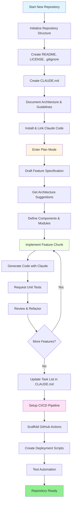
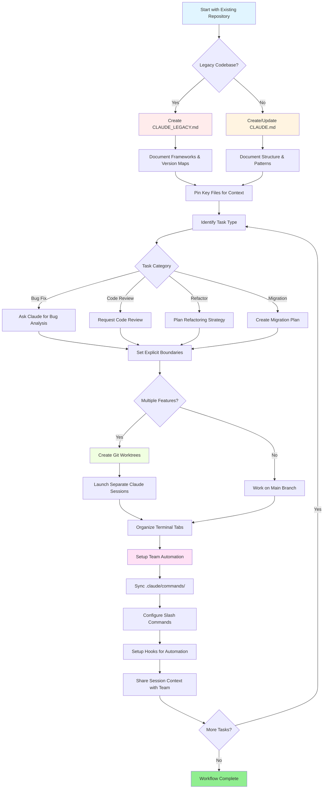

<picture>
  <source media="(prefers-color-scheme: dark)" srcset="resources/logos/claude-howto-logo-dark.svg">
  
</picture>

# Lista de buenos recursos

## Documentacion Oficial

| Recurso | Descripcion | Enlace |
|----------|-------------|------|
| Claude Code Docs | Documentacion oficial de Claude Code | [code.claude.com/docs/en/overview](https://code.claude.com/docs/en/overview) |
| Anthropic Docs | Documentacion completa de Anthropic | [docs.anthropic.com](https://docs.anthropic.com) |
| MCP Protocol | Especificacion del Model Context Protocol | [modelcontextprotocol.io](https://modelcontextprotocol.io) |
| MCP Servers | Implementaciones oficiales de servidores MCP | [github.com/modelcontextprotocol/servers](https://github.com/modelcontextprotocol/servers) |
| Anthropic Cookbook | Ejemplos de codigo y tutoriales | [github.com/anthropics/anthropic-cookbook](https://github.com/anthropics/anthropic-cookbook) |
| Claude Code Skills | Repositorio de skills de la comunidad | [github.com/anthropics/skills](https://github.com/anthropics/skills) |
| Agent Teams | Coordinacion y colaboracion multi-agente | [code.claude.com/docs/en/agent-teams](https://code.claude.com/docs/en/agent-teams) |
| Scheduled Tasks | Tareas recurrentes con /loop y cron | [code.claude.com/docs/en/scheduled-tasks](https://code.claude.com/docs/en/scheduled-tasks) |
| Chrome Integration | Automatizacion del navegador | [code.claude.com/docs/en/chrome](https://code.claude.com/docs/en/chrome) |
| Keybindings | Personalizacion de atajos de teclado | [code.claude.com/docs/en/keybindings](https://code.claude.com/docs/en/keybindings) |
| Desktop App | Aplicacion de escritorio nativa | [code.claude.com/docs/en/desktop](https://code.claude.com/docs/en/desktop) |
| Remote Control | Control remoto de sesiones | [code.claude.com/docs/en/remote-control](https://code.claude.com/docs/en/remote-control) |
| Auto Mode | Gestion automatica de permisos | [code.claude.com/docs/en/permissions](https://code.claude.com/docs/en/permissions) |
| Channels | Comunicacion multi-canal | [code.claude.com/docs/en/channels](https://code.claude.com/docs/en/channels) |
| Voice Dictation | Entrada de voz para Claude Code | [code.claude.com/docs/en/voice-dictation](https://code.claude.com/docs/en/voice-dictation) |

## Blog de Ingenieria de Anthropic

| Articulo | Descripcion | Enlace |
|---------|-------------|------|
| Code Execution with MCP | Como resolver el problema de bloat de contexto en MCP usando ejecucion de codigo — reduccion del 98.7% en tokens | [anthropic.com/engineering/code-execution-with-mcp](https://www.anthropic.com/engineering/code-execution-with-mcp) |

---

## Dominar Claude Code en 30 Minutos

_Video_: https://www.youtube.com/watch?v=6eBSHbLKuN0

_**Todos los Consejos**_
- **Explorar Funcionalidades Avanzadas y Atajos**
  - Revisa regularmente las notas de version de Claude para conocer las nuevas funciones de edicion de codigo y contexto.
  - Aprende los atajos de teclado para cambiar rapidamente entre las vistas de chat, archivo y editor.

- **Configuracion Eficiente**
  - Crea sesiones especificas por proyecto con nombres/descripciones claras para recuperarlas facilmente.
  - Fija los archivos o carpetas mas usados para que Claude pueda accederlos en cualquier momento.
  - Configura las integraciones de Claude (por ejemplo, GitHub, IDEs populares) para agilizar tu proceso de desarrollo.

- **Q&A Efectivo sobre el Codigo Base**
  - Hazle a Claude preguntas detalladas sobre arquitectura, patrones de diseno y modulos especificos.
  - Usa referencias de archivo y linea en tus preguntas (por ejemplo, "¿Que hace la logica en `app/models/user.py`?").
  - Para codebases grandes, proporciona un resumen o manifiesto para ayudar a Claude a enfocarse.
  - **Ejemplo de prompt**: _"¿Puedes explicar el flujo de autenticacion implementado en src/auth/AuthService.ts:45-120? ¿Como se integra con el middleware en src/middleware/auth.ts?"_

- **Edicion y Refactorizacion de Codigo**
  - Usa comentarios inline o solicitudes en bloques de codigo para obtener ediciones focalizadas ("Refactor this function for clarity").
  - Pide comparaciones antes/despues lado a lado.
  - Deja que Claude genere tests o documentacion despues de ediciones importantes para asegurar la calidad.
  - **Ejemplo de prompt**: _"Refactor the getUserData function in api/users.js to use async/await instead of promises. Show me a before/after comparison and generate unit tests for the refactored version."_

- **Gestion del Contexto**
  - Limita el codigo/contexto pegado a solo lo relevante para la tarea actual.
  - Usa prompts estructurados ("Here's file A, here's function B, my question is X") para mejor rendimiento.
  - Elimina o colapsa archivos grandes en la ventana del prompt para evitar superar los limites de contexto.
  - **Ejemplo de prompt**: _"Here's the User model from models/User.js and the validateUser function from utils/validation.js. My question is: how can I add email validation while maintaining backward compatibility?"_

- **Integrar Herramientas del Equipo**
  - Conecta las sesiones de Claude a los repositorios y la documentacion de tu equipo.
  - Usa templates integrados o crea los tuyos para tareas de ingenieria recurrentes.
  - Colabora compartiendo transcripciones de sesiones y prompts con tus companeros de equipo.

- **Mejorar el Rendimiento**
  - Dale a Claude instrucciones claras y orientadas a objetivos (por ejemplo, "Summarize this class in five bullet points").
  - Elimina comentarios innecesarios y codigo boilerplate del context window.
  - Si el resultado de Claude se desvía, resetea el contexto o reformula las preguntas para mejor alineacion.
  - **Ejemplo de prompt**: _"Summarize the DatabaseManager class in src/db/Manager.ts in five bullet points, focusing on its main responsibilities and key methods."_

- **Ejemplos de Uso Practico**
  - Debugging: Pega los errores y stack traces, luego pide posibles causas y soluciones.
  - Generacion de Tests: Solicita tests basados en propiedades, unitarios o de integracion para logica compleja.
  - Code Reviews: Pide a Claude que identifique cambios riesgosos, casos borde o code smells.
  - **Ejemplos de prompts**:
    - _"I'm getting this error: 'TypeError: Cannot read property 'map' of undefined at line 42 in components/UserList.jsx'. Here's the stack trace and the relevant code. What's causing this and how can I fix it?"_
    - _"Generate comprehensive unit tests for the PaymentProcessor class, including edge cases for failed transactions, timeouts, and invalid inputs."_
    - _"Review this pull request diff and identify potential security issues, performance bottlenecks, and code smells."_

- **Automatizacion de Workflows**
  - Automatiza tareas repetitivas (como formateo, limpieza y renombrados repetitivos) usando prompts de Claude.
  - Usa Claude para redactar descripciones de PR, notas de version o documentacion basada en diffs de codigo.
  - **Ejemplo de prompt**: _"Based on the git diff, create a detailed PR description with a summary of changes, list of modified files, testing steps, and potential impacts. Also generate release notes for version 2.3.0."_

**Consejo**: Para mejores resultados, combina varias de estas practicas — empieza fijando los archivos criticos y resumiendo tus objetivos, luego usa prompts focalizados y las herramientas de refactorizacion de Claude para mejorar incrementalmente tu codebase y automatizacion.

**Workflow recomendado con Claude Code**

### Workflow Recomendado con Claude Code

#### Para un Repositorio Nuevo

1. **Inicializar el Repo e Integracion con Claude**
   - Configura tu nuevo repositorio con la estructura esencial: README, LICENSE, .gitignore, configuraciones raiz.
   - Crea un archivo `CLAUDE.md` describiendo la arquitectura, los objetivos de alto nivel y las guias de codificacion.
   - Instala Claude Code y vincúlalo a tu repositorio para sugerencias de codigo, scaffolding de tests y automatizacion de workflows.

2. **Usar Plan Mode y Especificaciones**
   - Usa plan mode (`shift-tab` o `/plan`) para redactar una especificacion detallada antes de implementar funcionalidades.
   - Pide a Claude sugerencias de arquitectura y la disposicion inicial del proyecto.
   - Mantene una secuencia de prompts clara y orientada a objetivos — pide esquemas de componentes, modulos principales y responsabilidades.

3. **Desarrollar e Iterar**
   - Implementa las funcionalidades principales en pequenos bloques, usando prompts de Claude para generacion de codigo, refactorizacion y documentacion.
   - Solicita tests unitarios y ejemplos despues de cada incremento.
   - Mantene una lista de tareas actualizada en CLAUDE.md.

4. **Automatizar CI/CD y Despliegue**
   - Usa Claude para hacer scaffolding de GitHub Actions, scripts de npm/yarn o workflows de despliegue.
   - Adapta los pipelines facilmente actualizando tu CLAUDE.md y solicitando los comandos/scripts correspondientes.

#### Para un Repositorio Existente

1. **Configuracion del Repositorio y el Contexto**
   - Agrega o actualiza `CLAUDE.md` para documentar la estructura del repo, patrones de codificacion y archivos clave. Para repos legacy, usa `CLAUDE_LEGACY.md` cubriendo frameworks, mapas de versiones, instrucciones, bugs y notas de actualizacion.
   - Fija o destaca los archivos principales que Claude debe usar como contexto.

2. **Q&A Contextual sobre el Codigo**
   - Pide a Claude code reviews, explicaciones de bugs, refactorizaciones o planes de migracion referenciando archivos/funciones especificos.
   - Dale a Claude limites explicitos (por ejemplo, "modify only these files" o "no new dependencies").

3. **Gestion de Branches, Worktrees y Multi-Sesion**
   - Usa multiples git worktrees para funcionalidades o bugs aislados y lanza sesiones de Claude separadas por worktree.
   - Mantene las pestanas/ventanas de terminal organizadas por branch o funcionalidad para workflows en paralelo.

4. **Herramientas de Equipo y Automatizacion**
   - Sincroniza comandos personalizados via `.claude/commands/` para consistencia entre equipos.
   - Automatiza tareas repetitivas, creacion de PRs y formateo de codigo via slash commands o hooks de Claude.
   - Comparte sesiones y contexto con miembros del equipo para troubleshooting y revision colaborativa.

**Consejos**:
- Empieza cada nueva funcionalidad o fix con una especificacion y un prompt en plan mode.
- Para repos legacy y complejos, almacena guias detalladas en CLAUDE.md/CLAUDE_LEGACY.md.
- Da instrucciones claras y focalizadas y divide el trabajo complejo en planes de multiples fases.
- Limpia regularmente las sesiones, poda el contexto y elimina los worktrees completados para evitar el desorden.

Estos pasos capturan las recomendaciones principales para workflows fluidos con Claude Code tanto en codebases nuevas como existentes.

---

## Novedades y Capacidades (Marzo 2026)

### Recursos de Funcionalidades Clave

| Funcionalidad | Descripcion | Saber Mas |
|---------|-------------|------------|
| **Auto Memory** | Claude aprende y recuerda automaticamente tus preferencias entre sesiones | [Memory Guide](02-memory/) |
| **Remote Control** | Controla sesiones de Claude Code de forma programatica desde herramientas y scripts externos | [Advanced Features](09-advanced-features/) |
| **Web Sessions** | Accede a Claude Code a traves de interfaces basadas en navegador para desarrollo remoto | [CLI Reference](10-cli/) |
| **Desktop App** | Aplicacion de escritorio nativa para Claude Code con interfaz mejorada | [Claude Code Docs](https://code.claude.com/docs/en/desktop) |
| **Extended Thinking** | Toggle de razonamiento profundo via `Alt+T`/`Option+T` o variable de entorno `MAX_THINKING_TOKENS` | [Advanced Features](09-advanced-features/) |
| **Permission Modes** | Control granular: default, acceptEdits, plan, auto, dontAsk, bypassPermissions | [Advanced Features](09-advanced-features/) |
| **7-Tier Memory** | Managed Policy, Project, Project Rules, User, User Rules, Local, Auto Memory | [Memory Guide](02-memory/) |
| **Hook Events** | 25 eventos: PreToolUse, PostToolUse, PostToolUseFailure, Stop, StopFailure, SubagentStart, SubagentStop, Notification, Elicitation, y mas | [Hooks Guide](06-hooks/) |
| **Agent Teams** | Coordinar multiples agents trabajando juntos en tareas complejas | [Subagents Guide](04-subagents/) |
| **Scheduled Tasks** | Configurar tareas recurrentes con `/loop` y herramientas cron | [Advanced Features](09-advanced-features/) |
| **Chrome Integration** | Automatizacion del navegador con Chromium headless | [Advanced Features](09-advanced-features/) |
| **Keyboard Customization** | Personalizar atajos de teclado incluyendo secuencias chord | [Advanced Features](09-advanced-features/) |

---
**Ultima Actualizacion**: Abril 2026
